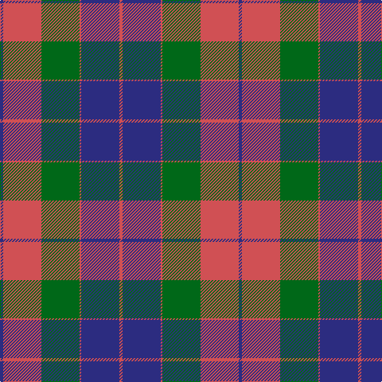

In pattern [BRGRBR](/patterns/brgrbr/).

This was sourced from tartans-authority.  It is a [6 stripes tartan](/stripes/stripes6/).

Original link http://www.tartansauthority.com/tartan-ferret/display/529/

## Thread count
DB/4 DO48 G48 DO2 DB48 DO/4

## Palette
Each colour and its ΔE from the base-6 reference it is a variant of.

| Colour | Shade | Base | ΔE (OKLab) |
|---|---|---|---|
| DB | <code style="background-color:#2C2C80;">#2C2C80</code> `#2C2C80` | B <code style="background-color:#2A418A;">#2A418A</code> | 0.06 |
| DO | <code style="background-color:#D05054;">#D05054</code> `#D05054` | R <code style="background-color:#CC0000;">#CC0000</code> | 0.09 |
| G | <code style="background-color:#006818;">#006818</code> `#006818` | G <code style="background-color:#006100;">#006100</code> | 0.02 |

# Sample pattern

## Nearest tartans

The nearest existing variants by ΔTartan distance.

1. [Mar Dress](/setts/s6/b2r24g24r1b24r2~b2c2c80-g006818-ra00048~x2/) — ΔT 0.88
1. [St. Matthews Check (School)](/setts/s5/b2y21b11ba21b1~b1c1c50-ba003c64-ybc8c00/) — ΔT 0.98
1. [Mar](/setts/s6/b2r39g39r1b39r2~b304080-g008000-rc00000~x2/) — ΔT 1.02
1. [Logan](/setts/s7/b8r3b1r3g14r3b1~b2c4084-g005020-rdc0000~x4/) — ΔT 1.22
1. [Nibley](/setts/s6/w3g15b18r15g1r2~b304080-g008000-rc00000-we0e0e0~x2/) — ΔT 1.26
1. [Nibley (Personal)](/setts/s6/w3g18b22r19g1r2~b202060-g003820-rc80000-we0e0e0~x2/) — ΔT 1.30
1. [Wyeth (Personal)](/setts/s5/b18r18ba2g12b1~b2c2c80-ba780078-g006818-rc80000~x4/) — ΔT 1.34
1. [Confederate (Military)](/setts/s7/r12b18k1r4k1g6k2~b1474b4-g006800-k000000-rc80000~x2/) — ΔT 1.40
1. [Bannockbane Brown #2](/setts/s7/b3g2b30g19y14g2y3~b202060-g808080-ya08858~x2/) — ΔT 1.41
1. [Confederate](/setts/s7/r12b18k1r4k1g6k2~b1474b4-g004c00-k000000-rc80000~x2/) — ΔT 1.41

## Neighbour map

Every grey dot is one of 15726 variants placed by the first two principal components of the ΔTartan feature space (44% of its variance). Red is this tartan; blue dots are its nearest — click one to open its page.

<svg viewBox="0 0 640 380" role="img" style="max-width:100%;height:auto;border:1px solid #e0e0e0;border-radius:4px;display:block" xmlns="http://www.w3.org/2000/svg"><image href="/nn/cloud.v1.png" width="640" height="380"/><a href="/setts/s6/b2r24g24r1b24r2~b2c2c80-g006818-ra00048~x2/"><circle cx="289.3" cy="202.7" r="4" fill="#3465a4"><title>Mar Dress</title></circle></a><a href="/setts/s5/b2y21b11ba21b1~b1c1c50-ba003c64-ybc8c00/"><circle cx="252.3" cy="212.2" r="4" fill="#3465a4"><title>St. Matthews Check (School)</title></circle></a><a href="/setts/s6/b2r39g39r1b39r2~b304080-g008000-rc00000~x2/"><circle cx="291.1" cy="172.8" r="4" fill="#3465a4"><title>Mar</title></circle></a><a href="/setts/s7/b8r3b1r3g14r3b1~b2c4084-g005020-rdc0000~x4/"><circle cx="287.1" cy="207.8" r="4" fill="#3465a4"><title>Logan</title></circle></a><a href="/setts/s6/w3g15b18r15g1r2~b304080-g008000-rc00000-we0e0e0~x2/"><circle cx="203.6" cy="186.5" r="4" fill="#3465a4"><title>Nibley</title></circle></a><a href="/setts/s6/w3g18b22r19g1r2~b202060-g003820-rc80000-we0e0e0~x2/"><circle cx="222.5" cy="179.2" r="4" fill="#3465a4"><title>Nibley (Personal)</title></circle></a><a href="/setts/s5/b18r18ba2g12b1~b2c2c80-ba780078-g006818-rc80000~x4/"><circle cx="240.3" cy="206.1" r="4" fill="#3465a4"><title>Wyeth (Personal)</title></circle></a><a href="/setts/s7/r12b18k1r4k1g6k2~b1474b4-g006800-k000000-rc80000~x2/"><circle cx="235.9" cy="163.8" r="4" fill="#3465a4"><title>Confederate (Military)</title></circle></a><a href="/setts/s7/b3g2b30g19y14g2y3~b202060-g808080-ya08858~x2/"><circle cx="295.8" cy="200.2" r="4" fill="#3465a4"><title>Bannockbane Brown #2</title></circle></a><a href="/setts/s7/r12b18k1r4k1g6k2~b1474b4-g004c00-k000000-rc80000~x2/"><circle cx="236.4" cy="164.1" r="4" fill="#3465a4"><title>Confederate</title></circle></a><circle cx="267.6" cy="192.7" r="5" fill="#c00000"/></svg>

ID: /setts/s6/b2r24g24r1b24r2~b2c2c80-g006818-rd05054~x2/
