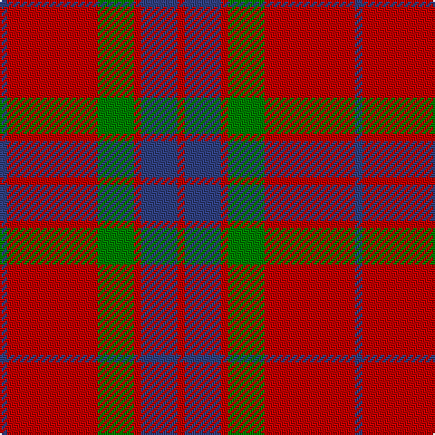

In pattern [BRGRBR](/patterns/brgrbr/).

This was sourced from weddslist.  It is a [6 stripes tartan](/stripes/stripes6/).

Original link http://www.weddslist.com/cgi-bin/tartans/pg.pl?source=sts

## Thread count
B/4 R50 G20 R4 B20 R/4

## Palette
Each colour and its ΔE from the base-6 reference it is a variant of.

| Colour | Shade | Base | ΔE (OKLab) |
|---|---|---|---|
| B | <code style="background-color:#304080;">#304080</code> `#304080` | B <code style="background-color:#2A418A;">#2A418A</code> | 0.02 |
| G | <code style="background-color:#008000;">#008000</code> `#008000` | G <code style="background-color:#006100;">#006100</code> | 0.10 |
| R | <code style="background-color:#C00000;">#C00000</code> `#C00000` | R <code style="background-color:#CC0000;">#CC0000</code> | 0.03 |

# Sample pattern

## Nearest tartans

The nearest existing variants by ΔTartan distance.

1. [Grant of Lurg Artifact Tartan Tartan Number: 527. Earliest known date: pre 1859 Owned by the family Dunbar. Count not given. A plaid. Previously marked 'Unidentified' See products available Copyright © Blair Urquhart, Comrie, 2015](/setts/s6/b2r25g10r2b10r2~b2c2c80-g006818-rc80000~x2/) — ΔT 0.41
1. [MacKintosh, Plaid](/setts/s6/r16b6r2g6r2b1~b304080-g008000-rc00000~x2/) — ΔT 0.60
1. [MacKintosh Plaid](/setts/s6/r16b6r2g6r2b1~b2c2c80-g285800-rc80000~x2/) — ΔT 0.79
1. [Hugh Fraser of Boblainy](/setts/s5/r1r14g7b7r1~b304080-g008000-rc00000~x4/) — ΔT 0.80
1. [Robertson - 1988 (Corporate)](/setts/s7/r2b1r16b4r1g10r1~b1c0070-g006818-rc80000~x4/) — ΔT 0.82
1. [Edinchat](/setts/s6/b2r28g13r2b13r2~b2c2c80-g006818-rc04c08~x4/) — ΔT 0.85
1. [Robertson 6](/setts/s6/g1r18b4r1g10r1~b304080-g008000-rc00000~x4/) — ΔT 0.94
1. [Dunbar](/setts/s6/r6g21k8r28k2r4~g006818-k101010-rc80000~x2/) — ΔT 0.97
1. [Auld Reekie](/setts/s6/b4r3b3r22g8r2~b2c2c80-g006818-rc80000~x2/) — ΔT 1.01
1. [MacKintosh](/setts/s6/r70b20r10g40r10b3~b2c2c80-g006818-rc80000/) — ΔT 1.02

## Neighbour map

Every grey dot is one of 15726 variants placed by the first two principal components of the ΔTartan feature space (44% of its variance). Red is this tartan; blue dots are its nearest — click one to open its page.

<svg viewBox="0 0 640 380" role="img" style="max-width:100%;height:auto;border:1px solid #e0e0e0;border-radius:4px;display:block" xmlns="http://www.w3.org/2000/svg"><image href="/nn/cloud.v1.png" width="640" height="380"/><a href="/setts/s6/b2r25g10r2b10r2~b2c2c80-g006818-rc80000~x2/"><circle cx="365.9" cy="206.3" r="4" fill="#3465a4"><title>Grant of Lurg Artifact Tartan Tartan Number: 527. Earliest known date: pre 1859 Owned by the family Dunbar. Count not given. A plaid. Previously marked 'Unidentified' See products available Copyright © Blair Urquhart, Comrie, 2015</title></circle></a><a href="/setts/s6/r16b6r2g6r2b1~b304080-g008000-rc00000~x2/"><circle cx="403.1" cy="204.4" r="4" fill="#3465a4"><title>MacKintosh, Plaid</title></circle></a><a href="/setts/s6/r16b6r2g6r2b1~b2c2c80-g285800-rc80000~x2/"><circle cx="403.3" cy="203.0" r="4" fill="#3465a4"><title>MacKintosh Plaid</title></circle></a><a href="/setts/s5/r1r14g7b7r1~b304080-g008000-rc00000~x4/"><circle cx="341.3" cy="224.7" r="4" fill="#3465a4"><title>Hugh Fraser of Boblainy</title></circle></a><a href="/setts/s7/r2b1r16b4r1g10r1~b1c0070-g006818-rc80000~x4/"><circle cx="375.5" cy="181.1" r="4" fill="#3465a4"><title>Robertson - 1988 (Corporate)</title></circle></a><a href="/setts/s6/b2r28g13r2b13r2~b2c2c80-g006818-rc04c08~x4/"><circle cx="347.6" cy="209.0" r="4" fill="#3465a4"><title>Edinchat</title></circle></a><a href="/setts/s6/g1r18b4r1g10r1~b304080-g008000-rc00000~x4/"><circle cx="397.7" cy="188.7" r="4" fill="#3465a4"><title>Robertson 6</title></circle></a><a href="/setts/s6/r6g21k8r28k2r4~g006818-k101010-rc80000~x2/"><circle cx="345.4" cy="211.3" r="4" fill="#3465a4"><title>Dunbar</title></circle></a><a href="/setts/s6/b4r3b3r22g8r2~b2c2c80-g006818-rc80000~x2/"><circle cx="418.0" cy="211.2" r="4" fill="#3465a4"><title>Auld Reekie</title></circle></a><a href="/setts/s6/r70b20r10g40r10b3~b2c2c80-g006818-rc80000/"><circle cx="401.5" cy="190.7" r="4" fill="#3465a4"><title>MacKintosh</title></circle></a><circle cx="370.3" cy="208.9" r="5" fill="#c00000"/></svg>

ID: /setts/s6/b2r25g10r2b10r2~b304080-g008000-rc00000~x2/
