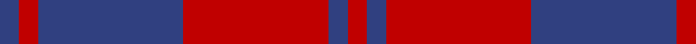
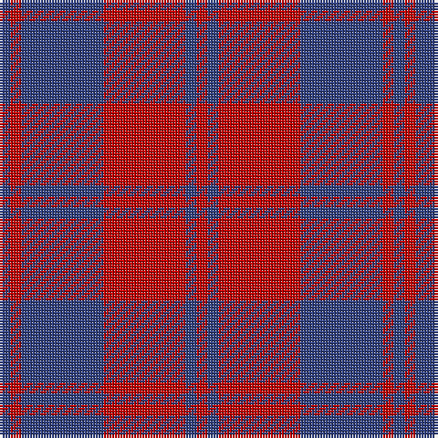

In pattern [BRBRBR](/patterns/brbrbr/).

This was sourced from weddslist.  It is a [6 stripes tartan](/stripes/stripes6/).

Original link http://www.weddslist.com/cgi-bin/tartans/pg.pl?source=sts

## Thread count
B/4 R4 B30 R30 B4 R/4

## Palette
Each colour and its ΔE from the base-6 reference it is a variant of.

| Colour | Shade | Base | ΔE (OKLab) |
|---|---|---|---|
| B | <code style="background-color:#304080;">#304080</code> `#304080` | B <code style="background-color:#2A418A;">#2A418A</code> | 0.02 |
| R | <code style="background-color:#C00000;">#C00000</code> `#C00000` | R <code style="background-color:#CC0000;">#CC0000</code> | 0.03 |

# Sample pattern

## Nearest tartans

The nearest existing variants by ΔTartan distance.

1. [MacGregor](/setts/s6/b1r1b7r7b1r1~b304080-rc00000~x4/) — ΔT 0.13
1. [MacGregor of Glengyle](/setts/s6/b1r1b7r7b1r1~b2c2c80-rd05054~x4/) — ΔT 1.05
1. [Rajput](/setts/s6/b6r39b10r10b21y5~b2c2c80-r880000-ye8c000~x2/) — ΔT 1.30
1. [Hebrides #7](/setts/s10/b2r2b15r15b2r2b2r15b15r2~b2c2c80-rc80000~x2/) — ΔT 1.31
1. [British European](/setts/s6/r12b2r12b17w2r2~b2c2c80-ra00000-wfcfcfc~x2/) — ΔT 1.44
1. [British European (Corporate)](/setts/s6/r12b2r12b17w2r2~b2c2c80-ra00000-wfcfcfc~x4/) — ΔT 1.44
1. [Wotherspoon](/setts/s5/r12g8r54b45g6~b304080-g008000-rc00000/) — ΔT 1.53
1. [Auburn University (Alabama) (Corp)](/setts/s6/b3r3b24r30b3r2~b202060-rb84c00~x2/) — ΔT 1.53
1. [Wotherspoon Family Tartan Tartan Number: 741. Earliest known date: c.1941 This sett comes from the MacGregor-Hastie collection which is housed at the Scottish Tartans Society. It was obtained from Andersons in 1947, one of several designs produced between 1930 and 1950 for Septs and Families of Scottish lineage. Wotherspoons are recorded in the Lowlands of Scotland from the beginning of the 14th century. The Rev. John Witherspoon (1722-94), born in Yester, East Lothian, was President of 'Princeton University' in 1768 and took an active part in the American Revolution. See products available Copyright © Blair Urquhart, Comrie, 2015](/setts/s5/r12g8r54b45g6~b2c2c80-g006818-rc80000/) — ΔT 1.55
1. [Matthews (Personal)](/setts/s6/b3r24b3r3b25w3~b2c2c80-rc80000-we0e0e0~x2/) — ΔT 1.57

## Neighbour map

Every grey dot is one of 15726 variants placed by the first two principal components of the ΔTartan feature space (44% of its variance). Red is this tartan; blue dots are its nearest — click one to open its page.

<svg viewBox="0 0 640 380" role="img" style="max-width:100%;height:auto;border:1px solid #e0e0e0;border-radius:4px;display:block" xmlns="http://www.w3.org/2000/svg"><image href="/nn/cloud.v1.png" width="640" height="380"/><a href="/setts/s6/b1r1b7r7b1r1~b304080-rc00000~x4/"><circle cx="387.2" cy="256.4" r="4" fill="#3465a4"><title>MacGregor</title></circle></a><a href="/setts/s6/b1r1b7r7b1r1~b2c2c80-rd05054~x4/"><circle cx="363.2" cy="248.4" r="4" fill="#3465a4"><title>MacGregor of Glengyle</title></circle></a><a href="/setts/s6/b6r39b10r10b21y5~b2c2c80-r880000-ye8c000~x2/"><circle cx="348.3" cy="248.6" r="4" fill="#3465a4"><title>Rajput</title></circle></a><a href="/setts/s10/b2r2b15r15b2r2b2r15b15r2~b2c2c80-rc80000~x2/"><circle cx="357.7" cy="229.1" r="4" fill="#3465a4"><title>Hebrides #7</title></circle></a><a href="/setts/s6/r12b2r12b17w2r2~b2c2c80-ra00000-wfcfcfc~x2/"><circle cx="347.4" cy="238.4" r="4" fill="#3465a4"><title>British European</title></circle></a><a href="/setts/s6/r12b2r12b17w2r2~b2c2c80-ra00000-wfcfcfc~x4/"><circle cx="347.4" cy="238.4" r="4" fill="#3465a4"><title>British European (Corporate)</title></circle></a><a href="/setts/s5/r12g8r54b45g6~b304080-g008000-rc00000/"><circle cx="341.1" cy="242.3" r="4" fill="#3465a4"><title>Wotherspoon</title></circle></a><a href="/setts/s6/b3r3b24r30b3r2~b202060-rb84c00~x2/"><circle cx="411.0" cy="215.4" r="4" fill="#3465a4"><title>Auburn University (Alabama) (Corp)</title></circle></a><a href="/setts/s5/r12g8r54b45g6~b2c2c80-g006818-rc80000/"><circle cx="332.0" cy="238.0" r="4" fill="#3465a4"><title>Wotherspoon Family Tartan Tartan Number: 741. Earliest known date: c.1941 This sett comes from the MacGregor-Hastie collection which is housed at the Scottish Tartans Society. It was obtained from Andersons in 1947, one of several designs produced between 1930 and 1950 for Septs and Families of Scottish lineage. Wotherspoons are recorded in the Lowlands of Scotland from the beginning of the 14th century. The Rev. John Witherspoon (1722-94), born in Yester, East Lothian, was President of 'Princeton University' in 1768 and took an active part in the American Revolution. See products available Copyright © Blair Urquhart, Comrie, 2015</title></circle></a><a href="/setts/s6/b3r24b3r3b25w3~b2c2c80-rc80000-we0e0e0~x2/"><circle cx="331.0" cy="215.3" r="4" fill="#3465a4"><title>Matthews (Personal)</title></circle></a><circle cx="391.6" cy="252.2" r="5" fill="#c00000"/></svg>

ID: /setts/s6/b2r2b15r15b2r2~b304080-rc00000~x2/
