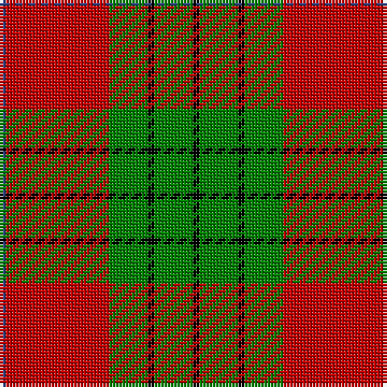

In pattern [BRGKGK](/patterns/brgkgk/).

This was sourced from weddslist.  It is a [6 stripes tartan](/stripes/stripes6/).

Original link http://www.weddslist.com/cgi-bin/tartans/pg.pl?source=sts

## Thread count
B/2 R32 G12 K2 G12 K/2

## Palette
Each colour and its ΔE from the base-6 reference it is a variant of.

| Colour | Shade | Base | ΔE (OKLab) |
|---|---|---|---|
| B | <code style="background-color:#304080;">#304080</code> `#304080` | B <code style="background-color:#2C4084;">#2C4084</code> | 0.01 |
| G | <code style="background-color:#008000;">#008000</code> `#008000` | G <code style="background-color:#006400;">#006400</code> | 0.09 |
| K | <code style="background-color:#000000;">#000000</code> `#000000` | K <code style="background-color:#000000;">#000000</code> | 0.00 |
| R | <code style="background-color:#C00000;">#C00000</code> `#C00000` | R <code style="background-color:#C80000;">#C80000</code> | 0.02 |

# Sample pattern

## Nearest tartans

The nearest existing variants by ΔTartan distance.

1. [MacAulay](/setts/s6/k4r32g12r6g16w2-g008000-k000000-rc00000-we0e0e0/) — ΔT 0.63
1. [Denny Hunting Clan Tartan Tartan Number: 518. Earliest known date: pre 2003 This tartan is remarkably similar to the Durham sett designed by Wilson's of Bannockburn around 1819. The variation in proportions may point to a deliberate modification suggested by the links between the names. See products available Copyright © Blair Urquhart, Comrie, 2015](/setts/s6/b2r32g12k2g12k2-b2c2c80-g006818-k101010-rc80000/) — ΔT 0.69
1. [MacAulay (Clan)](/setts/s6/k8r64g24r12g32w4-g006818-k101010-rc80000-we0e0e0/) — ΔT 0.79
1. [MacAulay Tartan Tartan Number: 1164. Earliest known date: 1881 This shorter version tallies with the count published by M'Intyre North in 1881 as having been given him by Logan. There are two Clans of the name associated with districts as far apart as Dumbarton and Lewis and they have no family connection with each other. They are the MacAulays of Ardencaple associated with the MacGregors and the MacAulays of Lewis who are associated with the MacLeods. This sett in its shortened form begins to resemble the MacGregor tartan. See products available Copyright © Blair Urquhart, Comrie, 2015](/setts/s6/k4r32g12r6g16w2-g006818-k101010-rc80000-we0e0e0/) — ΔT 0.79
1. [MacAulay](/setts/s6/k2r16g6r3g8w1-g004c00-k000000-rc80000-wd0d0d0/) — ΔT 0.82
1. [MacAulay](/setts/s6/k4r32g12r6g16w2-g006818-k101010-rc80000-wc0c0c0/) — ΔT 0.86
1. [Wilson's, No 5](/setts/s6/r64b10g34r8g10w4-b5480b0-g008000-rc00000-we0e0e0/) — ΔT 0.89
1. [MacGregor of Balquidder (Logan)](/setts/s6/g18r4g18r28k2w4-g006818-k101010-rc80000-we0e0e0/) — ΔT 0.99
1. [McInally (Name)](/setts/s7/r6g32r8k12r56g4y6-g006818-k101010-rc80000-yd09800/) — ΔT 1.02
1. [MacNab 6](/setts/s7/g56r14ra14g28ra14r96k8-g008000-k000000-rc00000-ra802040/) — ΔT 1.03

## Neighbour map

Every grey dot is one of 15726 variants placed by the first two principal components of the ΔTartan feature space (44% of its variance). Red is this tartan; blue dots are its nearest — click one to open its page.

<svg viewBox="0 0 640 380" role="img" style="max-width:100%;height:auto;border:1px solid #e0e0e0;border-radius:4px;display:block" xmlns="http://www.w3.org/2000/svg"><image href="/nn/cloud.v1.png" width="640" height="380"/><a href="/setts/s6/k4r32g12r6g16w2-g008000-k000000-rc00000-we0e0e0/"><circle cx="315.4" cy="182.4" r="4" fill="#3465a4"><title>MacAulay</title></circle></a><a href="/setts/s6/b2r32g12k2g12k2-b2c2c80-g006818-k101010-rc80000/"><circle cx="342.8" cy="177.1" r="4" fill="#3465a4"><title>Denny Hunting Clan Tartan Tartan Number: 518. Earliest known date: pre 2003 This tartan is remarkably similar to the Durham sett designed by Wilson's of Bannockburn around 1819. The variation in proportions may point to a deliberate modification suggested by the links between the names. See products available Copyright © Blair Urquhart, Comrie, 2015</title></circle></a><a href="/setts/s6/k8r64g24r12g32w4-g006818-k101010-rc80000-we0e0e0/"><circle cx="331.9" cy="188.0" r="4" fill="#3465a4"><title>MacAulay (Clan)</title></circle></a><a href="/setts/s6/k4r32g12r6g16w2-g006818-k101010-rc80000-we0e0e0/"><circle cx="331.9" cy="188.0" r="4" fill="#3465a4"><title>MacAulay Tartan Tartan Number: 1164. Earliest known date: 1881 This shorter version tallies with the count published by M'Intyre North in 1881 as having been given him by Logan. There are two Clans of the name associated with districts as far apart as Dumbarton and Lewis and they have no family connection with each other. They are the MacAulays of Ardencaple associated with the MacGregors and the MacAulays of Lewis who are associated with the MacLeods. This sett in its shortened form begins to resemble the MacGregor tartan. See products available Copyright © Blair Urquhart, Comrie, 2015</title></circle></a><a href="/setts/s6/k2r16g6r3g8w1-g004c00-k000000-rc80000-wd0d0d0/"><circle cx="322.4" cy="184.7" r="4" fill="#3465a4"><title>MacAulay</title></circle></a><a href="/setts/s6/k4r32g12r6g16w2-g006818-k101010-rc80000-wc0c0c0/"><circle cx="335.9" cy="189.9" r="4" fill="#3465a4"><title>MacAulay</title></circle></a><a href="/setts/s6/r64b10g34r8g10w4-b5480b0-g008000-rc00000-we0e0e0/"><circle cx="352.6" cy="177.7" r="4" fill="#3465a4"><title>Wilson's, No 5</title></circle></a><a href="/setts/s6/g18r4g18r28k2w4-g006818-k101010-rc80000-we0e0e0/"><circle cx="297.9" cy="199.1" r="4" fill="#3465a4"><title>MacGregor of Balquidder (Logan)</title></circle></a><a href="/setts/s7/r6g32r8k12r56g4y6-g006818-k101010-rc80000-yd09800/"><circle cx="345.7" cy="171.7" r="4" fill="#3465a4"><title>McInally (Name)</title></circle></a><a href="/setts/s7/g56r14ra14g28ra14r96k8-g008000-k000000-rc00000-ra802040/"><circle cx="288.9" cy="186.7" r="4" fill="#3465a4"><title>MacNab 6</title></circle></a><circle cx="323.2" cy="170.1" r="5" fill="#c00000"/></svg>

ID: /setts/s6/b2r32g12k2g12k2-b304080-g008000-k000000-rc00000/
