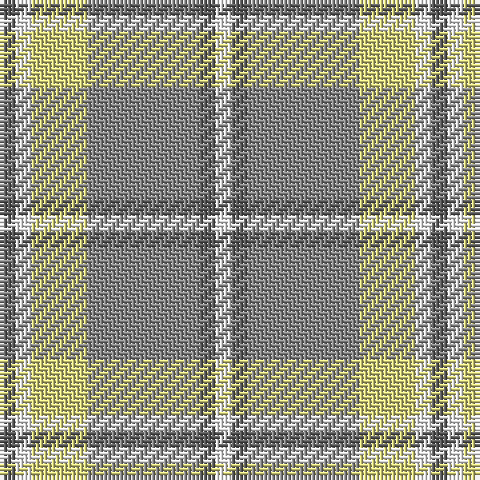

In pattern [BWYRBW](/patterns/bwyrbw/).

This was sourced from register-of-tartans.  It is a [6 stripes tartan](/stripes/stripes6/).

Original link https://www.tartanregister.gov.uk/tartanDetails.aspx?ref=462

## Attestations

This cloth appears in 2 source records; the oldest owns this page.

- 01/01/1963 — Cairngorm (register-of-tartans, [record](https://www.tartanregister.gov.uk/tartanDetails.aspx?ref=462))
- 1963 — Cairngorm (1963) (District) (tartans-authority, [record](http://www.tartansauthority.com/tartan-ferret/display/1314/))

## Thread count
N/4 W4 LG14 Na28 N4 W/4

## Palette
Each colour and its ΔE from the base-6 reference it is a variant of.

| Colour | Shade | Base | ΔE (OKLab) |
|---|---|---|---|
| LG | <code style="background-color:#D4D07C;">#D4D07C</code> `#D4D07C` | Y <code style="background-color:#F2BF00;">#F2BF00</code> | 0.08 |
| N | <code style="background-color:#5C5C5C;">#5C5C5C</code> `#5C5C5C` | B <code style="background-color:#2A418A;">#2A418A</code> | 0.15 |
| Na | <code style="background-color:#888888;">#888888</code> `#888888` | R <code style="background-color:#CC0000;">#CC0000</code> | 0.24 |
| W | <code style="background-color:#FCFCFC;">#FCFCFC</code> `#FCFCFC` | W <code style="background-color:#F7F7F7;">#F7F7F7</code> | 0.01 |

# Sample pattern

## Nearest tartans

The nearest existing variants by ΔTartan distance.

1. [Cairngorm](/setts/s6/b2w2y7wa14b2w2x2~b505050-we0e0e0-wac0c0c0-yf0c000/) — ΔT 0.88
1. [Trinity Bicycles (Corporate)](/setts/s5/g4w11g14wa30r4x2~g704400-rc80000-wb4c0c8-wac8c8bc/) — ΔT 1.10
1. [Cairngorm Trade Tartan Tartan Number: 1314. Earliest known date: 1985 A sample of this tartan was recorded by the Scottish Tartans Society during the period 1970 to 1990. See products available Copyright © Blair Urquhart, Comrie, 2015](/setts/s6/b2w2y7wa14b2w2x2~b5c5c5c-we0e0e0-wac0c0c0-ye8c000/) — ΔT 1.27
1. [Lochnagar Plaid (District)](/setts/s6/w1b1r7ba4r1w1x4~b780078-ba5c5c5c-r888888-we0e0e0/) — ΔT 1.46
1. [S.I.D.E. (Corporate)](/setts/s5/y15r9b30w3ba4x2~b5c8ca8-ba2c2c80-rc80000-we0e0e0-ye8c000/) — ΔT 1.47
1. [MacPherson Dress Blue (Dance) #2](/setts/s7/w5r3w26g21w3g8y3x2~g408060-r800028-we0e0e0-ye8c000/) — ΔT 1.53
1. [Beck-McSorley](/setts/s8/r1g1w1wa7g7w1g1w1x6~g285800-re87878-wc49cd8-wac0c0c0/) — ΔT 1.55
1. [Bagpipe Shop (Switzerland)](/setts/s5/b10w3y3g1r1x10~b646464-g4ca412-rff0000-wf8f4d0-ya4a8a8/) — ΔT 1.57
1. [MacGibboney (Name)](/setts/s6/w1g5wa5b1wa1y1x8~b5c8ca8-g006818-we0e0e0-wac0c0c0-ye8c000/) — ΔT 1.62
1. [Lochnagar Trade Tartan Tartan Number: 1771. Earliest known date: pre 2003 Colours represents the Scottish hills, the water, and the heather. See products available Copyright © Blair Urquhart, Comrie, 2015](/setts/s6/w1b1wa7r4wa1w1x4~b780078-r888888-we0e0e0-wac0c0c0/) — ΔT 1.63

## Neighbour map

Every grey dot is one of 15726 variants placed by the first two principal components of the ΔTartan feature space (44% of its variance). Red is this tartan; blue dots are its nearest — click one to open its page.

<svg viewBox="0 0 640 380" role="img" style="max-width:100%;height:auto;border:1px solid #e0e0e0;border-radius:4px;display:block" xmlns="http://www.w3.org/2000/svg"><image href="/nn/cloud.v1.png" width="640" height="380"/><a href="/setts/s6/b2w2y7wa14b2w2x2~b505050-we0e0e0-wac0c0c0-yf0c000/"><circle cx="262.2" cy="210.9" r="4" fill="#3465a4"><title>Cairngorm</title></circle></a><a href="/setts/s5/g4w11g14wa30r4x2~g704400-rc80000-wb4c0c8-wac8c8bc/"><circle cx="233.7" cy="221.8" r="4" fill="#3465a4"><title>Trinity Bicycles (Corporate)</title></circle></a><a href="/setts/s6/b2w2y7wa14b2w2x2~b5c5c5c-we0e0e0-wac0c0c0-ye8c000/"><circle cx="276.2" cy="216.8" r="4" fill="#3465a4"><title>Cairngorm Trade Tartan Tartan Number: 1314. Earliest known date: 1985 A sample of this tartan was recorded by the Scottish Tartans Society during the period 1970 to 1990. See products available Copyright © Blair Urquhart, Comrie, 2015</title></circle></a><a href="/setts/s6/w1b1r7ba4r1w1x4~b780078-ba5c5c5c-r888888-we0e0e0/"><circle cx="310.0" cy="226.8" r="4" fill="#3465a4"><title>Lochnagar Plaid (District)</title></circle></a><a href="/setts/s5/y15r9b30w3ba4x2~b5c8ca8-ba2c2c80-rc80000-we0e0e0-ye8c000/"><circle cx="229.4" cy="193.2" r="4" fill="#3465a4"><title>S.I.D.E. (Corporate)</title></circle></a><a href="/setts/s7/w5r3w26g21w3g8y3x2~g408060-r800028-we0e0e0-ye8c000/"><circle cx="261.1" cy="191.6" r="4" fill="#3465a4"><title>MacPherson Dress Blue (Dance) #2</title></circle></a><a href="/setts/s8/r1g1w1wa7g7w1g1w1x6~g285800-re87878-wc49cd8-wac0c0c0/"><circle cx="222.0" cy="185.3" r="4" fill="#3465a4"><title>Beck-McSorley</title></circle></a><a href="/setts/s5/b10w3y3g1r1x10~b646464-g4ca412-rff0000-wf8f4d0-ya4a8a8/"><circle cx="276.6" cy="188.7" r="4" fill="#3465a4"><title>Bagpipe Shop (Switzerland)</title></circle></a><a href="/setts/s6/w1g5wa5b1wa1y1x8~b5c8ca8-g006818-we0e0e0-wac0c0c0-ye8c000/"><circle cx="168.9" cy="212.3" r="4" fill="#3465a4"><title>MacGibboney (Name)</title></circle></a><a href="/setts/s6/w1b1wa7r4wa1w1x4~b780078-r888888-we0e0e0-wac0c0c0/"><circle cx="317.9" cy="224.8" r="4" fill="#3465a4"><title>Lochnagar Trade Tartan Tartan Number: 1771. Earliest known date: pre 2003 Colours represents the Scottish hills, the water, and the heather. See products available Copyright © Blair Urquhart, Comrie, 2015</title></circle></a><circle cx="250.3" cy="209.9" r="5" fill="#c00000"/></svg>

ID: /setts/s6/b2w2y7r14b2w2x2~b5c5c5c-r888888-wfcfcfc-yd4d07c/
