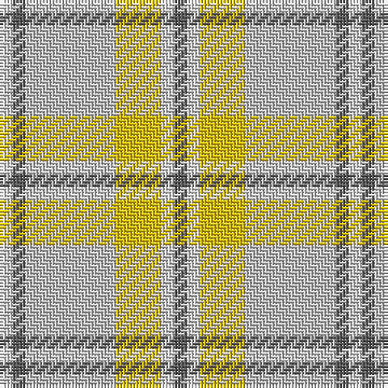

In pattern [BWYWBW](/patterns/bwywbw/).

This was sourced from house-of-tartan.  It is a [6 stripes tartan](/stripes/stripes6/).

Original link http://www.house-of-tartan.scotland.net/house/TartanViewjs.asp?colr=Def&tnam=1314

## Thread count
LN/4 N4 Na28 Y14 LN4 N/4

## Palette
Each colour and its ΔE from the base-6 reference it is a variant of.

| Colour | Shade | Base | ΔE (OKLab) |
|---|---|---|---|
| LN | <code style="background-color:#E0E0E0;">#E0E0E0</code> `#E0E0E0` | W <code style="background-color:#F7F7F7;">#F7F7F7</code> | 0.07 |
| N | <code style="background-color:#5C5C5C;">#5C5C5C</code> `#5C5C5C` | B <code style="background-color:#2A418A;">#2A418A</code> | 0.15 |
| Na | <code style="background-color:#C0C0C0;">#C0C0C0</code> `#C0C0C0` | W <code style="background-color:#F7F7F7;">#F7F7F7</code> | 0.17 |
| Y | <code style="background-color:#E8C000;">#E8C000</code> `#E8C000` | Y <code style="background-color:#F2BF00;">#F2BF00</code> | 0.02 |

# Sample pattern

## Nearest tartans

The nearest existing variants by ΔTartan distance.

1. [Cairngorm](/setts/s6/b2w2y7wa14b2w2~b505050-we0e0e0-wac0c0c0-yf0c000~x2/) — ΔT 0.52
1. [Lochnagar Trade Tartan Tartan Number: 1771. Earliest known date: pre 2003 Colours represents the Scottish hills, the water, and the heather. See products available Copyright © Blair Urquhart, Comrie, 2015](/setts/s6/w1b1wa7r4wa1w1~b780078-r888888-we0e0e0-wac0c0c0~x4/) — ΔT 1.22
1. [Cairngorm](/setts/s6/b2w2y7r14b2w2~b5c5c5c-r888888-wfcfcfc-yd4d07c~x2/) — ΔT 1.27
1. [Bannockbane Grey #2](/setts/s8/r2g2r15g2w10y15g2y2~g604000-r888888-we0e0e0-ya08858~x2/) — ΔT 1.69
1. [Clyde Trade Tartan Tartan Number: 1296. Earliest known date: pre 1992 See Strathclyde District See products available Copyright © Blair Urquhart, Comrie, 2015](/setts/s10/w4b2w18r2b5ra16r2ra2r2ra2~b5c5c5c-rc80000-ra888888-wc0c0c0~x2/) — ΔT 1.81
1. [Llama (Fashion)](/setts/s10/g2w19y2w2g3w3g3y6ya25w2~g745000-wf0e0d0-yfc8070-yab8a880~x2/) — ΔT 1.81
1. [de Meuron Dress (Family)](/setts/s7/w40b5w6y26r13w9g3~b440044-g604000-r888888-we8ccb8-ye8c000~x2/) — ΔT 1.87
1. [Lochnagar Plaid (District)](/setts/s6/w1b1r7ba4r1w1~b780078-ba5c5c5c-r888888-we0e0e0~x4/) — ΔT 1.89
1. [Irving of Glentulchan (Personal)](/setts/s6/r1y9ya9k1ya1w1~k101010-rc80000-we0e0e0-y70a880-ya80a0b4~x6/) — ΔT 1.93
1. [Bannockbane, Grey](/setts/s8/g2r2g15r2w10ra15r2ra2~g808080-r806050-ra906030-we0e0e0~x2/) — ΔT 1.93

## Neighbour map

Every grey dot is one of 15726 variants placed by the first two principal components of the ΔTartan feature space (44% of its variance). Red is this tartan; blue dots are its nearest — click one to open its page.

<svg viewBox="0 0 640 380" role="img" style="max-width:100%;height:auto;border:1px solid #e0e0e0;border-radius:4px;display:block" xmlns="http://www.w3.org/2000/svg"><image href="/nn/cloud.v1.png" width="640" height="380"/><a href="/setts/s6/b2w2y7wa14b2w2~b505050-we0e0e0-wac0c0c0-yf0c000~x2/"><circle cx="262.2" cy="210.9" r="4" fill="#3465a4"><title>Cairngorm</title></circle></a><a href="/setts/s6/w1b1wa7r4wa1w1~b780078-r888888-we0e0e0-wac0c0c0~x4/"><circle cx="317.9" cy="224.8" r="4" fill="#3465a4"><title>Lochnagar Trade Tartan Tartan Number: 1771. Earliest known date: pre 2003 Colours represents the Scottish hills, the water, and the heather. See products available Copyright © Blair Urquhart, Comrie, 2015</title></circle></a><a href="/setts/s6/b2w2y7r14b2w2~b5c5c5c-r888888-wfcfcfc-yd4d07c~x2/"><circle cx="250.3" cy="209.9" r="4" fill="#3465a4"><title>Cairngorm</title></circle></a><a href="/setts/s8/r2g2r15g2w10y15g2y2~g604000-r888888-we0e0e0-ya08858~x2/"><circle cx="213.2" cy="207.3" r="4" fill="#3465a4"><title>Bannockbane Grey #2</title></circle></a><a href="/setts/s10/w4b2w18r2b5ra16r2ra2r2ra2~b5c5c5c-rc80000-ra888888-wc0c0c0~x2/"><circle cx="262.5" cy="180.6" r="4" fill="#3465a4"><title>Clyde Trade Tartan Tartan Number: 1296. Earliest known date: pre 1992 See Strathclyde District See products available Copyright © Blair Urquhart, Comrie, 2015</title></circle></a><a href="/setts/s10/g2w19y2w2g3w3g3y6ya25w2~g745000-wf0e0d0-yfc8070-yab8a880~x2/"><circle cx="265.4" cy="151.3" r="4" fill="#3465a4"><title>Llama (Fashion)</title></circle></a><a href="/setts/s7/w40b5w6y26r13w9g3~b440044-g604000-r888888-we8ccb8-ye8c000~x2/"><circle cx="286.4" cy="165.5" r="4" fill="#3465a4"><title>de Meuron Dress (Family)</title></circle></a><a href="/setts/s6/w1b1r7ba4r1w1~b780078-ba5c5c5c-r888888-we0e0e0~x4/"><circle cx="310.0" cy="226.8" r="4" fill="#3465a4"><title>Lochnagar Plaid (District)</title></circle></a><a href="/setts/s6/r1y9ya9k1ya1w1~k101010-rc80000-we0e0e0-y70a880-ya80a0b4~x6/"><circle cx="298.1" cy="205.1" r="4" fill="#3465a4"><title>Irving of Glentulchan (Personal)</title></circle></a><a href="/setts/s8/g2r2g15r2w10ra15r2ra2~g808080-r806050-ra906030-we0e0e0~x2/"><circle cx="219.7" cy="209.8" r="4" fill="#3465a4"><title>Bannockbane, Grey</title></circle></a><circle cx="276.2" cy="216.8" r="5" fill="#c00000"/></svg>

ID: /setts/s6/b2w2y7wa14b2w2~b5c5c5c-we0e0e0-wac0c0c0-ye8c000~x2/
