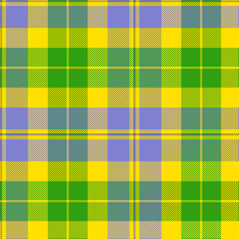

In pattern [BYBYGY](/patterns/bybygy/).

This was sourced from weddslist.  It is a [6 stripes tartan](/stripes/stripes6/).

Original link http://www.weddslist.com/cgi-bin/tartans/pg.pl?source=sts

## Thread count
Ba/4 Y8 B44 Y40 G38 Y/4

## Palette
Each colour and its ΔE from the base-6 reference it is a variant of.

| Colour | Shade | Base | ΔE (OKLab) |
|---|---|---|---|
| B | <code style="background-color:#8080D0;">#8080D0</code> `#8080D0` | B <code style="background-color:#2A418A;">#2A418A</code> | 0.24 |
| Ba | <code style="background-color:#606090;">#606090</code> `#606090` | B <code style="background-color:#2A418A;">#2A418A</code> | 0.12 |
| G | <code style="background-color:#30A010;">#30A010</code> `#30A010` | G <code style="background-color:#006100;">#006100</code> | 0.20 |
| Y | <code style="background-color:#FFE000;">#FFE000</code> `#FFE000` | Y <code style="background-color:#F2BF00;">#F2BF00</code> | 0.09 |

# Sample pattern

## Nearest tartans

The nearest existing variants by ΔTartan distance.

1. [Aviemore, Check](/setts/s8/g2r10g11y4r1w18g2r1~g008000-r806050-we0e0e0-yf0c000~x2/) — ΔT 1.22
1. [Aviemore Check (Fashion)](/setts/s8/g2ga10g11y4ga1w18g2ga1~g007c1c-ga604000-we0e0e0-ye8c000~x2/) — ΔT 1.39
1. [Birnham, Blue (Dance)](/setts/s6/k3w25g16w3b25w3~b506880-g006818-k101010-wf0e0c8~x2/) — ΔT 1.46
1. [Lake Ainslie Heritage](/setts/s7/w8wa16g18r2y4r1w4~g289c18-rc80000-w98c8e8-wafcfcfc-ye8c000~x2/) — ΔT 1.46
1. [Aviemore Check](/setts/s8/g2ga10g11y4ga1w18g2ga1~g006818-ga604000-we0e0e0-ye8c000~x2/) — ΔT 1.53
1. [MacPherson, dress green](/setts/s7/w5r3w26g20w3g8y3~g008000-rc00000-we0e0e0-yf0c000~x2/) — ΔT 1.56
1. [Ainslie, Lake (District)](/setts/s7/w8wa16g18r2y4r1w4~g289c18-rc80000-w98c8e8-wae0e0e0-ye8c000~x2/) — ΔT 1.61
1. [MacDiarmid, dress](/setts/s9/w38r12w37g32k3w4k3g32r4~g008000-k000000-rc00000-we0e0e0/) — ΔT 1.65
1. [MacIntosh, dress](/setts/s6/r3w8b4g14r4b2~b304080-g008000-rc00000-we0e0e0~x2/) — ΔT 1.68
1. [Bannock Bane M.406](/setts/s8/g4ga3g21ga2w14r22ga3r4~g005020-ga604000-rbe7832-we0e0e0~x2/) — ΔT 1.69

## Neighbour map

Every grey dot is one of 15726 variants placed by the first two principal components of the ΔTartan feature space (44% of its variance). Red is this tartan; blue dots are its nearest — click one to open its page.

<svg viewBox="0 0 640 380" role="img" style="max-width:100%;height:auto;border:1px solid #e0e0e0;border-radius:4px;display:block" xmlns="http://www.w3.org/2000/svg"><image href="/nn/cloud.v1.png" width="640" height="380"/><a href="/setts/s8/g2r10g11y4r1w18g2r1~g008000-r806050-we0e0e0-yf0c000~x2/"><circle cx="199.5" cy="152.0" r="4" fill="#3465a4"><title>Aviemore, Check</title></circle></a><a href="/setts/s8/g2ga10g11y4ga1w18g2ga1~g007c1c-ga604000-we0e0e0-ye8c000~x2/"><circle cx="187.9" cy="148.8" r="4" fill="#3465a4"><title>Aviemore Check (Fashion)</title></circle></a><a href="/setts/s6/k3w25g16w3b25w3~b506880-g006818-k101010-wf0e0c8~x2/"><circle cx="178.1" cy="201.5" r="4" fill="#3465a4"><title>Birnham, Blue (Dance)</title></circle></a><a href="/setts/s7/w8wa16g18r2y4r1w4~g289c18-rc80000-w98c8e8-wafcfcfc-ye8c000~x2/"><circle cx="153.6" cy="147.0" r="4" fill="#3465a4"><title>Lake Ainslie Heritage</title></circle></a><a href="/setts/s8/g2ga10g11y4ga1w18g2ga1~g006818-ga604000-we0e0e0-ye8c000~x2/"><circle cx="185.5" cy="148.1" r="4" fill="#3465a4"><title>Aviemore Check</title></circle></a><a href="/setts/s7/w5r3w26g20w3g8y3~g008000-rc00000-we0e0e0-yf0c000~x2/"><circle cx="250.8" cy="189.5" r="4" fill="#3465a4"><title>MacPherson, dress green</title></circle></a><a href="/setts/s7/w8wa16g18r2y4r1w4~g289c18-rc80000-w98c8e8-wae0e0e0-ye8c000~x2/"><circle cx="172.4" cy="155.9" r="4" fill="#3465a4"><title>Ainslie, Lake (District)</title></circle></a><a href="/setts/s9/w38r12w37g32k3w4k3g32r4~g008000-k000000-rc00000-we0e0e0/"><circle cx="222.5" cy="165.7" r="4" fill="#3465a4"><title>MacDiarmid, dress</title></circle></a><a href="/setts/s6/r3w8b4g14r4b2~b304080-g008000-rc00000-we0e0e0~x2/"><circle cx="148.8" cy="217.6" r="4" fill="#3465a4"><title>MacIntosh, dress</title></circle></a><a href="/setts/s8/g4ga3g21ga2w14r22ga3r4~g005020-ga604000-rbe7832-we0e0e0~x2/"><circle cx="179.0" cy="178.5" r="4" fill="#3465a4"><title>Bannock Bane M.406</title></circle></a><circle cx="183.8" cy="195.4" r="5" fill="#c00000"/></svg>

ID: /setts/s6/b2y4ba22y20g19y2~b606090-ba8080d0-g30a010-yffe000~x2/
