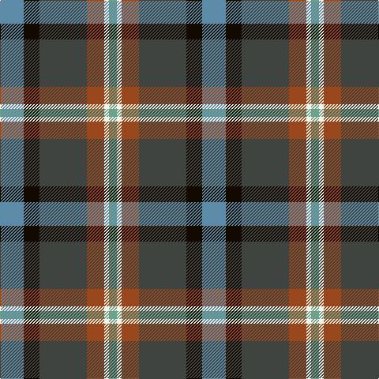

In pattern [BKBRWY](/patterns/bkbrwy/).

This was sourced from register-of-tartans.  It is a [6 stripes tartan](/stripes/stripes6/).

Original link https://www.tartanregister.gov.uk/tartanDetails.aspx?ref=10708

## Thread count
B/30 K20 N60 T22 W6 LG/10

## Palette
Each colour and its ΔE from the base-6 reference it is a variant of.

| Colour | Shade | Base | ΔE (OKLab) |
|---|---|---|---|
| B | <code style="background-color:#5C8CA8;">#5C8CA8</code> `#5C8CA8` | B <code style="background-color:#2C4084;">#2C4084</code> | 0.23 |
| K | <code style="background-color:#120A01;">#120A01</code> `#120A01` | K <code style="background-color:#000000;">#000000</code> | 0.15 |
| LG | <code style="background-color:#6AA28C;">#6AA28C</code> `#6AA28C` | Y <code style="background-color:#E8C000;">#E8C000</code> | 0.22 |
| N | <code style="background-color:#3F4441;">#3F4441</code> `#3F4441` | B <code style="background-color:#2C4084;">#2C4084</code> | 0.12 |
| T | <code style="background-color:#98481C;">#98481C</code> `#98481C` | R <code style="background-color:#C80000;">#C80000</code> | 0.11 |
| W | <code style="background-color:#F7F1E8;">#F7F1E8</code> `#F7F1E8` | W <code style="background-color:#F4F4F0;">#F4F4F0</code> | 0.01 |

# Sample pattern

## Nearest tartans

The nearest existing variants by ΔTartan distance.

1. [State Seal of Michigan (Fashion)](/setts/s6/r8b54y12ba38bb76w8-b441800-ba5c5c5c-bb1474b4-r880000-we8ccb8-ya08858/) — ΔT 0.85
1. [State Seal of Utah (Fashion)](/setts/s8/b96y50g30r14w10b14k20w20-b003c64-g604000-k101010-r880000-we8ccb8-ya08858/) — ΔT 0.98
1. [Atlantic, Ancient](/setts/s6/w6b34r32ba4g34y4-b304080-ba000050-g003000-r806050-we0e0e0-yf0c000/) — ΔT 1.00
1. [Renfrewshire District Tartan Tartan Number: 2560. Earliest known date: 1998 Designed for anyone residing in the County of Renfrewshire See products available Copyright © Blair Urquhart, Comrie, 2015](/setts/s7/r8b4ba14b40k14g20y8-b2c2c80-ba5c8ca8-g006818-k101010-ra00048-ye8c000/) — ΔT 1.07
1. [Morris of Balgonie (Personal)](/setts/s6/w4b40r6k20g40y4-b5c005c-g006818-k101010-r880000-wf8f8f8-yd09800/) — ΔT 1.09
1. [James (Personal)](/setts/s7/r8k24y4g48y4b24w8-b242470-g004828-k101010-rc80000-wb4bcc0-yb0b430/) — ΔT 1.09
1. [Coulthard (Personal)](/setts/s7/r6g18ga30b20k4b36w6-b202060-g006818-ga5c6428-k101010-rc8002c-we0e0e0/) — ΔT 1.09
1. [Allman-Jones (Personal)](/setts/s7/r6w4ra14b50k16ra30g4-b5c5c5c-g003820-k101010-rc80000-ra888888-wfcfcfc/) — ΔT 1.09
1. [Allman-Jones (Personal)](/setts/s7/r6w4g14b50k16g30ga4-b505050-g808080-ga003820-k101010-r960028-wf8f4d0/) — ΔT 1.14
1. [Thompson's Fancy Personal Tartan Tartan Number: 286. Earliest known date: pre 2003 Designed for his own use. See products available Copyright © Blair Urquhart, Comrie, 2015](/setts/s6/r12g48b12ba24k24ba6-b2c2c80-ba5c8ca8-g604000-k101010-rc80000/) — ΔT 1.15

## Neighbour map

Every grey dot is one of 15726 variants placed by the first two principal components of the ΔTartan feature space (44% of its variance). Red is this tartan; blue dots are its nearest — click one to open its page.

<svg viewBox="0 0 640 380" role="img" style="max-width:100%;height:auto;border:1px solid #e0e0e0;border-radius:4px;display:block" xmlns="http://www.w3.org/2000/svg"><image href="/nn/cloud.v1.png" width="640" height="380"/><a href="/setts/s6/r8b54y12ba38bb76w8-b441800-ba5c5c5c-bb1474b4-r880000-we8ccb8-ya08858/"><circle cx="169.7" cy="191.4" r="4" fill="#3465a4"><title>State Seal of Michigan (Fashion)</title></circle></a><a href="/setts/s8/b96y50g30r14w10b14k20w20-b003c64-g604000-k101010-r880000-we8ccb8-ya08858/"><circle cx="153.8" cy="161.1" r="4" fill="#3465a4"><title>State Seal of Utah (Fashion)</title></circle></a><a href="/setts/s6/w6b34r32ba4g34y4-b304080-ba000050-g003000-r806050-we0e0e0-yf0c000/"><circle cx="115.1" cy="194.5" r="4" fill="#3465a4"><title>Atlantic, Ancient</title></circle></a><a href="/setts/s7/r8b4ba14b40k14g20y8-b2c2c80-ba5c8ca8-g006818-k101010-ra00048-ye8c000/"><circle cx="134.7" cy="181.0" r="4" fill="#3465a4"><title>Renfrewshire District Tartan Tartan Number: 2560. Earliest known date: 1998 Designed for anyone residing in the County of Renfrewshire See products available Copyright © Blair Urquhart, Comrie, 2015</title></circle></a><a href="/setts/s6/w4b40r6k20g40y4-b5c005c-g006818-k101010-r880000-wf8f8f8-yd09800/"><circle cx="147.7" cy="176.9" r="4" fill="#3465a4"><title>Morris of Balgonie (Personal)</title></circle></a><a href="/setts/s7/r8k24y4g48y4b24w8-b242470-g004828-k101010-rc80000-wb4bcc0-yb0b430/"><circle cx="158.7" cy="166.4" r="4" fill="#3465a4"><title>James (Personal)</title></circle></a><a href="/setts/s7/r6g18ga30b20k4b36w6-b202060-g006818-ga5c6428-k101010-rc8002c-we0e0e0/"><circle cx="182.7" cy="197.7" r="4" fill="#3465a4"><title>Coulthard (Personal)</title></circle></a><a href="/setts/s7/r6w4ra14b50k16ra30g4-b5c5c5c-g003820-k101010-rc80000-ra888888-wfcfcfc/"><circle cx="202.4" cy="164.7" r="4" fill="#3465a4"><title>Allman-Jones (Personal)</title></circle></a><a href="/setts/s7/r6w4g14b50k16g30ga4-b505050-g808080-ga003820-k101010-r960028-wf8f4d0/"><circle cx="210.2" cy="169.8" r="4" fill="#3465a4"><title>Allman-Jones (Personal)</title></circle></a><a href="/setts/s6/r12g48b12ba24k24ba6-b2c2c80-ba5c8ca8-g604000-k101010-rc80000/"><circle cx="160.7" cy="222.4" r="4" fill="#3465a4"><title>Thompson's Fancy Personal Tartan Tartan Number: 286. Earliest known date: pre 2003 Designed for his own use. See products available Copyright © Blair Urquhart, Comrie, 2015</title></circle></a><circle cx="151.0" cy="189.9" r="5" fill="#c00000"/></svg>

ID: /setts/s6/b30k20ba60r22w6y10-b5c8ca8-ba3f4441-k120a01-r98481c-wf7f1e8-y6aa28c/
