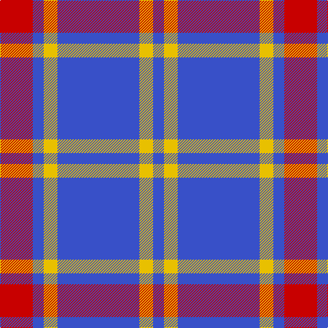

In pattern [BYBYBR](/stripes/bybybr/).

This was sourced from register-of-tartans.  It is a [6 stripe tartan](/stripes/stripes6/).

Original link https://www.tartanregister.gov.uk/tartanDetails.aspx?ref=4194

## Register references

External register numbers recorded for this tartan.

- Scottish Register of Tartans: [4194](https://www.tartanregister.gov.uk/tartanDetails.aspx?ref=4194)
- Scottish Tartans Authority (ITI): 6385

## Thread count
R/48 B16 Y20 B120 Y20 B/16

## Palette
Each colour and the base-6 reference it is a variant of.

| Colour | Shade | Base |
|---|---|---|
| B | <code style="background-color:#3850C8;">#3850C8</code> `oklch(48.8% 0.188 269.4)` <small>#3850C8</small> | B <code style="background-color:#2A418A;">#2A418A</code> |
| R | <code style="background-color:#C80000;">#C80000</code> `oklch(52.3% 0.215 29.2)` <small>#C80000</small> | R <code style="background-color:#CC0000;">#CC0000</code> |
| Y | <code style="background-color:#E8C000;">#E8C000</code> `oklch(81.9% 0.168 93.7)` <small>#E8C000</small> | Y <code style="background-color:#F2BF00;">#F2BF00</code> |

# Sample pattern

## Nearest tartans

The nearest existing variants by ΔTartan distance, with this tartan at the top so the swatches line up against it.

ΔTartan

Tartan

Sett

—

<a href="/ttd/edit/#slug=b30ly5b4r12~x4">UEFA (Glasgow)</a> <a class="nn-out" href="/setts/s6/b30ly5b4r12~x4/" title="open its dictionary page">↗</a>

1.12

<a href="/ttd/edit/#slug=b30ly5b4r12~x4">UEFA (Corporate)</a> <a class="nn-out" href="/setts/s4/b30ly5b4r12~x4/" title="open its dictionary page">↗</a>

1.18

<a href="/ttd/edit/#slug=dp30m5dp5t4dp4g12~x2">International Festival of Authors</a> <a class="nn-out" href="/setts/s6/dp30m5dp5t4dp4g12~x2/" title="open its dictionary page">↗</a>

1.32

<a href="/ttd/edit/#slug=k1w3db2w4db8w1db1~x6">Queen Margaret University (Corporate</a> <a class="nn-out" href="/setts/s7/k1w3db2w4db8w1db1~x6/" title="open its dictionary page">↗</a>

1.35

<a href="/ttd/edit/#slug=b11lo2r1lo2r1~x4">Carlisle Ancient</a> <a class="nn-out" href="/setts/s5/b11lo2r1lo2r1~x4/" title="open its dictionary page">↗</a>

1.37

<a href="/setts/s6/db60ly6db11r25~x2/">South Australian Pipes &amp; Drums (Corp</a>

1.41

<a href="/ttd/edit/#slug=db26lp11db3lp4k2~x4">Debbie Munro Memorial (Corporate)</a> <a class="nn-out" href="/setts/s5/db26lp11db3lp4k2~x4/" title="open its dictionary page">↗</a>

1.43

<a href="/ttd/edit/#slug=m13w3m1k3w1~x6">Glen App</a> <a class="nn-out" href="/setts/s5/m13w3m1k3w1~x6/" title="open its dictionary page">↗</a>

1.49

<a href="/ttd/edit/#slug=db3lo9db3lo9db20r3~x2">Latin</a> <a class="nn-out" href="/setts/s6/db3lo9db3lo9db20r3~x2/" title="open its dictionary page">↗</a>

1.51

<a href="/setts/s4/dp23w4r4~x4/">Auchmaliddie Samkoma</a>

1.51

<a href="/ttd/edit/#slug=g22dp22g3dp11w3dp4w3~x2">O'Long (Personal)</a> <a class="nn-out" href="/setts/s7/g22dp22g3dp11w3dp4w3~x2/" title="open its dictionary page">↗</a>

## Neighbour map

Every grey dot is one of 14299 variants placed by the first two principal components of the ΔTartan feature space (44% of its variance). Red is this tartan; blue dots are its nearest — click one to open its page.

<svg viewBox="0 0 640 380" role="img" style="max-width:100%;height:auto;border:1px solid #e0e0e0;border-radius:4px;display:block" xmlns="http://www.w3.org/2000/svg"><image href="/nn/cloud.v1.png" width="640" height="380"/><a href="/setts/s4/b30ly5b4r12~x4/"><circle cx="381.9" cy="250.7" r="4" fill="#3465a4"><title>UEFA (Corporate)</title></circle></a><a href="/setts/s6/dp30m5dp5t4dp4g12~x2/"><circle cx="349.1" cy="210.4" r="4" fill="#3465a4"><title>International Festival of Authors</title></circle></a><a href="/setts/s7/k1w3db2w4db8w1db1~x6/"><circle cx="280.5" cy="208.6" r="4" fill="#3465a4"><title>Queen Margaret University (Corporate</title></circle></a><a href="/setts/s5/b11lo2r1lo2r1~x4/"><circle cx="396.5" cy="209.3" r="4" fill="#3465a4"><title>Carlisle Ancient</title></circle></a><a href="/setts/s6/db60ly6db11r25~x2/"><circle cx="410.4" cy="214.8" r="4" fill="#3465a4"><title>South Australian Pipes &amp; Drums (Corp</title></circle></a><a href="/setts/s5/db26lp11db3lp4k2~x4/"><circle cx="378.3" cy="206.0" r="4" fill="#3465a4"><title>Debbie Munro Memorial (Corporate)</title></circle></a><a href="/setts/s5/m13w3m1k3w1~x6/"><circle cx="392.1" cy="184.9" r="4" fill="#3465a4"><title>Glen App</title></circle></a><a href="/setts/s6/db3lo9db3lo9db20r3~x2/"><circle cx="305.7" cy="239.7" r="4" fill="#3465a4"><title>Latin</title></circle></a><a href="/setts/s4/dp23w4r4~x4/"><circle cx="350.3" cy="236.7" r="4" fill="#3465a4"><title>Auchmaliddie Samkoma</title></circle></a><a href="/setts/s7/g22dp22g3dp11w3dp4w3~x2/"><circle cx="305.3" cy="222.8" r="4" fill="#3465a4"><title>O'Long (Personal)</title></circle></a><circle cx="346.9" cy="217.8" r="5" fill="#c00000"/></svg>

ID: /setts/s6/b30ly5b4r12~x4/
