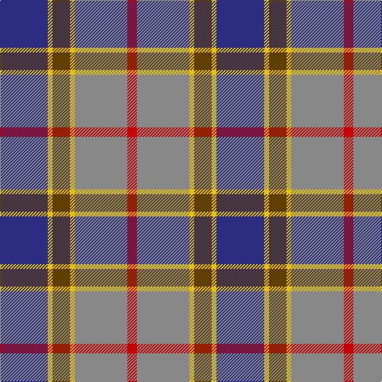

In pattern [BYGYRR](/patterns/bygyrr/).

This was sourced from house-of-tartan.  It is a [6 stripes tartan](/stripes/stripes6/).

Original link http://www.house-of-tartan.scotland.net/house/TartanViewjs.asp?colr=Def&tnam=683

## Thread count
DB/60 Y6 T22 Y6 N66 R/12

## Palette
Each colour and its ΔE from the base-6 reference it is a variant of.

| Colour | Shade | Base | ΔE (OKLab) |
|---|---|---|---|
| DB | <code style="background-color:#2C2C80;">#2C2C80</code> `#2C2C80` | B <code style="background-color:#2A418A;">#2A418A</code> | 0.06 |
| N | <code style="background-color:#888888;">#888888</code> `#888888` | R <code style="background-color:#CC0000;">#CC0000</code> | 0.24 |
| R | <code style="background-color:#C80000;">#C80000</code> `#C80000` | R <code style="background-color:#CC0000;">#CC0000</code> | 0.01 |
| T | <code style="background-color:#604000;">#604000</code> `#604000` | G <code style="background-color:#006100;">#006100</code> | 0.14 |
| Y | <code style="background-color:#E8C000;">#E8C000</code> `#E8C000` | Y <code style="background-color:#F2BF00;">#F2BF00</code> | 0.02 |

# Sample pattern

## Nearest tartans

The nearest existing variants by ΔTartan distance.

1. [Balfour](/setts/s6/b30y3g11y3ga33r6x2~b2c4084-g503c14-ga808080-rdc0000-ye8c000/) — ΔT 0.63
1. [Afternoon Tea / Black Tea](/setts/s6/r15b8g25b72ba98w15~b1c1c1c-ba646464-g789484-ra00048-wf8f8f8/) — ΔT 0.90
1. [Commonwealth Games Council (Corp.)](/setts/s6/r3k17b11r2ra20w2x2~b484848-k101010-rb468ac-ra888888-we0e0e0/) — ΔT 0.92
1. [Soroptimist International (Corporate](/setts/s6/w2k1r10k6b12y2x2~b1870a4-k101010-r9c68a4-we0e0e0-ybc8c00/) — ΔT 0.93
1. [Ritchie, Stephen James (Personal)](/setts/s7/b4ba19y2k19ba2y25w2x2~b2888c4-ba5c5c5c-k101010-wc4c4c4-ya0a0a0/) — ΔT 0.96
1. [Afternoon Tea / Darjeeling](/setts/s6/w15g98b72r25b8y15~b202060-g406054-r880000-wfcfcfc-yfccc00/) — ΔT 0.97
1. [Canine All Dogs](/setts/s6/r5b3g24ba24r4y2x2~b2888c4-ba2c2c80-g006818-rc80000-ye8c000/) — ΔT 1.04
1. [Ballantyne (Personal) STWR](/setts/s8/b34g9y3g9ga30r3ga11r5~b000064-g503c14-ga808080-r960028-yfadc00/) — ΔT 1.05
1. [Unidentified (Sock Tie)](/setts/s5/b27r9w3g16ra7x2~b003c96-g525014-rbe7832-ra960028-we0e0e0/) — ΔT 1.06
1. [Scotland 2000 Commemorative Tartan Tartan Number: 2514. Earliest known date: 1999 Strathmore Woollen Mills Millenium tartan designed by Arthur Mackie of Strathmore Woollen Co., Forfar See products available Copyright © Blair Urquhart, Comrie, 2015](/setts/s8/w4b30g6r2g6r28y2r3x2~b2888c4-g006818-r901c38-we0e0e0-ye8c000/) — ΔT 1.08

## Neighbour map

Every grey dot is one of 15726 variants placed by the first two principal components of the ΔTartan feature space (44% of its variance). Red is this tartan; blue dots are its nearest — click one to open its page.

<svg viewBox="0 0 640 380" role="img" style="max-width:100%;height:auto;border:1px solid #e0e0e0;border-radius:4px;display:block" xmlns="http://www.w3.org/2000/svg"><image href="/nn/cloud.v1.png" width="640" height="380"/><a href="/setts/s6/b30y3g11y3ga33r6x2~b2c4084-g503c14-ga808080-rdc0000-ye8c000/"><circle cx="212.2" cy="192.2" r="4" fill="#3465a4"><title>Balfour</title></circle></a><a href="/setts/s6/r15b8g25b72ba98w15~b1c1c1c-ba646464-g789484-ra00048-wf8f8f8/"><circle cx="209.3" cy="181.6" r="4" fill="#3465a4"><title>Afternoon Tea / Black Tea</title></circle></a><a href="/setts/s6/r3k17b11r2ra20w2x2~b484848-k101010-rb468ac-ra888888-we0e0e0/"><circle cx="157.4" cy="190.0" r="4" fill="#3465a4"><title>Commonwealth Games Council (Corp.)</title></circle></a><a href="/setts/s6/w2k1r10k6b12y2x2~b1870a4-k101010-r9c68a4-we0e0e0-ybc8c00/"><circle cx="161.2" cy="186.5" r="4" fill="#3465a4"><title>Soroptimist International (Corporate</title></circle></a><a href="/setts/s7/b4ba19y2k19ba2y25w2x2~b2888c4-ba5c5c5c-k101010-wc4c4c4-ya0a0a0/"><circle cx="172.8" cy="166.5" r="4" fill="#3465a4"><title>Ritchie, Stephen James (Personal)</title></circle></a><a href="/setts/s6/w15g98b72r25b8y15~b202060-g406054-r880000-wfcfcfc-yfccc00/"><circle cx="200.4" cy="179.6" r="4" fill="#3465a4"><title>Afternoon Tea / Darjeeling</title></circle></a><a href="/setts/s6/r5b3g24ba24r4y2x2~b2888c4-ba2c2c80-g006818-rc80000-ye8c000/"><circle cx="215.9" cy="185.1" r="4" fill="#3465a4"><title>Canine All Dogs</title></circle></a><a href="/setts/s8/b34g9y3g9ga30r3ga11r5~b000064-g503c14-ga808080-r960028-yfadc00/"><circle cx="184.2" cy="172.0" r="4" fill="#3465a4"><title>Ballantyne (Personal) STWR</title></circle></a><a href="/setts/s5/b27r9w3g16ra7x2~b003c96-g525014-rbe7832-ra960028-we0e0e0/"><circle cx="193.0" cy="221.7" r="4" fill="#3465a4"><title>Unidentified (Sock Tie)</title></circle></a><a href="/setts/s8/w4b30g6r2g6r28y2r3x2~b2888c4-g006818-r901c38-we0e0e0-ye8c000/"><circle cx="236.3" cy="145.6" r="4" fill="#3465a4"><title>Scotland 2000 Commemorative Tartan Tartan Number: 2514. Earliest known date: 1999 Strathmore Woollen Mills Millenium tartan designed by Arthur Mackie of Strathmore Woollen Co., Forfar See products available Copyright © Blair Urquhart, Comrie, 2015</title></circle></a><circle cx="196.8" cy="185.0" r="5" fill="#c00000"/></svg>

ID: /setts/s6/b30y3g11y3r33ra6x2~b2c2c80-g604000-r888888-rac80000-ye8c000/
