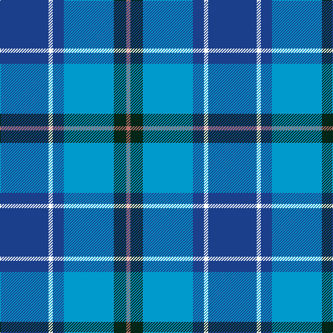

In pattern [BWBBGR](/patterns/bwbbgr/).

This was sourced from register-of-tartans.  It is a [6 stripes tartan](/stripes/stripes6/).

Original link https://www.tartanregister.gov.uk/tartanDetails.aspx?ref=10550

## Register references

External register numbers recorded for this tartan.

- Scottish Register of Tartans: [10550](https://www.tartanregister.gov.uk/tartanDetails.aspx?ref=10550)

## Thread count
Ba/70 W6 Ba16 B72 DG18 LT/6

## Palette
Each colour and its ΔE from the base-6 reference it is a variant of.

| Colour | Shade | Base | ΔE (OKLab) |
|---|---|---|---|
| B | <code style="background-color:#009ACD;">#009ACD</code> `#009ACD` | B <code style="background-color:#2A418A;">#2A418A</code> | 0.26 |
| Ba | <code style="background-color:#1B3F8B;">#1B3F8B</code> `#1B3F8B` | B <code style="background-color:#2A418A;">#2A418A</code> | 0.02 |
| DG | <code style="background-color:#002618;">#002618</code> `#002618` | G <code style="background-color:#006100;">#006100</code> | 0.21 |
| LT | <code style="background-color:#BB7168;">#BB7168</code> `#BB7168` | R <code style="background-color:#CC0000;">#CC0000</code> | 0.16 |
| W | <code style="background-color:#FFFFFF;">#FFFFFF</code> `#FFFFFF` | W <code style="background-color:#F7F7F7;">#F7F7F7</code> | 0.02 |

# Sample pattern

## Nearest tartans

The nearest existing variants by ΔTartan distance.

1. [Icelandair](/setts/s7/b3ba24k11b20w2b5y3~b2c4084-ba2888c4-k101010-wffffff-yd87c00~x2/) — ΔT 0.96
1. [Aberdeen Academy of Performing Art](/setts/s6/b4ba2bb3b24bc24w3~b2c2c80-ba780078-bb440044-bc5c8ca8-wfcfcfc~x2/) — ΔT 1.00
1. [Jamieson, Robert (Personal)](/setts/s5/w6y6b21ba32r3~b1474b4-ba003c64-rc8002c-wc0c0c0-ybc8c00~x2/) — ΔT 1.08
1. [Aberdeen Academy of Performing Arts](/setts/s6/b4ba2bb3b24bc24w3~b1c1c50-ba9058d8-bb440044-bc1870a4-wffffff~x2/) — ΔT 1.10
1. [SABA](/setts/s5/w3b2ba15bb15r2~b003c64-ba2c2c80-bb2888c4-rc80000-we0e0e0~x4/) — ΔT 1.18
1. [Rhode Island, State of](/setts/s7/b4ba28b11w2b2g14y2~b14283c-ba1474b4-g408060-we0e0e0-ye8c000~x2/) — ΔT 1.21
1. [Afternoon Tea / Earl Grey](/setts/s6/r15b98ba72y25ba8w15~b3682af-ba003c64-re87878-wf0e0c8-yc4bc68/) — ΔT 1.29
1. [Afternoon Tea / Mint Tea](/setts/s6/w15y98b72ba25b8ya15~b003c64-ba1474b4-wffffff-y48a4c0-yaf8e38c/) — ΔT 1.34
1. [Federal Bureau of Investigation](/setts/s7/b6w2b2w3b16ba26r2~b1c0070-ba1870a4-r880000-wc0c0c0~x2/) — ΔT 1.38
1. [Blalack](/setts/s10/g4y2b14y2b2y2b2y14k1w2~b2c2c80-g006818-k101010-wf8f8f8-y48a4c0~x2/) — ΔT 1.39

## Neighbour map

Every grey dot is one of 15726 variants placed by the first two principal components of the ΔTartan feature space (44% of its variance). Red is this tartan; blue dots are its nearest — click one to open its page.

<svg viewBox="0 0 640 380" role="img" style="max-width:100%;height:auto;border:1px solid #e0e0e0;border-radius:4px;display:block" xmlns="http://www.w3.org/2000/svg"><image href="/nn/cloud.v1.png" width="640" height="380"/><a href="/setts/s7/b3ba24k11b20w2b5y3~b2c4084-ba2888c4-k101010-wffffff-yd87c00~x2/"><circle cx="203.3" cy="184.1" r="4" fill="#3465a4"><title>Icelandair</title></circle></a><a href="/setts/s6/b4ba2bb3b24bc24w3~b2c2c80-ba780078-bb440044-bc5c8ca8-wfcfcfc~x2/"><circle cx="263.0" cy="181.4" r="4" fill="#3465a4"><title>Aberdeen Academy of Performing Art</title></circle></a><a href="/setts/s5/w6y6b21ba32r3~b1474b4-ba003c64-rc8002c-wc0c0c0-ybc8c00~x2/"><circle cx="238.1" cy="210.2" r="4" fill="#3465a4"><title>Jamieson, Robert (Personal)</title></circle></a><a href="/setts/s6/b4ba2bb3b24bc24w3~b1c1c50-ba9058d8-bb440044-bc1870a4-wffffff~x2/"><circle cx="261.2" cy="185.5" r="4" fill="#3465a4"><title>Aberdeen Academy of Performing Arts</title></circle></a><a href="/setts/s5/w3b2ba15bb15r2~b003c64-ba2c2c80-bb2888c4-rc80000-we0e0e0~x4/"><circle cx="199.8" cy="215.5" r="4" fill="#3465a4"><title>SABA</title></circle></a><a href="/setts/s7/b4ba28b11w2b2g14y2~b14283c-ba1474b4-g408060-we0e0e0-ye8c000~x2/"><circle cx="243.2" cy="175.8" r="4" fill="#3465a4"><title>Rhode Island, State of</title></circle></a><a href="/setts/s6/r15b98ba72y25ba8w15~b3682af-ba003c64-re87878-wf0e0c8-yc4bc68/"><circle cx="205.2" cy="183.4" r="4" fill="#3465a4"><title>Afternoon Tea / Earl Grey</title></circle></a><a href="/setts/s6/w15y98b72ba25b8ya15~b003c64-ba1474b4-wffffff-y48a4c0-yaf8e38c/"><circle cx="189.5" cy="179.5" r="4" fill="#3465a4"><title>Afternoon Tea / Mint Tea</title></circle></a><a href="/setts/s7/b6w2b2w3b16ba26r2~b1c0070-ba1870a4-r880000-wc0c0c0~x2/"><circle cx="284.9" cy="188.2" r="4" fill="#3465a4"><title>Federal Bureau of Investigation</title></circle></a><a href="/setts/s10/g4y2b14y2b2y2b2y14k1w2~b2c2c80-g006818-k101010-wf8f8f8-y48a4c0~x2/"><circle cx="231.7" cy="144.2" r="4" fill="#3465a4"><title>Blalack</title></circle></a><circle cx="244.3" cy="192.1" r="5" fill="#c00000"/></svg>

ID: /setts/s6/b35w3b8ba36g9r3~b1b3f8b-ba009acd-g002618-rbb7168-wffffff~x2/
