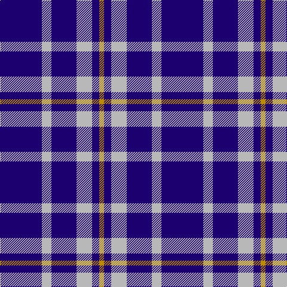

In pattern [BYBYBY](/patterns/bybyby/).

This was sourced from register-of-tartans.  It is a [6 stripes tartan](/stripes/stripes6/).

Original link https://www.tartanregister.gov.uk/tartanDetails.aspx?ref=4825

## Attestations

This cloth appears in 2 source records; the oldest owns this page.

- 01/01/2002 — Ochterlonie (register-of-tartans, [record](https://www.tartanregister.gov.uk/tartanDetails.aspx?ref=4825))
- pre 2002 — Auchterlonie (Name) (tartans-authority, [record](http://www.tartansauthority.com/tartan-ferret/display/2677/))

## Thread count
DB/70 N16 DB42 N26 DB12 DY/8

## Palette
Each colour and its ΔE from the base-6 reference it is a variant of.

| Colour | Shade | Base | ΔE (OKLab) |
|---|---|---|---|
| DB | <code style="background-color:#1C0070;">#1C0070</code> `#1C0070` | B <code style="background-color:#2A418A;">#2A418A</code> | 0.14 |
| DY | <code style="background-color:#BC8C00;">#BC8C00</code> `#BC8C00` | Y <code style="background-color:#F2BF00;">#F2BF00</code> | 0.16 |
| N | <code style="background-color:#B8B8B8;">#B8B8B8</code> `#B8B8B8` | Y <code style="background-color:#F2BF00;">#F2BF00</code> | 0.17 |

# Sample pattern

## Nearest tartans

The nearest existing variants by ΔTartan distance.

1. [Auchterlonie (Personal)](/setts/s6/b40w8b25w14b8y4~b2c2c80-wfcfcfc-ye8c000~x2/) — ΔT 1.07
1. [Dollar, Academy](/setts/s6/b9k9b9k9b42w5~b304080-k000000-we0e0e0~x2/) — ΔT 1.12
1. [Scottish Qualifications Auth. (Corp)](/setts/s7/b36y5b8w3b8w10b3~b202060-wc0c0c0-yd87c00~x2/) — ΔT 1.42
1. [Burberry Blue](/setts/s5/y3k3y3k10r1~k000034-r8c0000-yb0b0b0~x6/) — ΔT 1.46
1. [Nike ACG Lunarstorm (Fashion)](/setts/s7/b8r2b18r1b2w10b4~b2c2c80-rc80000-wf8f8f8~x2/) — ΔT 1.55
1. [Glen Moy](/setts/s5/b13w3b1r3w1~b1c0070-rc80000-wc0c0c0~x6/) — ΔT 1.59
1. [Ochterlonie](/setts/s6/b30w7b18w11b6y3~b102040-we0e0e0-yf0c000~x2/) — ΔT 1.59
1. [Dollar Academy (1930s) (Corporate)](/setts/s6/b9k9b9k9b42w5~b2c2c80-k101010-we0e0e0~x2/) — ΔT 1.61
1. [Murray Taylor](/setts/s6/b3ba3b16ba16b16w3~b202060-ba3c82af-wffffff~x2/) — ΔT 1.65
1. [Debbie Munro Memorial (Corporate)](/setts/s5/b26w11b3w4k2~b003c9c-k101010-wfc9cd4~x4/) — ΔT 1.69

## Neighbour map

Every grey dot is one of 15726 variants placed by the first two principal components of the ΔTartan feature space (44% of its variance). Red is this tartan; blue dots are its nearest — click one to open its page.

<svg viewBox="0 0 640 380" role="img" style="max-width:100%;height:auto;border:1px solid #e0e0e0;border-radius:4px;display:block" xmlns="http://www.w3.org/2000/svg"><image href="/nn/cloud.v1.png" width="640" height="380"/><a href="/setts/s6/b40w8b25w14b8y4~b2c2c80-wfcfcfc-ye8c000~x2/"><circle cx="395.4" cy="230.3" r="4" fill="#3465a4"><title>Auchterlonie (Personal)</title></circle></a><a href="/setts/s6/b9k9b9k9b42w5~b304080-k000000-we0e0e0~x2/"><circle cx="413.8" cy="239.5" r="4" fill="#3465a4"><title>Dollar, Academy</title></circle></a><a href="/setts/s7/b36y5b8w3b8w10b3~b202060-wc0c0c0-yd87c00~x2/"><circle cx="451.9" cy="207.7" r="4" fill="#3465a4"><title>Scottish Qualifications Auth. (Corp)</title></circle></a><a href="/setts/s5/y3k3y3k10r1~k000034-r8c0000-yb0b0b0~x6/"><circle cx="348.7" cy="242.4" r="4" fill="#3465a4"><title>Burberry Blue</title></circle></a><a href="/setts/s7/b8r2b18r1b2w10b4~b2c2c80-rc80000-wf8f8f8~x2/"><circle cx="407.1" cy="190.7" r="4" fill="#3465a4"><title>Nike ACG Lunarstorm (Fashion)</title></circle></a><a href="/setts/s5/b13w3b1r3w1~b1c0070-rc80000-wc0c0c0~x6/"><circle cx="393.0" cy="206.9" r="4" fill="#3465a4"><title>Glen Moy</title></circle></a><a href="/setts/s6/b30w7b18w11b6y3~b102040-we0e0e0-yf0c000~x2/"><circle cx="381.6" cy="236.0" r="4" fill="#3465a4"><title>Ochterlonie</title></circle></a><a href="/setts/s6/b9k9b9k9b42w5~b2c2c80-k101010-we0e0e0~x2/"><circle cx="446.1" cy="251.1" r="4" fill="#3465a4"><title>Dollar Academy (1930s) (Corporate)</title></circle></a><a href="/setts/s6/b3ba3b16ba16b16w3~b202060-ba3c82af-wffffff~x2/"><circle cx="320.6" cy="273.6" r="4" fill="#3465a4"><title>Murray Taylor</title></circle></a><a href="/setts/s5/b26w11b3w4k2~b003c9c-k101010-wfc9cd4~x4/"><circle cx="375.8" cy="211.2" r="4" fill="#3465a4"><title>Debbie Munro Memorial (Corporate)</title></circle></a><circle cx="385.3" cy="244.8" r="5" fill="#c00000"/></svg>

ID: /setts/s6/b35y8b21y13b6ya4~b1c0070-yb8b8b8-yabc8c00~x2/
