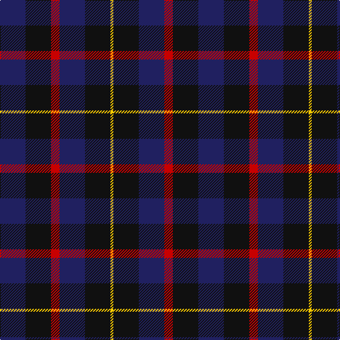

In pattern [BKRBKY](/patterns/bkrbky/).

This was sourced from tartans-authority.  It is a [6 stripes tartan](/stripes/stripes6/).

Original link http://www.tartansauthority.com/tartan-ferret/display/10718/

## Thread count
DB/36 K36 R12 DB36 K36 Y/4

## Palette
Each colour and its ΔE from the base-6 reference it is a variant of.

| Colour | Shade | Base | ΔE (OKLab) |
|---|---|---|---|
| DB | <code style="background-color:#202060;">#202060</code> `#202060` | B <code style="background-color:#2C4084;">#2C4084</code> | 0.11 |
| K | <code style="background-color:#101010;">#101010</code> `#101010` | K <code style="background-color:#000000;">#000000</code> | 0.17 |
| R | <code style="background-color:#C80000;">#C80000</code> `#C80000` | R <code style="background-color:#C80000;">#C80000</code> | 0.00 |
| Y | <code style="background-color:#FCCC00;">#FCCC00</code> `#FCCC00` | Y <code style="background-color:#E8C000;">#E8C000</code> | 0.04 |

# Sample pattern

## Nearest tartans

The nearest existing variants by ΔTartan distance.

1. [Britannia](/setts/s5/k28r8k50b60w8-b202060-k101010-rc80000-we0e0e0/) — ΔT 1.28
1. [The Harbour Town, Hilton Head](/setts/s6/k6g22k6b22k36r6-b600030-g004010-k000030-r906030/) — ΔT 1.34
1. [Old Brigade](/setts/s6/b36k36r12b36k36y4-b000080-k101010-rff0000-yffe600/) — ΔT 1.44
1. [Wilson's No 108](/setts/s8/k28g28k4g28k28b4ba28k4-b3c82af-ba5a008c-g005020-k101010/) — ΔT 1.45
1. [Belfrage](/setts/s6/b44ba10bb18g28b20y4-b000048-ba646464-bb3c0014-g004028-yc8a050/) — ΔT 1.51
1. [Wilson's No.228 #2](/setts/s6/b16k22g18k22b16ba4-b780078-ba5c8ca8-g285800-k101010/) — ΔT 1.51
1. [Swan (Name)](/setts/s6/k12b34k12b34k54w6-b2c2c80-k101010-we0e0e0/) — ΔT 1.54
1. [Abercrombie (Wilsons No 2/64)](/setts/s7/k24g24y4g24k24b24k4-b5a008c-g005020-k101010-ye8c000/) — ΔT 1.54
1. [Scottish Express International](/setts/s6/b4k16w4k16ba28k4-b9058d8-ba1c0070-k101010-wa8ace8/) — ΔT 1.54
1. [Gifford (Personal)](/setts/s7/k30r16y4b50k10b26k10-b2c2c80-k101010-rc80000-ye8c000/) — ΔT 1.55

## Neighbour map

Every grey dot is one of 15726 variants placed by the first two principal components of the ΔTartan feature space (44% of its variance). Red is this tartan; blue dots are its nearest — click one to open its page.

<svg viewBox="0 0 640 380" role="img" style="max-width:100%;height:auto;border:1px solid #e0e0e0;border-radius:4px;display:block" xmlns="http://www.w3.org/2000/svg"><image href="/nn/cloud.v1.png" width="640" height="380"/><a href="/setts/s5/k28r8k50b60w8-b202060-k101010-rc80000-we0e0e0/"><circle cx="283.6" cy="259.1" r="4" fill="#3465a4"><title>Britannia</title></circle></a><a href="/setts/s6/k6g22k6b22k36r6-b600030-g004010-k000030-r906030/"><circle cx="265.5" cy="268.9" r="4" fill="#3465a4"><title>The Harbour Town, Hilton Head</title></circle></a><a href="/setts/s6/b36k36r12b36k36y4-b000080-k101010-rff0000-yffe600/"><circle cx="231.3" cy="261.2" r="4" fill="#3465a4"><title>Old Brigade</title></circle></a><a href="/setts/s8/k28g28k4g28k28b4ba28k4-b3c82af-ba5a008c-g005020-k101010/"><circle cx="231.9" cy="259.0" r="4" fill="#3465a4"><title>Wilson's No 108</title></circle></a><a href="/setts/s6/b44ba10bb18g28b20y4-b000048-ba646464-bb3c0014-g004028-yc8a050/"><circle cx="267.1" cy="241.0" r="4" fill="#3465a4"><title>Belfrage</title></circle></a><a href="/setts/s6/b16k22g18k22b16ba4-b780078-ba5c8ca8-g285800-k101010/"><circle cx="193.5" cy="295.6" r="4" fill="#3465a4"><title>Wilson's No.228 #2</title></circle></a><a href="/setts/s6/k12b34k12b34k54w6-b2c2c80-k101010-we0e0e0/"><circle cx="330.2" cy="269.6" r="4" fill="#3465a4"><title>Swan (Name)</title></circle></a><a href="/setts/s7/k24g24y4g24k24b24k4-b5a008c-g005020-k101010-ye8c000/"><circle cx="190.5" cy="274.7" r="4" fill="#3465a4"><title>Abercrombie (Wilsons No 2/64)</title></circle></a><a href="/setts/s6/b4k16w4k16ba28k4-b9058d8-ba1c0070-k101010-wa8ace8/"><circle cx="282.8" cy="252.5" r="4" fill="#3465a4"><title>Scottish Express International</title></circle></a><a href="/setts/s7/k30r16y4b50k10b26k10-b2c2c80-k101010-rc80000-ye8c000/"><circle cx="297.3" cy="221.6" r="4" fill="#3465a4"><title>Gifford (Personal)</title></circle></a><circle cx="268.9" cy="275.1" r="5" fill="#c00000"/></svg>

ID: /setts/s6/b36k36r12b36k36y4-b202060-k101010-rc80000-yfccc00/
