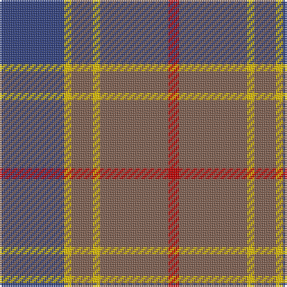

In pattern [BYRYRR](/patterns/byryrr/).

This was sourced from weddslist.  It is a [6 stripes tartan](/stripes/stripes6/).

Original link http://www.weddslist.com/cgi-bin/tartans/pg.pl?source=sts

## Thread count
B/36 Y4 LT12 Y4 LT38 R/6

## Palette
Each colour and its ΔE from the base-6 reference it is a variant of.

| Colour | Shade | Base | ΔE (OKLab) |
|---|---|---|---|
| B | <code style="background-color:#304080;">#304080</code> `#304080` | B <code style="background-color:#2C4084;">#2C4084</code> | 0.01 |
| LT | <code style="background-color:#806050;">#806050</code> `#806050` | R <code style="background-color:#C80000;">#C80000</code> | 0.17 |
| R | <code style="background-color:#C00000;">#C00000</code> `#C00000` | R <code style="background-color:#C80000;">#C80000</code> | 0.02 |
| Y | <code style="background-color:#F0C000;">#F0C000</code> `#F0C000` | Y <code style="background-color:#E8C000;">#E8C000</code> | 0.01 |

# Sample pattern

## Nearest tartans

The nearest existing variants by ΔTartan distance.

1. [Cameron Hunting](/setts/s6/b30r10b60ba64b8y6-b4c3428-ba1474b4-rc80000-yd09800/) — ΔT 1.02
1. [Cameron Hunting Brown Clan Tartan Tartan Number: 1745. Earliest known date: 1916 Nothing See products available Copyright © Blair Urquhart, Comrie, 2015](/setts/s6/g30r10g60b64g8y6-b2c2c80-g604000-rc80000-ye8c000/) — ΔT 1.06
1. [Balfour #2](/setts/s6/b36y4g12y4g38r6-b2c2c80-g604000-rc80000-ye8c000/) — ΔT 1.08
1. [Balfour (Clan)](/setts/s6/b72y8g24y8g76r12-b2c2c80-g604000-rc80000-ye8c000/) — ΔT 1.08
1. [Rob Roy (Film)](/setts/s6/g12ga4g40ga16r40g8-g708490-ga003820-r800028/) — ΔT 1.12
1. [Dama Classic](/setts/s8/g60y6g6y6g24b60k6b10-b2e2e2e-g615e57-k181818-ye2d1a3/) — ΔT 1.15
1. [Lochnagar Plaid (District)](/setts/s6/w4b4r28ba16r4w4-b780078-ba5c5c5c-r888888-we0e0e0/) — ΔT 1.16
1. [Cameron, hunting](/setts/s6/r30ra10r60b64r8y6-b304080-r806050-rac00000-yf0c000/) — ΔT 1.17
1. [Unamed Riding cloak 1745](/setts/s5/b2ba16r4g16r2-b3c82af-ba2c4084-g503c14-rdc0000/) — ΔT 1.26
1. [Devlin, Craig (Personal)](/setts/s6/g16w6b12ba22b60ba10-b5c5c5c-ba2c2c80-g006818-we0e0e0/) — ΔT 1.26

## Neighbour map

Every grey dot is one of 15726 variants placed by the first two principal components of the ΔTartan feature space (44% of its variance). Red is this tartan; blue dots are its nearest — click one to open its page.

<svg viewBox="0 0 640 380" role="img" style="max-width:100%;height:auto;border:1px solid #e0e0e0;border-radius:4px;display:block" xmlns="http://www.w3.org/2000/svg"><image href="/nn/cloud.v1.png" width="640" height="380"/><a href="/setts/s6/b30r10b60ba64b8y6-b4c3428-ba1474b4-rc80000-yd09800/"><circle cx="347.3" cy="230.0" r="4" fill="#3465a4"><title>Cameron Hunting</title></circle></a><a href="/setts/s6/g30r10g60b64g8y6-b2c2c80-g604000-rc80000-ye8c000/"><circle cx="354.6" cy="230.9" r="4" fill="#3465a4"><title>Cameron Hunting Brown Clan Tartan Tartan Number: 1745. Earliest known date: 1916 Nothing See products available Copyright © Blair Urquhart, Comrie, 2015</title></circle></a><a href="/setts/s6/b36y4g12y4g38r6-b2c2c80-g604000-rc80000-ye8c000/"><circle cx="295.9" cy="216.1" r="4" fill="#3465a4"><title>Balfour #2</title></circle></a><a href="/setts/s6/b72y8g24y8g76r12-b2c2c80-g604000-rc80000-ye8c000/"><circle cx="295.9" cy="216.1" r="4" fill="#3465a4"><title>Balfour (Clan)</title></circle></a><a href="/setts/s6/g12ga4g40ga16r40g8-g708490-ga003820-r800028/"><circle cx="313.8" cy="244.2" r="4" fill="#3465a4"><title>Rob Roy (Film)</title></circle></a><a href="/setts/s8/g60y6g6y6g24b60k6b10-b2e2e2e-g615e57-k181818-ye2d1a3/"><circle cx="333.3" cy="207.1" r="4" fill="#3465a4"><title>Dama Classic</title></circle></a><a href="/setts/s6/w4b4r28ba16r4w4-b780078-ba5c5c5c-r888888-we0e0e0/"><circle cx="309.8" cy="226.9" r="4" fill="#3465a4"><title>Lochnagar Plaid (District)</title></circle></a><a href="/setts/s6/r30ra10r60b64r8y6-b304080-r806050-rac00000-yf0c000/"><circle cx="377.7" cy="238.9" r="4" fill="#3465a4"><title>Cameron, hunting</title></circle></a><a href="/setts/s5/b2ba16r4g16r2-b3c82af-ba2c4084-g503c14-rdc0000/"><circle cx="271.9" cy="247.8" r="4" fill="#3465a4"><title>Unamed Riding cloak 1745</title></circle></a><a href="/setts/s6/g16w6b12ba22b60ba10-b5c5c5c-ba2c2c80-g006818-we0e0e0/"><circle cx="355.4" cy="236.0" r="4" fill="#3465a4"><title>Devlin, Craig (Personal)</title></circle></a><circle cx="315.8" cy="222.6" r="5" fill="#c00000"/></svg>

ID: /setts/s6/b36y4r12y4r38ra6-b304080-r806050-rac00000-yf0c000/
