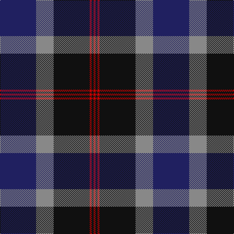

In pattern [BRKRKR](/patterns/brkrkr/).

This was sourced from house-of-tartan.  It is a [6 stripes tartan](/stripes/stripes6/).

Original link http://www.house-of-tartan.scotland.net/house/TartanViewjs.asp?colr=Def&tnam=6110

## Thread count
DB/74 N36 K74 R4 K4 R/4

## Palette
Each colour and its ΔE from the base-6 reference it is a variant of.

| Colour | Shade | Base | ΔE (OKLab) |
|---|---|---|---|
| DB | <code style="background-color:#202060;">#202060</code> `#202060` | B <code style="background-color:#2A418A;">#2A418A</code> | 0.11 |
| DBa | <code style="background-color:#2C2C80;">#2C2C80</code> `#2C2C80` | B <code style="background-color:#2A418A;">#2A418A</code> | 0.06 |
| K | <code style="background-color:#101010;">#101010</code> `#101010` | K <code style="background-color:#000000;">#000000</code> | 0.17 |
| N | <code style="background-color:#888888;">#888888</code> `#888888` | R <code style="background-color:#CC0000;">#CC0000</code> | 0.24 |
| Na | <code style="background-color:#C0C0C0;">#C0C0C0</code> `#C0C0C0` | W <code style="background-color:#F7F7F7;">#F7F7F7</code> | 0.17 |
| R | <code style="background-color:#C80000;">#C80000</code> `#C80000` | R <code style="background-color:#CC0000;">#CC0000</code> | 0.01 |

# Sample pattern

## Nearest tartans

The nearest existing variants by ΔTartan distance.

1. [Sandberg](/setts/s7/r3k12g4b12r1k2r1x4~b2c2c80-g006818-k101010-rc80000/) — ΔT 0.85
1. [Monarchs](/setts/s6/b19k4ba1k4g9ba1x4~b304080-ba600030-g006030-k000000/) — ΔT 1.06
1. [Mowat](/setts/s7/b26k1b2k18y2g16k16x2~b2c2c80-g006818-k101010-ye8c000/) — ΔT 1.13
1. [205 (Scottish) Field Hospital (Mil.)](/setts/s6/r3ra18k2g18k24rb1x2~g003820-k00002c-r888888-ra901c38-rbc80000/) — ΔT 1.15
1. [Dundas #2](/setts/s7/k4b16k12g12r1g2k2x2~b2c2c80-g006818-k101010-rc80000/) — ΔT 1.21
1. [New England (Fashion)](/setts/s6/k2w1k12g5b11r1x2~b2c2c80-g006818-k101010-rc80000-we0e0e0/) — ΔT 1.24
1. [Gammell (1978) (Personal)](/setts/s7/b3r2b22k11g22r2g3x2~b1c0070-g006818-k101010-rc80000/) — ΔT 1.25
1. [Diaspora](/setts/s6/b3g1r22k12b28w3x2~b003478-g003800-k000034-r8c0000-wc8c8c8/) — ΔT 1.26
1. [MacRobart (Personal)](/setts/s6/b30k10g10w2g15w2x2~b202060-g006818-k101010-wa8ace8/) — ΔT 1.29
1. [Brown Family Tartan Tartan Number: 432. Earliest known date: 1850 The Scott Adie collection, a book of manufacturers samples, was recently sold at auction. The book is dated 1850 and the samples are thought to represent the tartans available for purchase between 1840-50. See products available Copyright © Blair Urquhart, Comrie, 2015](/setts/s8/b6r1b2r1b2k18r8g2x4~b2c2c80-g006818-k101010-rc80000/) — ΔT 1.32

## Neighbour map

Every grey dot is one of 15726 variants placed by the first two principal components of the ΔTartan feature space (44% of its variance). Red is this tartan; blue dots are its nearest — click one to open its page.

<svg viewBox="0 0 640 380" role="img" style="max-width:100%;height:auto;border:1px solid #e0e0e0;border-radius:4px;display:block" xmlns="http://www.w3.org/2000/svg"><image href="/nn/cloud.v1.png" width="640" height="380"/><a href="/setts/s7/r3k12g4b12r1k2r1x4~b2c2c80-g006818-k101010-rc80000/"><circle cx="241.0" cy="202.8" r="4" fill="#3465a4"><title>Sandberg</title></circle></a><a href="/setts/s6/b19k4ba1k4g9ba1x4~b304080-ba600030-g006030-k000000/"><circle cx="301.9" cy="191.0" r="4" fill="#3465a4"><title>Monarchs</title></circle></a><a href="/setts/s7/b26k1b2k18y2g16k16x2~b2c2c80-g006818-k101010-ye8c000/"><circle cx="283.9" cy="194.1" r="4" fill="#3465a4"><title>Mowat</title></circle></a><a href="/setts/s6/r3ra18k2g18k24rb1x2~g003820-k00002c-r888888-ra901c38-rbc80000/"><circle cx="244.5" cy="175.6" r="4" fill="#3465a4"><title>205 (Scottish) Field Hospital (Mil.)</title></circle></a><a href="/setts/s7/k4b16k12g12r1g2k2x2~b2c2c80-g006818-k101010-rc80000/"><circle cx="245.5" cy="210.6" r="4" fill="#3465a4"><title>Dundas #2</title></circle></a><a href="/setts/s6/k2w1k12g5b11r1x2~b2c2c80-g006818-k101010-rc80000-we0e0e0/"><circle cx="235.3" cy="200.0" r="4" fill="#3465a4"><title>New England (Fashion)</title></circle></a><a href="/setts/s7/b3r2b22k11g22r2g3x2~b1c0070-g006818-k101010-rc80000/"><circle cx="228.1" cy="206.8" r="4" fill="#3465a4"><title>Gammell (1978) (Personal)</title></circle></a><a href="/setts/s6/b3g1r22k12b28w3x2~b003478-g003800-k000034-r8c0000-wc8c8c8/"><circle cx="279.5" cy="162.6" r="4" fill="#3465a4"><title>Diaspora</title></circle></a><a href="/setts/s6/b30k10g10w2g15w2x2~b202060-g006818-k101010-wa8ace8/"><circle cx="261.0" cy="213.5" r="4" fill="#3465a4"><title>MacRobart (Personal)</title></circle></a><a href="/setts/s8/b6r1b2r1b2k18r8g2x4~b2c2c80-g006818-k101010-rc80000/"><circle cx="282.7" cy="163.3" r="4" fill="#3465a4"><title>Brown Family Tartan Tartan Number: 432. Earliest known date: 1850 The Scott Adie collection, a book of manufacturers samples, was recently sold at auction. The book is dated 1850 and the samples are thought to represent the tartans available for purchase between 1840-50. See products available Copyright © Blair Urquhart, Comrie, 2015</title></circle></a><circle cx="270.0" cy="192.3" r="5" fill="#c00000"/></svg>

ID: /setts/s6/b37r18k37ra2k2ra2x2~b202060-k101010-r888888-rac80000/
