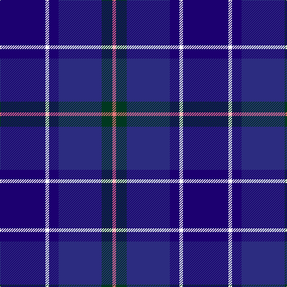

In pattern [BWBBGR](/patterns/bwbbgr/).

This was sourced from tartans-authority.  It is a [6 stripes tartan](/stripes/stripes6/).

Original link http://www.tartansauthority.com/tartan-ferret/display/10550/

## Thread count
DBa/76 W6 DBa16 DB72 DG18 LR/6

## Palette
Each colour and its ΔE from the base-6 reference it is a variant of.

| Colour | Shade | Base | ΔE (OKLab) |
|---|---|---|---|
| DB | <code style="background-color:#2C2C80;">#2C2C80</code> `#2C2C80` | B <code style="background-color:#2A418A;">#2A418A</code> | 0.06 |
| DBa | <code style="background-color:#1C0070;">#1C0070</code> `#1C0070` | B <code style="background-color:#2A418A;">#2A418A</code> | 0.14 |
| DG | <code style="background-color:#003820;">#003820</code> `#003820` | G <code style="background-color:#006100;">#006100</code> | 0.15 |
| LR | <code style="background-color:#E87878;">#E87878</code> `#E87878` | R <code style="background-color:#CC0000;">#CC0000</code> | 0.19 |
| W | <code style="background-color:#FCFCFC;">#FCFCFC</code> `#FCFCFC` | W <code style="background-color:#F7F7F7;">#F7F7F7</code> | 0.01 |

# Sample pattern

## Nearest tartans

The nearest existing variants by ΔTartan distance.

1. [Kilmarnock F.C. (Sports)](/setts/s11/b4w3b4ba3b3ba3b15bb8b11bb28y2~b2c2c80-ba780078-bb1c0070-we0e0e0-ye8c000~x2/) — ΔT 1.35
1. [Goldblatt, Joe, Jeff (Personal)](/setts/s9/b6ba4k4ba26k12b3bb42y4bb4~b780078-ba003c64-bb2c2c80-k00002c-ye8c000/) — ΔT 1.36
1. [Riley's Theme (Fashion)](/setts/s6/b20k4g5ba14w1b2~b2c2c80-ba440044-g006818-k101010-wfcfcfc~x2/) — ΔT 1.37
1. [Hutchesons' Grammar (Corporate)](/setts/s6/b8r4ba30bb30ra3bb4~b5c8ca8-ba2c2c80-bb14283c-r888888-rac80000~x2/) — ΔT 1.39
1. [Great Scot (Fashion)](/setts/s7/b12ba6b52bb41r12bc6r12~b2c2c80-ba2888c4-bb003c64-bc780078-rb468ac/) — ΔT 1.48
1. [MacFarland-Collins (Name)](/setts/s6/b40ba16k5bb16w2bc6~b2c2c80-ba1474b4-bb3850c8-bc780078-k101010-wfcfcfc~x2/) — ΔT 1.52
1. [Spirit of Alva](/setts/s10/b6ba10bb4ba12g19bb4g8k20ba50b4~b3c82af-ba3c0096-bb280032-g002814-k101010/) — ΔT 1.53
1. [St. Andrew Society](/setts/s7/b16k16ba16w3ba16k2bb3~b2c2c80-ba1c0070-bb2888c4-k101010-we0e0e0~x2/) — ΔT 1.65
1. [Loyalhanna (District?)](/setts/s8/b15k3b21k3k15b2k2b15~b00008c-k000000~x2/) — ΔT 1.65
1. [Blue Peter](/setts/s10/y3b25ba4b4ba4b4ba25g4bb4r2~b00008c-ba141e46-bb5a008c-g146400-re86000-ye0a126~x2/) — ΔT 1.67

## Neighbour map

Every grey dot is one of 15726 variants placed by the first two principal components of the ΔTartan feature space (44% of its variance). Red is this tartan; blue dots are its nearest — click one to open its page.

<svg viewBox="0 0 640 380" role="img" style="max-width:100%;height:auto;border:1px solid #e0e0e0;border-radius:4px;display:block" xmlns="http://www.w3.org/2000/svg"><image href="/nn/cloud.v1.png" width="640" height="380"/><a href="/setts/s11/b4w3b4ba3b3ba3b15bb8b11bb28y2~b2c2c80-ba780078-bb1c0070-we0e0e0-ye8c000~x2/"><circle cx="300.4" cy="178.3" r="4" fill="#3465a4"><title>Kilmarnock F.C. (Sports)</title></circle></a><a href="/setts/s9/b6ba4k4ba26k12b3bb42y4bb4~b780078-ba003c64-bb2c2c80-k00002c-ye8c000/"><circle cx="285.9" cy="179.5" r="4" fill="#3465a4"><title>Goldblatt, Joe, Jeff (Personal)</title></circle></a><a href="/setts/s6/b20k4g5ba14w1b2~b2c2c80-ba440044-g006818-k101010-wfcfcfc~x2/"><circle cx="309.0" cy="189.8" r="4" fill="#3465a4"><title>Riley's Theme (Fashion)</title></circle></a><a href="/setts/s6/b8r4ba30bb30ra3bb4~b5c8ca8-ba2c2c80-bb14283c-r888888-rac80000~x2/"><circle cx="277.2" cy="218.8" r="4" fill="#3465a4"><title>Hutchesons' Grammar (Corporate)</title></circle></a><a href="/setts/s7/b12ba6b52bb41r12bc6r12~b2c2c80-ba2888c4-bb003c64-bc780078-rb468ac/"><circle cx="283.1" cy="226.7" r="4" fill="#3465a4"><title>Great Scot (Fashion)</title></circle></a><a href="/setts/s6/b40ba16k5bb16w2bc6~b2c2c80-ba1474b4-bb3850c8-bc780078-k101010-wfcfcfc~x2/"><circle cx="275.4" cy="175.1" r="4" fill="#3465a4"><title>MacFarland-Collins (Name)</title></circle></a><a href="/setts/s10/b6ba10bb4ba12g19bb4g8k20ba50b4~b3c82af-ba3c0096-bb280032-g002814-k101010/"><circle cx="304.1" cy="182.6" r="4" fill="#3465a4"><title>Spirit of Alva</title></circle></a><a href="/setts/s7/b16k16ba16w3ba16k2bb3~b2c2c80-ba1c0070-bb2888c4-k101010-we0e0e0~x2/"><circle cx="212.3" cy="237.3" r="4" fill="#3465a4"><title>St. Andrew Society</title></circle></a><a href="/setts/s8/b15k3b21k3k15b2k2b15~b00008c-k000000~x2/"><circle cx="254.1" cy="225.3" r="4" fill="#3465a4"><title>Loyalhanna (District?)</title></circle></a><a href="/setts/s10/y3b25ba4b4ba4b4ba25g4bb4r2~b00008c-ba141e46-bb5a008c-g146400-re86000-ye0a126~x2/"><circle cx="255.8" cy="160.7" r="4" fill="#3465a4"><title>Blue Peter</title></circle></a><circle cx="304.6" cy="211.7" r="5" fill="#c00000"/></svg>

ID: /setts/s6/b38w3b8ba36g9r3~b1c0070-ba2c2c80-g003820-re87878-wfcfcfc~x2/
