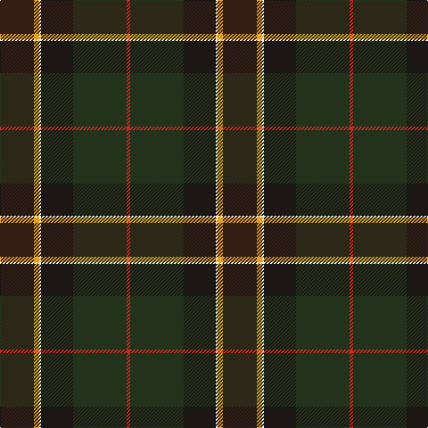

In pattern [BYWKGR](/patterns/bywkgr/).

This was sourced from register-of-tartans.  It is a [6 stripes tartan](/stripes/stripes6/).

Original link https://www.tartanregister.gov.uk/tartanDetails.aspx?ref=10240

## Thread count
Ka/38 Y6 W2 K36 Kb60 R/4

## Palette
Each colour and its ΔE from the base-6 reference it is a variant of.

| Colour | Shade | Base | ΔE (OKLab) |
|---|---|---|---|
| K | <code style="background-color:#1C1714;">#1C1714</code> `#1C1714` | K <code style="background-color:#000000;">#000000</code> | 0.21 |
| Ka | <code style="background-color:#351E14;">#351E14</code> `#351E14` | B <code style="background-color:#2C4084;">#2C4084</code> | 0.20 |
| Kb | <code style="background-color:#23321B;">#23321B</code> `#23321B` | G <code style="background-color:#006400;">#006400</code> | 0.17 |
| R | <code style="background-color:#CA2625;">#CA2625</code> `#CA2625` | R <code style="background-color:#C80000;">#C80000</code> | 0.03 |
| W | <code style="background-color:#F9F5EF;">#F9F5EF</code> `#F9F5EF` | W <code style="background-color:#F4F4F0;">#F4F4F0</code> | 0.01 |
| Y | <code style="background-color:#E0A126;">#E0A126</code> `#E0A126` | Y <code style="background-color:#E8C000;">#E8C000</code> | 0.08 |

# Sample pattern

ID: /setts/s6/b38y6w2k36g60r4-b351e14-g23321b-k1c1714-rca2625-wf9f5ef-ye0a126/
