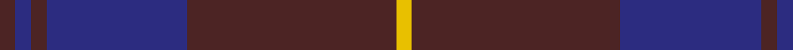

In pattern [BBBBBY](/patterns/bbbbby/).

This was sourced from house-of-tartan.  It is a [6 stripes tartan](/stripes/stripes6/).

Original link http://www.house-of-tartan.scotland.net/house/TartanViewjs.asp?colr=Def&tnam=1731

## Thread count
T/3 DB3 T3 DB27 T40 Y/3

## Palette
Each colour and its ΔE from the base-6 reference it is a variant of.

| Colour | Shade | Base | ΔE (OKLab) |
|---|---|---|---|
| DB | <code style="background-color:#2C2C80;">#2C2C80</code> `#2C2C80` | B <code style="background-color:#2A418A;">#2A418A</code> | 0.06 |
| T | <code style="background-color:#4C2424;">#4C2424</code> `#4C2424` | B <code style="background-color:#2A418A;">#2A418A</code> | 0.18 |
| Y | <code style="background-color:#E8C000;">#E8C000</code> `#E8C000` | Y <code style="background-color:#F2BF00;">#F2BF00</code> | 0.02 |

# Sample pattern

## Nearest tartans

The nearest existing variants by ΔTartan distance.

1. [Sligo, County](/setts/s6/b50ba4b12ba23y4ba4~b303070-ba441800-yd8b000~x2/) — ΔT 0.74
1. [Keeper of the Quaich](/setts/s6/g3b3g3b27g40ga3~b304080-g402000-ga908000/) — ΔT 0.97
1. [Keepers of the Quaich](/setts/s6/y3g33b24g2b2g2~b2c2c80-g604000-yd09800~x2/) — ΔT 1.14
1. [Gavin](/setts/s7/b26w2b3ba15ba26bb2ba3~b680028-ba14283c-bb4c0000-wfcfcfc~x2/) — ΔT 1.18
1. [Largan (?)](/setts/s6/b8k39b8k39b87r6~b2c2c80-k101010-rc80000/) — ΔT 1.38
1. [Harmony 11](/setts/s6/b6g2b29g29b2g6~b5a008c-g503c14~x2/) — ΔT 1.42
1. [Dege of Saville Row](/setts/s6/g11b1g3ba1b9r1~b202060-ba2c2c80-g604000-rc80000~x4/) — ΔT 1.43
1. [Hillsdale (Corporate?)](/setts/s5/b13ba6r51b51ba5~b1c1c50-ba5c5c5c-r880000~x2/) — ΔT 1.49
1. [Ardee (Corporate)](/setts/s5/b4r1b18ba18y1~b1c1c50-ba5c5c5c-rc80000-ya0a0a0~x4/) — ΔT 1.55
1. [Feniston (Personal)](/setts/s5/b30ba10b3ba30r3~b680028-ba202060-rec34c4~x2/) — ΔT 1.58

## Neighbour map

Every grey dot is one of 15726 variants placed by the first two principal components of the ΔTartan feature space (44% of its variance). Red is this tartan; blue dots are its nearest — click one to open its page.

<svg viewBox="0 0 640 380" role="img" style="max-width:100%;height:auto;border:1px solid #e0e0e0;border-radius:4px;display:block" xmlns="http://www.w3.org/2000/svg"><image href="/nn/cloud.v1.png" width="640" height="380"/><a href="/setts/s6/b50ba4b12ba23y4ba4~b303070-ba441800-yd8b000~x2/"><circle cx="471.1" cy="243.2" r="4" fill="#3465a4"><title>Sligo, County</title></circle></a><a href="/setts/s6/g3b3g3b27g40ga3~b304080-g402000-ga908000/"><circle cx="471.2" cy="240.5" r="4" fill="#3465a4"><title>Keeper of the Quaich</title></circle></a><a href="/setts/s6/y3g33b24g2b2g2~b2c2c80-g604000-yd09800~x2/"><circle cx="439.7" cy="216.7" r="4" fill="#3465a4"><title>Keepers of the Quaich</title></circle></a><a href="/setts/s7/b26w2b3ba15ba26bb2ba3~b680028-ba14283c-bb4c0000-wfcfcfc~x2/"><circle cx="411.0" cy="222.8" r="4" fill="#3465a4"><title>Gavin</title></circle></a><a href="/setts/s6/b8k39b8k39b87r6~b2c2c80-k101010-rc80000/"><circle cx="427.8" cy="248.7" r="4" fill="#3465a4"><title>Largan (?)</title></circle></a><a href="/setts/s6/b6g2b29g29b2g6~b5a008c-g503c14~x2/"><circle cx="451.4" cy="254.2" r="4" fill="#3465a4"><title>Harmony 11</title></circle></a><a href="/setts/s6/g11b1g3ba1b9r1~b202060-ba2c2c80-g604000-rc80000~x4/"><circle cx="398.6" cy="237.4" r="4" fill="#3465a4"><title>Dege of Saville Row</title></circle></a><a href="/setts/s5/b13ba6r51b51ba5~b1c1c50-ba5c5c5c-r880000~x2/"><circle cx="386.1" cy="262.7" r="4" fill="#3465a4"><title>Hillsdale (Corporate?)</title></circle></a><a href="/setts/s5/b4r1b18ba18y1~b1c1c50-ba5c5c5c-rc80000-ya0a0a0~x4/"><circle cx="398.2" cy="222.3" r="4" fill="#3465a4"><title>Ardee (Corporate)</title></circle></a><a href="/setts/s5/b30ba10b3ba30r3~b680028-ba202060-rec34c4~x2/"><circle cx="424.4" cy="277.7" r="4" fill="#3465a4"><title>Feniston (Personal)</title></circle></a><circle cx="456.7" cy="233.1" r="5" fill="#c00000"/></svg>

ID: /setts/s6/b3ba3b3ba27b40y3~b4c2424-ba2c2c80-ye8c000/
