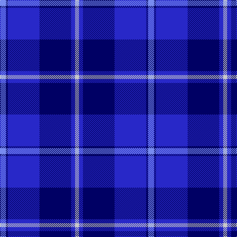

**Bands:** [BBBBBW](/stripes/bbbbbw/) · **Stripes:** [B DB DB DB DB LB](/stripes/stripes6/) B DB DB DB DB LB

This was sourced from register-of-tartans.  It is a [6 band tartan](/bands/bands6/).

Original link https://www.tartanregister.gov.uk/tartanDetails.aspx?ref=4193

## Attestations

This cloth appears in 2 source records; the oldest owns this page.

- 01/01/2002 — U.S.S. John Paul Jones #1 (register-of-tartans, [record](https://www.tartanregister.gov.uk/tartanDetails.aspx?ref=4193))
- pre 2002 — U.S.S. John Paul Jones (Military) (tartans-authority, [record](http://www.tartansauthority.com/tartan-ferret/display/4360/))

## Register references

External register numbers recorded for this tartan.

- Scottish Register of Tartans: [4193](https://www.tartanregister.gov.uk/tartanDetails.aspx?ref=4193)
- Scottish Tartans Authority (ITI): 4360

## Thread count
LP/12 DB4 B64 DB64 B8 N/8

## Palette
Each colour and its ΔE from the base-6 reference it is a variant of.

| Colour | Shade | Base | ΔE (OKLab) |
|---|---|---|---|
| B | <code style="background-color:#2828C8;">#2828C8</code> `#2828C8` | B <code style="background-color:#2A418A;">#2A418A</code> | 0.11 |
| DB | <code style="background-color:#000064;">#000064</code> `#000064` | B <code style="background-color:#2A418A;">#2A418A</code> | 0.18 |
| DR | <code style="background-color:#8C0000;">#8C0000</code> `#8C0000` | R <code style="background-color:#CC0000;">#CC0000</code> | 0.14 |
| DY | <code style="background-color:#C88C00;">#C88C00</code> `#C88C00` | Y <code style="background-color:#F2BF00;">#F2BF00</code> | 0.15 |
| G | <code style="background-color:#007800;">#007800</code> `#007800` | G <code style="background-color:#006100;">#006100</code> | 0.07 |
| K | <code style="background-color:#000000;">#000000</code> `#000000` | K <code style="background-color:#000000;">#000000</code> | 0.00 |
| LP | <code style="background-color:#788CF0;">#788CF0</code> `#788CF0` | B <code style="background-color:#2A418A;">#2A418A</code> | 0.27 |
| N | <code style="background-color:#C8C8C8;">#C8C8C8</code> `#C8C8C8` | W <code style="background-color:#F7F7F7;">#F7F7F7</code> | 0.14 |
| P | <code style="background-color:#64008C;">#64008C</code> `#64008C` | B <code style="background-color:#2A418A;">#2A418A</code> | 0.14 |

# Sample pattern

## Nearest tartans

The nearest existing variants by ΔTartan distance.

1. [Federal Bureau of Investigation](/setts/s7/db6lb2db2lb3db16b26r2~x2/) — ΔT 1.70
1. [Fujisankei Serene](/setts/s9/n1t6db4t1db16n1db4n6t1~x4/) — ΔT 1.74
1. [Callaway (Name)](/setts/s9/r4b12db36w4db4b16w3db6b3~x2/) — ΔT 1.81
1. [MacNeil - 1994 (Personal)](/setts/s5/b30k12dt12k2w3~x2/) — ΔT 1.81
1. [Ewell Castle School](/setts/s6/b4w1b18db18r1db4~x4/) — ΔT 1.82
1. [South Carolina](/setts/s10/y8db1y1db24y2db1y2db5b20w5~x2/) — ΔT 1.84
1. [Fenston/Morris (Personal)](/setts/s5/k33db8k4db35p3~x2/) — ΔT 1.85
1. [Westwood MacSky (Fashion)](/setts/s10/w2db13db13ly2db13db13w2db6db6ly1~x2/) — ΔT 1.86
1. [Gilt Edge (Corporate)](/setts/s5/db3db2t31db34w2~x2/) — ΔT 1.91
1. [Saint Margaret of Scotland Youth Group](/setts/s8/p30db5p3db33lg8k3db8w2~x2/) — ΔT 1.96

## Neighbour map

Every grey dot is one of 14313 variants placed by the first two principal components of the ΔTartan feature space (44% of its variance). Red is this tartan; blue dots are its nearest — click one to open its page.

<svg viewBox="0 0 640 380" role="img" style="max-width:100%;height:auto;border:1px solid #e0e0e0;border-radius:4px;display:block" xmlns="http://www.w3.org/2000/svg"><image href="/nn/cloud.v1.png" width="640" height="380"/><a href="/setts/s7/db6lb2db2lb3db16b26r2~x2/"><circle cx="288.5" cy="190.7" r="4" fill="#3465a4"><title>Federal Bureau of Investigation</title></circle></a><a href="/setts/s9/n1t6db4t1db16n1db4n6t1~x4/"><circle cx="369.2" cy="193.1" r="4" fill="#3465a4"><title>Fujisankei Serene</title></circle></a><a href="/setts/s9/r4b12db36w4db4b16w3db6b3~x2/"><circle cx="304.0" cy="180.7" r="4" fill="#3465a4"><title>Callaway (Name)</title></circle></a><a href="/setts/s5/b30k12dt12k2w3~x2/"><circle cx="280.2" cy="211.1" r="4" fill="#3465a4"><title>MacNeil - 1994 (Personal)</title></circle></a><a href="/setts/s6/b4w1b18db18r1db4~x4/"><circle cx="345.7" cy="204.5" r="4" fill="#3465a4"><title>Ewell Castle School</title></circle></a><a href="/setts/s10/y8db1y1db24y2db1y2db5b20w5~x2/"><circle cx="257.7" cy="140.2" r="4" fill="#3465a4"><title>South Carolina</title></circle></a><a href="/setts/s5/k33db8k4db35p3~x2/"><circle cx="346.6" cy="250.0" r="4" fill="#3465a4"><title>Fenston/Morris (Personal)</title></circle></a><a href="/setts/s10/w2db13db13ly2db13db13w2db6db6ly1~x2/"><circle cx="269.5" cy="211.9" r="4" fill="#3465a4"><title>Westwood MacSky (Fashion)</title></circle></a><a href="/setts/s5/db3db2t31db34w2~x2/"><circle cx="345.8" cy="201.9" r="4" fill="#3465a4"><title>Gilt Edge (Corporate)</title></circle></a><a href="/setts/s8/p30db5p3db33lg8k3db8w2~x2/"><circle cx="279.9" cy="157.0" r="4" fill="#3465a4"><title>Saint Margaret of Scotland Youth Group</title></circle></a><circle cx="302.5" cy="206.0" r="5" fill="#c00000"/></svg>

ID: /setts/s6/b3db1db16db16db2lb2~x4/
