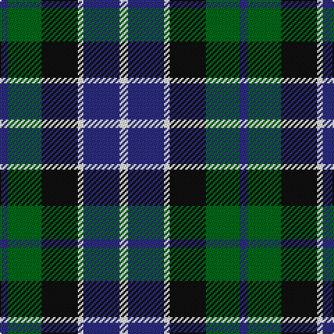

In pattern [BGKWBW](/patterns/bgkwbw/).

This was sourced from register-of-tartans.  It is a [6 stripes tartan](/stripes/stripes6/).

Original link https://www.tartanregister.gov.uk/tartanDetails.aspx?ref=1691

## Attestations

This cloth appears in 2 source records; the oldest owns this page.

- 01/01/1978 — Herd/Hurd (register-of-tartans, [record](https://www.tartanregister.gov.uk/tartanDetails.aspx?ref=1691))
- 1978 — Herd/Hurd (Name) (tartans-authority, [record](http://www.tartansauthority.com/tartan-ferret/display/170/))

## Thread count
DBa/6 G24 K26 W4 DBa26 W/6

## Palette
Each colour and its ΔE from the base-6 reference it is a variant of.

| Colour | Shade | Base | ΔE (OKLab) |
|---|---|---|---|
| B | <code style="background-color:#2474E8;">#2474E8</code> `#2474E8` | B <code style="background-color:#2A418A;">#2A418A</code> | 0.19 |
| DB | <code style="background-color:#1C0070;">#1C0070</code> `#1C0070` | B <code style="background-color:#2A418A;">#2A418A</code> | 0.14 |
| DBa | <code style="background-color:#2C2C80;">#2C2C80</code> `#2C2C80` | B <code style="background-color:#2A418A;">#2A418A</code> | 0.06 |
| G | <code style="background-color:#006818;">#006818</code> `#006818` | G <code style="background-color:#006100;">#006100</code> | 0.02 |
| K | <code style="background-color:#101010;">#101010</code> `#101010` | K <code style="background-color:#000000;">#000000</code> | 0.17 |
| N | <code style="background-color:#B8B8B8;">#B8B8B8</code> `#B8B8B8` | Y <code style="background-color:#F2BF00;">#F2BF00</code> | 0.17 |
| P | <code style="background-color:#6840FC;">#6840FC</code> `#6840FC` | B <code style="background-color:#2A418A;">#2A418A</code> | 0.20 |
| W | <code style="background-color:#FCFCFC;">#FCFCFC</code> `#FCFCFC` | W <code style="background-color:#F7F7F7;">#F7F7F7</code> | 0.01 |

# Sample pattern

## Nearest tartans

The nearest existing variants by ΔTartan distance.

1. [Edinburgh Tattoo 50th (Commemorative](/setts/s5/k1b8r6g8k1x4~b000090-g008854-k000000-rc80000/) — ΔT 0.77
1. [Unidentified No 26](/setts/s6/w4b4g22k20b20w3~b2c4084-g005020-k101010-we0e0e0/) — ΔT 0.79
1. [Unnamed, No 26](/setts/s6/w4b4g22k20b20w3~b304080-g008000-k000000-we0e0e0/) — ΔT 0.81
1. [Murray](/setts/s6/b2k2b12k8g11r2x2~b304080-g008000-k000000-rc00000/) — ΔT 0.86
1. [Campbell, The White Stripe](/setts/s6/b2k2b12k11g12w2x2~b304080-g008000-k000000-we0e0e0/) — ΔT 0.90
1. [Melville](/setts/s6/k4w2g13k13b12k2x2~b608c9c-g408060-k101010-wfcfcfc/) — ΔT 0.90
1. [Douglas Green](/setts/s5/k4w2g8b8w1~b000064-g004c00-k000000-wd0d0d0/) — ΔT 0.91
1. [Fletcher of Dunans](/setts/s7/b6k1b6k8r1g8r2x2~b304080-g008000-k000000-rc00000/) — ΔT 0.92
1. [Wellington, or Waterloo](/setts/s6/b3g6k6b4r1b1x2~b5480b0-g008000-k000000-rc00000/) — ΔT 0.93
1. [Wellington, or Waterloo](/setts/s6/b3g12k14b11r3b3x2~b5480b0-g008000-k000000-rc00000/) — ΔT 0.95

## Neighbour map

Every grey dot is one of 15726 variants placed by the first two principal components of the ΔTartan feature space (44% of its variance). Red is this tartan; blue dots are its nearest — click one to open its page.

<svg viewBox="0 0 640 380" role="img" style="max-width:100%;height:auto;border:1px solid #e0e0e0;border-radius:4px;display:block" xmlns="http://www.w3.org/2000/svg"><image href="/nn/cloud.v1.png" width="640" height="380"/><a href="/setts/s5/k1b8r6g8k1x4~b000090-g008854-k000000-rc80000/"><circle cx="139.2" cy="233.1" r="4" fill="#3465a4"><title>Edinburgh Tattoo 50th (Commemorative</title></circle></a><a href="/setts/s6/w4b4g22k20b20w3~b2c4084-g005020-k101010-we0e0e0/"><circle cx="146.4" cy="236.8" r="4" fill="#3465a4"><title>Unidentified No 26</title></circle></a><a href="/setts/s6/w4b4g22k20b20w3~b304080-g008000-k000000-we0e0e0/"><circle cx="114.0" cy="225.2" r="4" fill="#3465a4"><title>Unnamed, No 26</title></circle></a><a href="/setts/s6/b2k2b12k8g11r2x2~b304080-g008000-k000000-rc00000/"><circle cx="148.6" cy="240.0" r="4" fill="#3465a4"><title>Murray</title></circle></a><a href="/setts/s6/b2k2b12k11g12w2x2~b304080-g008000-k000000-we0e0e0/"><circle cx="125.5" cy="236.5" r="4" fill="#3465a4"><title>Campbell, The White Stripe</title></circle></a><a href="/setts/s6/k4w2g13k13b12k2x2~b608c9c-g408060-k101010-wfcfcfc/"><circle cx="163.3" cy="238.3" r="4" fill="#3465a4"><title>Melville</title></circle></a><a href="/setts/s5/k4w2g8b8w1~b000064-g004c00-k000000-wd0d0d0/"><circle cx="131.6" cy="243.1" r="4" fill="#3465a4"><title>Douglas Green</title></circle></a><a href="/setts/s7/b6k1b6k8r1g8r2x2~b304080-g008000-k000000-rc00000/"><circle cx="143.6" cy="227.6" r="4" fill="#3465a4"><title>Fletcher of Dunans</title></circle></a><a href="/setts/s6/b3g6k6b4r1b1x2~b5480b0-g008000-k000000-rc00000/"><circle cx="124.8" cy="245.1" r="4" fill="#3465a4"><title>Wellington, or Waterloo</title></circle></a><a href="/setts/s6/b3g12k14b11r3b3x2~b5480b0-g008000-k000000-rc00000/"><circle cx="111.9" cy="249.5" r="4" fill="#3465a4"><title>Wellington, or Waterloo</title></circle></a><circle cx="122.5" cy="236.2" r="5" fill="#c00000"/></svg>

ID: /setts/s6/b3g12k13w2b13w3x2~b2c2c80-g006818-k101010-wfcfcfc/
