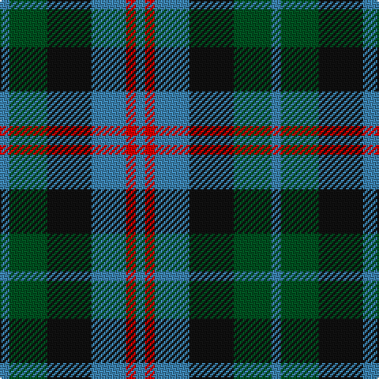

In pattern [BGKBRB](/patterns/bgkbrb/).

This was sourced from register-of-tartans.  It is a [6 stripes tartan](/stripes/stripes6/).

Original link https://www.tartanregister.gov.uk/tartanDetails.aspx?ref=4590

## Thread count
B/6 G24 K28 B22 R6 B/6

## Palette
Each colour and its ΔE from the base-6 reference it is a variant of.

| Colour | Shade | Base | ΔE (OKLab) |
|---|---|---|---|
| B | <code style="background-color:#3C82AF;">#3C82AF</code> `#3C82AF` | B <code style="background-color:#2A418A;">#2A418A</code> | 0.19 |
| G | <code style="background-color:#005020;">#005020</code> `#005020` | G <code style="background-color:#006100;">#006100</code> | 0.07 |
| K | <code style="background-color:#101010;">#101010</code> `#101010` | K <code style="background-color:#000000;">#000000</code> | 0.17 |
| R | <code style="background-color:#DC0000;">#DC0000</code> `#DC0000` | R <code style="background-color:#CC0000;">#CC0000</code> | 0.03 |

# Sample pattern

## Nearest tartans

The nearest existing variants by ΔTartan distance.

1. [Wellington or Waterloo Commemorative Tartan Tartan Number: 154. Earliest known date: pre 2003 Name derived from Wilson letters 1821 and 1824 See products available Copyright © Blair Urquhart, Comrie, 2015](/setts/s6/b3g6k6b4r1b1x2~b5c8ca8-g006818-k101010-rc80000/) — ΔT 0.68
1. [Lennie Family Tartan Tartan Number: 725. Earliest known date: 1819 Wilson's No 231. See products available Copyright © Blair Urquhart, Comrie, 2015](/setts/s6/g2b8k9ba2g10k2x2~b780078-ba5c8ca8-g006818-k101010/) — ΔT 0.72
1. [Waterloo](/setts/s6/g3ga6k6g4r1g1x2~g789484-ga003820-k101010-rc80000/) — ΔT 0.75
1. [Gunn - 1810 (Clan)](/setts/s6/r4g12k12g2b12g3x2~b1c0070-g006818-k101010-rc80000/) — ΔT 0.78
1. [Morrison Society](/setts/s6/k3g14k14g2b14r3x2~b1474b4-g006818-k101010-rc80000/) — ΔT 0.80
1. [Fletcher of Dunans](/setts/s7/b10k3b10k14r2g14r5x2~b1870a4-g006818-k101010-rc80000/) — ΔT 0.83
1. [Unidentified No 26](/setts/s6/w4b4g22k20b20w3~b2c4084-g005020-k101010-we0e0e0/) — ΔT 0.94
1. [Melville](/setts/s6/k4w2g13k13b12k2x2~b608c9c-g408060-k101010-wfcfcfc/) — ΔT 0.97
1. [Callum Beg (Fashion)](/setts/s6/g1b6k6g6r1g1x6~b2c2c80-g006818-k101010-rc80000/) — ΔT 1.02
1. [Dyce #3](/setts/s6/k2y1g6k6b6w1x4~b2c4084-g005020-k101010-we0e0e0-ye8c000/) — ΔT 1.06

## Neighbour map

Every grey dot is one of 15726 variants placed by the first two principal components of the ΔTartan feature space (44% of its variance). Red is this tartan; blue dots are its nearest — click one to open its page.

<svg viewBox="0 0 640 380" role="img" style="max-width:100%;height:auto;border:1px solid #e0e0e0;border-radius:4px;display:block" xmlns="http://www.w3.org/2000/svg"><image href="/nn/cloud.v1.png" width="640" height="380"/><a href="/setts/s6/b3g6k6b4r1b1x2~b5c8ca8-g006818-k101010-rc80000/"><circle cx="153.7" cy="253.9" r="4" fill="#3465a4"><title>Wellington or Waterloo Commemorative Tartan Tartan Number: 154. Earliest known date: pre 2003 Name derived from Wilson letters 1821 and 1824 See products available Copyright © Blair Urquhart, Comrie, 2015</title></circle></a><a href="/setts/s6/g2b8k9ba2g10k2x2~b780078-ba5c8ca8-g006818-k101010/"><circle cx="162.7" cy="259.2" r="4" fill="#3465a4"><title>Lennie Family Tartan Tartan Number: 725. Earliest known date: 1819 Wilson's No 231. See products available Copyright © Blair Urquhart, Comrie, 2015</title></circle></a><a href="/setts/s6/g3ga6k6g4r1g1x2~g789484-ga003820-k101010-rc80000/"><circle cx="154.5" cy="253.0" r="4" fill="#3465a4"><title>Waterloo</title></circle></a><a href="/setts/s6/r4g12k12g2b12g3x2~b1c0070-g006818-k101010-rc80000/"><circle cx="164.3" cy="260.3" r="4" fill="#3465a4"><title>Gunn - 1810 (Clan)</title></circle></a><a href="/setts/s6/k3g14k14g2b14r3x2~b1474b4-g006818-k101010-rc80000/"><circle cx="159.5" cy="244.1" r="4" fill="#3465a4"><title>Morrison Society</title></circle></a><a href="/setts/s7/b10k3b10k14r2g14r5x2~b1870a4-g006818-k101010-rc80000/"><circle cx="138.6" cy="247.3" r="4" fill="#3465a4"><title>Fletcher of Dunans</title></circle></a><a href="/setts/s6/w4b4g22k20b20w3~b2c4084-g005020-k101010-we0e0e0/"><circle cx="146.4" cy="236.8" r="4" fill="#3465a4"><title>Unidentified No 26</title></circle></a><a href="/setts/s6/k4w2g13k13b12k2x2~b608c9c-g408060-k101010-wfcfcfc/"><circle cx="163.3" cy="238.3" r="4" fill="#3465a4"><title>Melville</title></circle></a><a href="/setts/s6/g1b6k6g6r1g1x6~b2c2c80-g006818-k101010-rc80000/"><circle cx="194.5" cy="255.4" r="4" fill="#3465a4"><title>Callum Beg (Fashion)</title></circle></a><a href="/setts/s6/k2y1g6k6b6w1x4~b2c4084-g005020-k101010-we0e0e0-ye8c000/"><circle cx="131.9" cy="235.8" r="4" fill="#3465a4"><title>Dyce #3</title></circle></a><circle cx="146.2" cy="261.8" r="5" fill="#c00000"/></svg>

ID: /setts/s6/b3g12k14b11r3b3x2~b3c82af-g005020-k101010-rdc0000/
