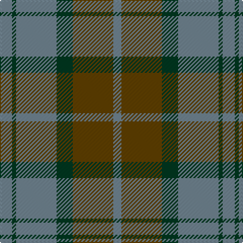

In pattern [BGBGGB](/patterns/bgbggb/).

This was sourced from tartans-authority.  It is a [6 stripes tartan](/stripes/stripes6/).

Original link http://www.tartansauthority.com/tartan-ferret/display/7026/

## Thread count
LG/12 DG4 LG40 DG16 T40 LG/8

## Palette
Each colour and its ΔE from the base-6 reference it is a variant of.

| Colour | Shade | Base | ΔE (OKLab) |
|---|---|---|---|
| DG | <code style="background-color:#003820;">#003820</code> `#003820` | G <code style="background-color:#006100;">#006100</code> | 0.15 |
| LG | <code style="background-color:#708490;">#708490</code> `#708490` | B <code style="background-color:#2A418A;">#2A418A</code> | 0.23 |
| T | <code style="background-color:#604000;">#604000</code> `#604000` | G <code style="background-color:#006100;">#006100</code> | 0.14 |

# Sample pattern

## Nearest tartans

The nearest existing variants by ΔTartan distance.

1. [Glasgow #2](/setts/s7/g25r4b24r21g25r3b4~b2c4084-g005020-rc82828~x2/) — ΔT 1.15
1. [Glasgow, Rock and Wheel](/setts/s7/g25r4b24r21g25r4b2~b304080-g008000-r802040~x2/) — ΔT 1.18
1. [Daks-Simpson (Muted Skye)](/setts/s8/b5r15g4r4g24r4g4b5~b2c2c80-g604000-r888888/) — ΔT 1.24
1. [Bethlehem, City of (District)](/setts/s5/b3r10g9ra1g3~b1c0070-g006c3c-r888888-ra880000~x4/) — ΔT 1.32
1. [Rob Roy (Film)](/setts/s6/b3g1b10g4r10b2~b708490-g003820-r800028~x4/) — ΔT 1.37
1. [Lister (Name)](/setts/s7/g8r29g8y3g8r8y3~g604000-r888888-ye8c000~x2/) — ΔT 1.42
1. [Heil, Rudiger (Personal)](/setts/s8/y6b2y2b2y18b13ba13b2~b5c5c5c-ba003c64-ybc8c00~x2/) — ΔT 1.44
1. [GS Gaelic School (School)](/setts/s7/b30r5g30r22b30r5g4~b003c64-g006818-rc80000/) — ΔT 1.45
1. [Bean of Freeport Htg (Corporate)](/setts/s7/b6r15g41r15b20g41ba6~b003c64-ba1c0070-g006438-rc8002c/) — ΔT 1.46
1. [Wilson's No.161](/setts/s4/b13r2g13r2~b5c8ca8-g006818-rc80000~x2/) — ΔT 1.47

## Neighbour map

Every grey dot is one of 15726 variants placed by the first two principal components of the ΔTartan feature space (44% of its variance). Red is this tartan; blue dots are its nearest — click one to open its page.

<svg viewBox="0 0 640 380" role="img" style="max-width:100%;height:auto;border:1px solid #e0e0e0;border-radius:4px;display:block" xmlns="http://www.w3.org/2000/svg"><image href="/nn/cloud.v1.png" width="640" height="380"/><a href="/setts/s7/g25r4b24r21g25r3b4~b2c4084-g005020-rc82828~x2/"><circle cx="280.0" cy="258.0" r="4" fill="#3465a4"><title>Glasgow #2</title></circle></a><a href="/setts/s7/g25r4b24r21g25r4b2~b304080-g008000-r802040~x2/"><circle cx="289.4" cy="241.6" r="4" fill="#3465a4"><title>Glasgow, Rock and Wheel</title></circle></a><a href="/setts/s8/b5r15g4r4g24r4g4b5~b2c2c80-g604000-r888888/"><circle cx="314.2" cy="249.5" r="4" fill="#3465a4"><title>Daks-Simpson (Muted Skye)</title></circle></a><a href="/setts/s5/b3r10g9ra1g3~b1c0070-g006c3c-r888888-ra880000~x4/"><circle cx="277.4" cy="250.3" r="4" fill="#3465a4"><title>Bethlehem, City of (District)</title></circle></a><a href="/setts/s6/b3g1b10g4r10b2~b708490-g003820-r800028~x4/"><circle cx="313.2" cy="245.4" r="4" fill="#3465a4"><title>Rob Roy (Film)</title></circle></a><a href="/setts/s7/g8r29g8y3g8r8y3~g604000-r888888-ye8c000~x2/"><circle cx="361.3" cy="231.9" r="4" fill="#3465a4"><title>Lister (Name)</title></circle></a><a href="/setts/s8/y6b2y2b2y18b13ba13b2~b5c5c5c-ba003c64-ybc8c00~x2/"><circle cx="278.0" cy="224.9" r="4" fill="#3465a4"><title>Heil, Rudiger (Personal)</title></circle></a><a href="/setts/s7/b30r5g30r22b30r5g4~b003c64-g006818-rc80000/"><circle cx="268.3" cy="259.3" r="4" fill="#3465a4"><title>GS Gaelic School (School)</title></circle></a><a href="/setts/s7/b6r15g41r15b20g41ba6~b003c64-ba1c0070-g006438-rc8002c/"><circle cx="303.3" cy="254.2" r="4" fill="#3465a4"><title>Bean of Freeport Htg (Corporate)</title></circle></a><a href="/setts/s4/b13r2g13r2~b5c8ca8-g006818-rc80000~x2/"><circle cx="287.7" cy="286.7" r="4" fill="#3465a4"><title>Wilson's No.161</title></circle></a><circle cx="333.0" cy="260.1" r="5" fill="#c00000"/></svg>

ID: /setts/s6/b3g1b10g4ga10b2~b708490-g003820-ga604000~x4/
