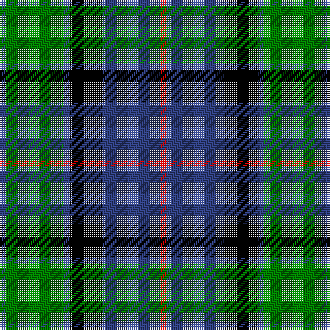

In pattern [BGBKBR](/patterns/bgbkbr/).

This was sourced from weddslist.  It is a [6 stripes tartan](/stripes/stripes6/).

Original link http://www.weddslist.com/cgi-bin/tartans/pg.pl?source=sts

## Thread count
B/3 G28 B3 K16 B28 R/3

## Palette
Each colour and its ΔE from the base-6 reference it is a variant of.

| Colour | Shade | Base | ΔE (OKLab) |
|---|---|---|---|
| B | <code style="background-color:#304080;">#304080</code> `#304080` | B <code style="background-color:#2A418A;">#2A418A</code> | 0.02 |
| G | <code style="background-color:#008000;">#008000</code> `#008000` | G <code style="background-color:#006100;">#006100</code> | 0.10 |
| K | <code style="background-color:#000000;">#000000</code> `#000000` | K <code style="background-color:#000000;">#000000</code> | 0.00 |
| R | <code style="background-color:#C00000;">#C00000</code> `#C00000` | R <code style="background-color:#CC0000;">#CC0000</code> | 0.03 |

# Sample pattern

## Nearest tartans

The nearest existing variants by ΔTartan distance.

1. [Blair](/setts/s7/b3r1b10k8g10r1g3~b304080-g008000-k000000-rc00000~x4/) — ΔT 0.75
1. [Triad Highland Games Proposed](/setts/s7/r1b8k8r1k8g8r1~b2888c4-g006818-k101010-re87878~x4/) — ΔT 0.79
1. [Lamont](/setts/s8/b10k1b1k1b2k8g10w1~b304080-g008000-k000000-we0e0e0~x2/) — ΔT 0.90
1. [Gunn](/setts/s6/r2g12k12g1b12g1~b304080-g008000-k000000-rc00000~x2/) — ΔT 0.91
1. [Michaluk (Personal)](/setts/s6/k3b4g20k20g3y3~b1474b4-g408060-k101010-ybc8c00~x4/) — ΔT 0.92
1. [Unnamed, No 59](/setts/s6/b1ba11k11g11k2b1~b5480b0-ba304080-g008000-k000000~x2/) — ΔT 0.92
1. [Graham of Menteith](/setts/s6/g18b2g4k14ba12k3~b5480b0-ba304080-g008000-k000000~x2/) — ΔT 0.92
1. [Douglas](/setts/s5/k2w2g8b8w1~b000064-g004c00-k000000-wd0d0d0/) — ΔT 0.93
1. [Reid Taylor, "House Check"](/setts/s7/b2k1r1b9k9g10k2~b304080-g008000-k000000-rc00000~x2/) — ΔT 0.94
1. [Ferguson](/setts/s6/g4b24r3k24g25k4~b304080-g008000-k000000-rc00000~x2/) — ΔT 0.97

## Neighbour map

Every grey dot is one of 15726 variants placed by the first two principal components of the ΔTartan feature space (44% of its variance). Red is this tartan; blue dots are its nearest — click one to open its page.

<svg viewBox="0 0 640 380" role="img" style="max-width:100%;height:auto;border:1px solid #e0e0e0;border-radius:4px;display:block" xmlns="http://www.w3.org/2000/svg"><image href="/nn/cloud.v1.png" width="640" height="380"/><a href="/setts/s7/b3r1b10k8g10r1g3~b304080-g008000-k000000-rc00000~x4/"><circle cx="163.6" cy="212.9" r="4" fill="#3465a4"><title>Blair</title></circle></a><a href="/setts/s7/r1b8k8r1k8g8r1~b2888c4-g006818-k101010-re87878~x4/"><circle cx="191.7" cy="225.2" r="4" fill="#3465a4"><title>Triad Highland Games Proposed</title></circle></a><a href="/setts/s8/b10k1b1k1b2k8g10w1~b304080-g008000-k000000-we0e0e0~x2/"><circle cx="180.6" cy="189.4" r="4" fill="#3465a4"><title>Lamont</title></circle></a><a href="/setts/s6/r2g12k12g1b12g1~b304080-g008000-k000000-rc00000~x2/"><circle cx="169.2" cy="206.0" r="4" fill="#3465a4"><title>Gunn</title></circle></a><a href="/setts/s6/k3b4g20k20g3y3~b1474b4-g408060-k101010-ybc8c00~x4/"><circle cx="230.8" cy="226.8" r="4" fill="#3465a4"><title>Michaluk (Personal)</title></circle></a><a href="/setts/s6/b1ba11k11g11k2b1~b5480b0-ba304080-g008000-k000000~x2/"><circle cx="163.5" cy="212.1" r="4" fill="#3465a4"><title>Unnamed, No 59</title></circle></a><a href="/setts/s6/g18b2g4k14ba12k3~b5480b0-ba304080-g008000-k000000~x2/"><circle cx="173.8" cy="228.4" r="4" fill="#3465a4"><title>Graham of Menteith</title></circle></a><a href="/setts/s5/k2w2g8b8w1~b000064-g004c00-k000000-wd0d0d0/"><circle cx="163.9" cy="233.7" r="4" fill="#3465a4"><title>Douglas</title></circle></a><a href="/setts/s7/b2k1r1b9k9g10k2~b304080-g008000-k000000-rc00000~x2/"><circle cx="166.2" cy="207.6" r="4" fill="#3465a4"><title>Reid Taylor, &quot;House Check&quot;</title></circle></a><a href="/setts/s6/g4b24r3k24g25k4~b304080-g008000-k000000-rc00000~x2/"><circle cx="151.1" cy="225.4" r="4" fill="#3465a4"><title>Ferguson</title></circle></a><circle cx="203.5" cy="215.8" r="5" fill="#c00000"/></svg>

ID: /setts/s6/b3g28b3k16b28r3~b304080-g008000-k000000-rc00000/
