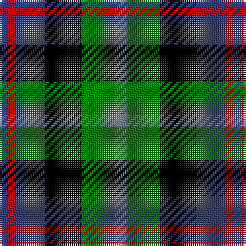

In pattern [BGKBRB](/patterns/bgkbrb/).

This was sourced from weddslist.  It is a [6 stripes tartan](/stripes/stripes6/).

Original link http://www.weddslist.com/cgi-bin/tartans/pg.pl?source=sts

## Thread count
B/4 R4 B14 K18 G16 Ba/6

## Palette
Each colour and its ΔE from the base-6 reference it is a variant of.

| Colour | Shade | Base | ΔE (OKLab) |
|---|---|---|---|
| B | <code style="background-color:#304080;">#304080</code> `#304080` | B <code style="background-color:#2A418A;">#2A418A</code> | 0.02 |
| Ba | <code style="background-color:#5480B0;">#5480B0</code> `#5480B0` | B <code style="background-color:#2A418A;">#2A418A</code> | 0.19 |
| G | <code style="background-color:#008000;">#008000</code> `#008000` | G <code style="background-color:#006100;">#006100</code> | 0.10 |
| K | <code style="background-color:#000000;">#000000</code> `#000000` | K <code style="background-color:#000000;">#000000</code> | 0.00 |
| R | <code style="background-color:#C00000;">#C00000</code> `#C00000` | R <code style="background-color:#CC0000;">#CC0000</code> | 0.03 |

# Sample pattern

## Nearest tartans

The nearest existing variants by ΔTartan distance.

1. [Casely](/setts/s6/r4g11k11g2b11ga3~b304080-g008000-ga607030-k000000-rc00000~x4/) — ΔT 0.64
1. [Birse](/setts/s6/k4g16k14y3b16r4~b304080-g008000-k000000-rc00000-yf0c000~x2/) — ΔT 0.66
1. [Royal Highland](/setts/s6/y4g17k17b17r3b3~b304080-g008000-k000000-rc00000-yb0b0b0~x2/) — ΔT 0.71
1. [Dalmeny](/setts/s5/r4g15k15b15w4~b304080-g008000-k000000-rc00000-we0e0e0~x2/) — ΔT 0.72
1. [Cooke](/setts/s7/k6b2ba12g8r5k2g3~b8080d0-ba304080-g008000-k000000-rc00020~x4/) — ΔT 0.77
1. [Mitchell Family Tartan Tartan Number: 2142. Earliest known date: 1816-20 Named in honour of General Billy Mitchell when it was adopted as the tartan of the United States Air Force pipe band. The sett is also known as Russell, Hunter and Galbraith. The earliest reference to the tartan is in the collection of the Highland Society of London where it is labelled Galbraith. See products available Copyright © Blair Urquhart, Comrie, 2015](/setts/s6/k3g8k8r2b8w2~b2c2c80-g006818-k101010-rc80000-we0e0e0~x2/) — ΔT 0.85
1. [Dalmeny (Wlison's) Family Tartan Tartan Number: 1480. Earliest known date: 1819 Restricted See products available Copyright © Blair Urquhart, Comrie, 2015](/setts/s5/r4g15k15b15w4~b2c2c80-g006818-k101010-rc80000-we0e0e0~x2/) — ΔT 0.85
1. [Russell (Clan)](/setts/s6/k3g10k10r3b8w3~b2c2c80-g006818-k101010-rc80000-wfcfcfc~x2/) — ΔT 0.86
1. [Hinnigan (Personal)](/setts/s8/r8g4b16g4k14r14b4ba3~b000064-ba3474fc-g006818-k000000-r8c6428~x2/) — ΔT 0.87
1. [MacCaughan, or MacEachain](/setts/s6/b2g6k2ba6k1r2~b800070-ba304080-g008000-k000000-rc00000~x4/) — ΔT 0.91

## Neighbour map

Every grey dot is one of 15726 variants placed by the first two principal components of the ΔTartan feature space (44% of its variance). Red is this tartan; blue dots are its nearest — click one to open its page.

<svg viewBox="0 0 640 380" role="img" style="max-width:100%;height:auto;border:1px solid #e0e0e0;border-radius:4px;display:block" xmlns="http://www.w3.org/2000/svg"><image href="/nn/cloud.v1.png" width="640" height="380"/><a href="/setts/s6/r4g11k11g2b11ga3~b304080-g008000-ga607030-k000000-rc00000~x4/"><circle cx="69.7" cy="234.9" r="4" fill="#3465a4"><title>Casely</title></circle></a><a href="/setts/s6/k4g16k14y3b16r4~b304080-g008000-k000000-rc00000-yf0c000~x2/"><circle cx="73.7" cy="229.3" r="4" fill="#3465a4"><title>Birse</title></circle></a><a href="/setts/s6/y4g17k17b17r3b3~b304080-g008000-k000000-rc00000-yb0b0b0~x2/"><circle cx="89.4" cy="223.4" r="4" fill="#3465a4"><title>Royal Highland</title></circle></a><a href="/setts/s5/r4g15k15b15w4~b304080-g008000-k000000-rc00000-we0e0e0~x2/"><circle cx="32.4" cy="258.8" r="4" fill="#3465a4"><title>Dalmeny</title></circle></a><a href="/setts/s7/k6b2ba12g8r5k2g3~b8080d0-ba304080-g008000-k000000-rc00020~x4/"><circle cx="78.2" cy="218.1" r="4" fill="#3465a4"><title>Cooke</title></circle></a><a href="/setts/s6/k3g8k8r2b8w2~b2c2c80-g006818-k101010-rc80000-we0e0e0~x2/"><circle cx="91.3" cy="253.9" r="4" fill="#3465a4"><title>Mitchell Family Tartan Tartan Number: 2142. Earliest known date: 1816-20 Named in honour of General Billy Mitchell when it was adopted as the tartan of the United States Air Force pipe band. The sett is also known as Russell, Hunter and Galbraith. The earliest reference to the tartan is in the collection of the Highland Society of London where it is labelled Galbraith. See products available Copyright © Blair Urquhart, Comrie, 2015</title></circle></a><a href="/setts/s5/r4g15k15b15w4~b2c2c80-g006818-k101010-rc80000-we0e0e0~x2/"><circle cx="55.4" cy="266.0" r="4" fill="#3465a4"><title>Dalmeny (Wlison's) Family Tartan Tartan Number: 1480. Earliest known date: 1819 Restricted See products available Copyright © Blair Urquhart, Comrie, 2015</title></circle></a><a href="/setts/s6/k3g10k10r3b8w3~b2c2c80-g006818-k101010-rc80000-wfcfcfc~x2/"><circle cx="63.9" cy="256.8" r="4" fill="#3465a4"><title>Russell (Clan)</title></circle></a><a href="/setts/s8/r8g4b16g4k14r14b4ba3~b000064-ba3474fc-g006818-k000000-r8c6428~x2/"><circle cx="80.6" cy="222.4" r="4" fill="#3465a4"><title>Hinnigan (Personal)</title></circle></a><a href="/setts/s6/b2g6k2ba6k1r2~b800070-ba304080-g008000-k000000-rc00000~x4/"><circle cx="90.9" cy="224.1" r="4" fill="#3465a4"><title>MacCaughan, or MacEachain</title></circle></a><circle cx="53.0" cy="243.8" r="5" fill="#c00000"/></svg>

ID: /setts/s6/b3g8k9ba7r2ba2~b5480b0-ba304080-g008000-k000000-rc00000~x2/
