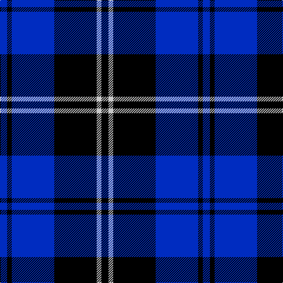

In pattern [BKBKWK](/patterns/bkbkwk/).

This was sourced from register-of-tartans.  It is a [6 stripes tartan](/stripes/stripes6/).

Original link https://www.tartanregister.gov.uk/tartanDetails.aspx?ref=4054

## Attestations

This cloth appears in 2 source records; the oldest owns this page.

- 01/01/2002 — Swan (register-of-tartans, [record](https://www.tartanregister.gov.uk/tartanDetails.aspx?ref=4054))
- pre 2002 — Swan (Name) (tartans-authority, [record](http://www.tartansauthority.com/tartan-ferret/display/5164/))

## Register references

External register numbers recorded for this tartan.

- Scottish Register of Tartans: [4054](https://www.tartanregister.gov.uk/tartanDetails.aspx?ref=4054)
- Scottish Tartans Authority (ITI): 5164

## Thread count
B/12 K8 B72 K72 N8 K/12

## Palette
Each colour and its ΔE from the base-6 reference it is a variant of.

| Colour | Shade | Base | ΔE (OKLab) |
|---|---|---|---|
| B | <code style="background-color:#002CC0;">#002CC0</code> `#002CC0` | B <code style="background-color:#2A418A;">#2A418A</code> | 0.10 |
| K | <code style="background-color:#000000;">#000000</code> `#000000` | K <code style="background-color:#000000;">#000000</code> | 0.00 |
| N | <code style="background-color:#C8C8C8;">#C8C8C8</code> `#C8C8C8` | W <code style="background-color:#F7F7F7;">#F7F7F7</code> | 0.14 |

# Sample pattern

## Nearest tartans

The nearest existing variants by ΔTartan distance.

1. [Swan 2015, Brian E (Personal)](/setts/s7/k2b9k2b9k13w1k2~b0000cd-k101010-wffffff~x4/) — ΔT 1.35
1. [Salem Scottish Dancer's Wee Bluet](/setts/s8/k10b10k60w9k7b36w6k6~b0a648c-k000028-we0e0e0/) — ΔT 1.37
1. [Swan, Brian E](/setts/s6/k6b17k6b17k27w3~b0000cd-k101010-wffffff~x2/) — ΔT 1.37
1. [Carrick High School](/setts/s7/k6y2k16b6k3ba18k2~b788cb4-ba00008c-k000000-yc88c00~x2/) — ΔT 1.42
1. [Scottish Express International](/setts/s6/b6k29ba6k29b50ka6~b304080-ba8080d0-k000000-ka000030/) — ΔT 1.61
1. [MacKay, Blue](/setts/s5/k15b4k15b28r2~b304080-k000000-rc00000~x2/) — ΔT 1.69
1. [Marchmont](/setts/s7/k1b12k12g1k12b12w1~b304080-g407050-k000000-we0e0e0~x4/) — ΔT 1.69
1. [MacKay](/setts/s6/b2k6b2k6b16r1~b304080-k000000-rc00000~x2/) — ΔT 1.74
1. [Slanj (Corporate)](/setts/s6/r4k28b3k3b25k3~b1474b4-k101010-r9c68a4~x2/) — ΔT 1.78
1. [Fenston/Morris (Personal)](/setts/s5/k33b8k4b35ba3~b0000cd-baaa00ff-k101010~x2/) — ΔT 1.79

## Neighbour map

Every grey dot is one of 15726 variants placed by the first two principal components of the ΔTartan feature space (44% of its variance). Red is this tartan; blue dots are its nearest — click one to open its page.

<svg viewBox="0 0 640 380" role="img" style="max-width:100%;height:auto;border:1px solid #e0e0e0;border-radius:4px;display:block" xmlns="http://www.w3.org/2000/svg"><image href="/nn/cloud.v1.png" width="640" height="380"/><a href="/setts/s7/k2b9k2b9k13w1k2~b0000cd-k101010-wffffff~x4/"><circle cx="318.5" cy="229.3" r="4" fill="#3465a4"><title>Swan 2015, Brian E (Personal)</title></circle></a><a href="/setts/s8/k10b10k60w9k7b36w6k6~b0a648c-k000028-we0e0e0/"><circle cx="312.3" cy="206.1" r="4" fill="#3465a4"><title>Salem Scottish Dancer's Wee Bluet</title></circle></a><a href="/setts/s6/k6b17k6b17k27w3~b0000cd-k101010-wffffff~x2/"><circle cx="287.7" cy="259.3" r="4" fill="#3465a4"><title>Swan, Brian E</title></circle></a><a href="/setts/s7/k6y2k16b6k3ba18k2~b788cb4-ba00008c-k000000-yc88c00~x2/"><circle cx="245.9" cy="218.8" r="4" fill="#3465a4"><title>Carrick High School</title></circle></a><a href="/setts/s6/b6k29ba6k29b50ka6~b304080-ba8080d0-k000000-ka000030/"><circle cx="252.2" cy="234.8" r="4" fill="#3465a4"><title>Scottish Express International</title></circle></a><a href="/setts/s5/k15b4k15b28r2~b304080-k000000-rc00000~x2/"><circle cx="322.7" cy="247.9" r="4" fill="#3465a4"><title>MacKay, Blue</title></circle></a><a href="/setts/s7/k1b12k12g1k12b12w1~b304080-g407050-k000000-we0e0e0~x4/"><circle cx="281.2" cy="219.2" r="4" fill="#3465a4"><title>Marchmont</title></circle></a><a href="/setts/s6/b2k6b2k6b16r1~b304080-k000000-rc00000~x2/"><circle cx="386.5" cy="219.6" r="4" fill="#3465a4"><title>MacKay</title></circle></a><a href="/setts/s6/r4k28b3k3b25k3~b1474b4-k101010-r9c68a4~x2/"><circle cx="320.2" cy="228.1" r="4" fill="#3465a4"><title>Slanj (Corporate)</title></circle></a><a href="/setts/s5/k33b8k4b35ba3~b0000cd-baaa00ff-k101010~x2/"><circle cx="342.9" cy="248.9" r="4" fill="#3465a4"><title>Fenston/Morris (Personal)</title></circle></a><circle cx="294.2" cy="232.0" r="5" fill="#c00000"/></svg>

ID: /setts/s6/b3k2b18k18w2k3~b002cc0-k000000-wc8c8c8~x4/
