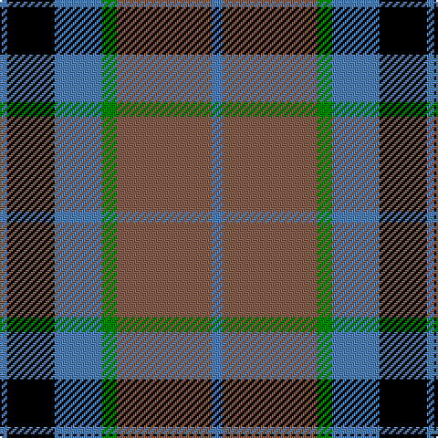

In pattern [BKBGRB](/patterns/bkbgrb/).

This was sourced from weddslist.  It is a [6 stripes tartan](/stripes/stripes6/).

Original link http://www.weddslist.com/cgi-bin/tartans/pg.pl?source=sts

## Thread count
B/4 K26 B26 G8 LT52 B/6

## Palette
Each colour and its ΔE from the base-6 reference it is a variant of.

| Colour | Shade | Base | ΔE (OKLab) |
|---|---|---|---|
| B | <code style="background-color:#5480B0;">#5480B0</code> `#5480B0` | B <code style="background-color:#2A418A;">#2A418A</code> | 0.19 |
| G | <code style="background-color:#008000;">#008000</code> `#008000` | G <code style="background-color:#006100;">#006100</code> | 0.10 |
| K | <code style="background-color:#000000;">#000000</code> `#000000` | K <code style="background-color:#000000;">#000000</code> | 0.00 |
| LT | <code style="background-color:#806050;">#806050</code> `#806050` | R <code style="background-color:#CC0000;">#CC0000</code> | 0.17 |

# Sample pattern

## Nearest tartans

The nearest existing variants by ΔTartan distance.

1. [MacTavish / Thom(p)son, hunting](/setts/s6/b4r28g6b12k12b3x2~b5480b0-g008000-k000000-r806050/) — ΔT 0.58
1. [Scottish Ballet](/setts/s6/y5g22b15ba11b5g2x2~b440044-ba780078-g288028-ye8c000/) — ΔT 0.83
1. [MacKean (Personal)](/setts/s7/r8k18r6k18b27k2w3x2~b1474b4-k101010-rc80000-wfcfcfc/) — ΔT 0.94
1. [Afternoon Tea / Darjeeling](/setts/s6/w15g98b72r25b8y15~b202060-g406054-r880000-wfcfcfc-yfccc00/) — ΔT 0.96
1. [Oceanic (Corporate?)](/setts/s7/y8k4r39k37b36k6b7~b003c64-k101010-r888888-ye8c000/) — ΔT 1.01
1. [Highland Spring Dress (2004) (Corp)](/setts/s5/w4b30g10r25w2x2~b2c2c80-g289c18-r880000-wfcfcfc/) — ΔT 1.01
1. [Afternoon Tea / Black Tea](/setts/s6/r15b8g25b72ba98w15~b1c1c1c-ba646464-g789484-ra00048-wf8f8f8/) — ΔT 1.05
1. [Afternoon Tea / Darjeeling](/setts/s6/w15g98b72r25b8y15~b14283c-g005448-r800028-wf0e0c8-yffe600/) — ΔT 1.06
1. [Ardmore (Fashion)](/setts/s8/k21r2k8w2r16b6k2b8x2~b5c5c5c-k101010-ra07c58-we0e0e0/) — ΔT 1.07
1. [Burberry Hunting](/setts/s5/k3w3k3g10r1x6~g406054-k101010-rc80000-wfcfcfc/) — ΔT 1.09

## Neighbour map

Every grey dot is one of 15726 variants placed by the first two principal components of the ΔTartan feature space (44% of its variance). Red is this tartan; blue dots are its nearest — click one to open its page.

<svg viewBox="0 0 640 380" role="img" style="max-width:100%;height:auto;border:1px solid #e0e0e0;border-radius:4px;display:block" xmlns="http://www.w3.org/2000/svg"><image href="/nn/cloud.v1.png" width="640" height="380"/><a href="/setts/s6/b4r28g6b12k12b3x2~b5480b0-g008000-k000000-r806050/"><circle cx="199.7" cy="212.9" r="4" fill="#3465a4"><title>MacTavish / Thom(p)son, hunting</title></circle></a><a href="/setts/s6/y5g22b15ba11b5g2x2~b440044-ba780078-g288028-ye8c000/"><circle cx="192.6" cy="213.4" r="4" fill="#3465a4"><title>Scottish Ballet</title></circle></a><a href="/setts/s7/r8k18r6k18b27k2w3x2~b1474b4-k101010-rc80000-wfcfcfc/"><circle cx="227.6" cy="196.3" r="4" fill="#3465a4"><title>MacKean (Personal)</title></circle></a><a href="/setts/s6/w15g98b72r25b8y15~b202060-g406054-r880000-wfcfcfc-yfccc00/"><circle cx="200.4" cy="179.6" r="4" fill="#3465a4"><title>Afternoon Tea / Darjeeling</title></circle></a><a href="/setts/s7/y8k4r39k37b36k6b7~b003c64-k101010-r888888-ye8c000/"><circle cx="169.8" cy="207.7" r="4" fill="#3465a4"><title>Oceanic (Corporate?)</title></circle></a><a href="/setts/s5/w4b30g10r25w2x2~b2c2c80-g289c18-r880000-wfcfcfc/"><circle cx="225.6" cy="196.4" r="4" fill="#3465a4"><title>Highland Spring Dress (2004) (Corp)</title></circle></a><a href="/setts/s6/r15b8g25b72ba98w15~b1c1c1c-ba646464-g789484-ra00048-wf8f8f8/"><circle cx="209.3" cy="181.6" r="4" fill="#3465a4"><title>Afternoon Tea / Black Tea</title></circle></a><a href="/setts/s6/w15g98b72r25b8y15~b14283c-g005448-r800028-wf0e0c8-yffe600/"><circle cx="203.2" cy="185.7" r="4" fill="#3465a4"><title>Afternoon Tea / Darjeeling</title></circle></a><a href="/setts/s8/k21r2k8w2r16b6k2b8x2~b5c5c5c-k101010-ra07c58-we0e0e0/"><circle cx="237.1" cy="198.1" r="4" fill="#3465a4"><title>Ardmore (Fashion)</title></circle></a><a href="/setts/s5/k3w3k3g10r1x6~g406054-k101010-rc80000-wfcfcfc/"><circle cx="229.5" cy="214.0" r="4" fill="#3465a4"><title>Burberry Hunting</title></circle></a><circle cx="212.4" cy="196.2" r="5" fill="#c00000"/></svg>

ID: /setts/s6/b3r26g4b13k13b2x2~b5480b0-g008000-k000000-r806050/
