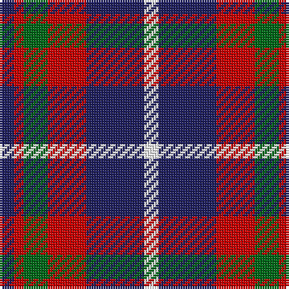

In pattern [BRGRBW](/patterns/brgrbw/).

This was sourced from tartans-authority.  It is a [6 stripes tartan](/stripes/stripes6/).

Original link http://www.tartansauthority.com/tartan-ferret/display/8547/

## Thread count
DB/6 R4 G10 R16 DB24 W/6

## Palette
Each colour and its ΔE from the base-6 reference it is a variant of.

| Colour | Shade | Base | ΔE (OKLab) |
|---|---|---|---|
| DB | <code style="background-color:#202060;">#202060</code> `#202060` | B <code style="background-color:#2A418A;">#2A418A</code> | 0.11 |
| G | <code style="background-color:#006818;">#006818</code> `#006818` | G <code style="background-color:#006100;">#006100</code> | 0.02 |
| R | <code style="background-color:#C80000;">#C80000</code> `#C80000` | R <code style="background-color:#CC0000;">#CC0000</code> | 0.01 |
| W | <code style="background-color:#FCFCFC;">#FCFCFC</code> `#FCFCFC` | W <code style="background-color:#F7F7F7;">#F7F7F7</code> | 0.01 |

# Sample pattern

## Nearest tartans

The nearest existing variants by ΔTartan distance.

1. [Wcwm 759-3](/setts/s6/w5r34k24r4ra24r4x2~k000000-r8c8c8c-ra8c0000-wc8c8c8/) — ΔT 1.00
1. [MacTavish #2](/setts/s6/b1r6ba1b3k3b1x8~b5c8ca8-ba1c0070-k101010-r880000/) — ΔT 1.04
1. [Dunbog Primary (School)](/setts/s6/r12b3g5b16y2g2x2~b000048-g447438-rc80000-ye8c000/) — ΔT 1.07
1. [University of Notre Dame](/setts/s6/r5b35k25b8y10r5x2~b2c2c80-k101010-rc80000-yfccc00/) — ΔT 1.14
1. [Meg Merrilees Fancy Tartan Tartan Number: 1602. Earliest known date: 1831 Miss McDougall, Inverness library, says in her notes:The first mention I had of this tartan was in an advertisment by D MacDougall, Draper, 27 High St., Inverness in 1831 . . . Meg Merrilees and other winter shawls. From Dalgety Archives. STS notes that it was sold by Forsyth's in Glasgow in 1840. Meg Merrilees was a character in one of Scotts novels, Guy Mannering. BU See products available Copyright © Blair Urquhart, Comrie, 2015](/setts/s6/w23b6w6r5k35r10x2~b2c2c80-k101010-rc80000-we0e0e0/) — ΔT 1.14
1. [Oban Grey](/setts/s5/k4w3k4g9r1x4~g808080-k101010-rdc0000-we0e0e0/) — ΔT 1.17
1. [Unidentified #17](/setts/s4/b8k3r4y1x2~b2c4084-k101010-rdc0000-ye8c000/) — ΔT 1.17
1. [Chivas Regal (Corporate)](/setts/s5/b2k2b2r5y1x12~b003c64-k101010-rb03000-ye8c000/) — ΔT 1.18
1. [Thompson Grey Dress](/setts/s6/r1ra6k1w3k3r1x8~k101010-r880000-ra888888-we0e0e0/) — ΔT 1.19
1. [Battle of Prestonpans (1745) Herit](/setts/s5/b9r12g9b5w2x4~b2c2c80-g285800-rc80000-wfcfcfc/) — ΔT 1.20

## Neighbour map

Every grey dot is one of 15726 variants placed by the first two principal components of the ΔTartan feature space (44% of its variance). Red is this tartan; blue dots are its nearest — click one to open its page.

<svg viewBox="0 0 640 380" role="img" style="max-width:100%;height:auto;border:1px solid #e0e0e0;border-radius:4px;display:block" xmlns="http://www.w3.org/2000/svg"><image href="/nn/cloud.v1.png" width="640" height="380"/><a href="/setts/s6/w5r34k24r4ra24r4x2~k000000-r8c8c8c-ra8c0000-wc8c8c8/"><circle cx="188.8" cy="206.0" r="4" fill="#3465a4"><title>Wcwm 759-3</title></circle></a><a href="/setts/s6/b1r6ba1b3k3b1x8~b5c8ca8-ba1c0070-k101010-r880000/"><circle cx="190.7" cy="234.6" r="4" fill="#3465a4"><title>MacTavish #2</title></circle></a><a href="/setts/s6/r12b3g5b16y2g2x2~b000048-g447438-rc80000-ye8c000/"><circle cx="221.4" cy="212.4" r="4" fill="#3465a4"><title>Dunbog Primary (School)</title></circle></a><a href="/setts/s6/r5b35k25b8y10r5x2~b2c2c80-k101010-rc80000-yfccc00/"><circle cx="218.2" cy="223.1" r="4" fill="#3465a4"><title>University of Notre Dame</title></circle></a><a href="/setts/s6/w23b6w6r5k35r10x2~b2c2c80-k101010-rc80000-we0e0e0/"><circle cx="160.4" cy="202.6" r="4" fill="#3465a4"><title>Meg Merrilees Fancy Tartan Tartan Number: 1602. Earliest known date: 1831 Miss McDougall, Inverness library, says in her notes:The first mention I had of this tartan was in an advertisment by D MacDougall, Draper, 27 High St., Inverness in 1831 . . . Meg Merrilees and other winter shawls. From Dalgety Archives. STS notes that it was sold by Forsyth's in Glasgow in 1840. Meg Merrilees was a character in one of Scotts novels, Guy Mannering. BU See products available Copyright © Blair Urquhart, Comrie, 2015</title></circle></a><a href="/setts/s5/k4w3k4g9r1x4~g808080-k101010-rdc0000-we0e0e0/"><circle cx="185.1" cy="227.2" r="4" fill="#3465a4"><title>Oban Grey</title></circle></a><a href="/setts/s4/b8k3r4y1x2~b2c4084-k101010-rdc0000-ye8c000/"><circle cx="236.1" cy="248.2" r="4" fill="#3465a4"><title>Unidentified #17</title></circle></a><a href="/setts/s5/b2k2b2r5y1x12~b003c64-k101010-rb03000-ye8c000/"><circle cx="174.4" cy="262.5" r="4" fill="#3465a4"><title>Chivas Regal (Corporate)</title></circle></a><a href="/setts/s6/r1ra6k1w3k3r1x8~k101010-r880000-ra888888-we0e0e0/"><circle cx="142.4" cy="217.2" r="4" fill="#3465a4"><title>Thompson Grey Dress</title></circle></a><a href="/setts/s5/b9r12g9b5w2x4~b2c2c80-g285800-rc80000-wfcfcfc/"><circle cx="148.8" cy="264.0" r="4" fill="#3465a4"><title>Battle of Prestonpans (1745) Herit</title></circle></a><circle cx="180.2" cy="233.0" r="5" fill="#c00000"/></svg>

ID: /setts/s6/b3r2g5r8b12w3x2~b202060-g006818-rc80000-wfcfcfc/
