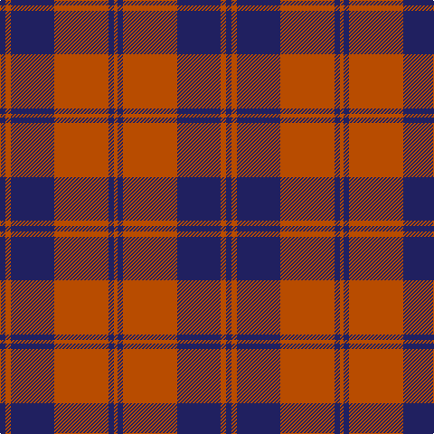

In pattern [BRBRBR](/patterns/brbrbr/).

This was sourced from tartans-authority.  It is a [6 stripes tartan](/stripes/stripes6/).

Original link http://www.tartansauthority.com/tartan-ferret/display/5881/

## Thread count
DB/6 DO6 DB48 DO60 DB6 DO/4

## Palette
Each colour and its ΔE from the base-6 reference it is a variant of.

| Colour | Shade | Base | ΔE (OKLab) |
|---|---|---|---|
| DB | <code style="background-color:#202060;">#202060</code> `#202060` | B <code style="background-color:#2A418A;">#2A418A</code> | 0.11 |
| DO | <code style="background-color:#B84C00;">#B84C00</code> `#B84C00` | R <code style="background-color:#CC0000;">#CC0000</code> | 0.08 |

# Sample pattern

## Nearest tartans

The nearest existing variants by ΔTartan distance.

1. [Auburn University (Alabama)](/setts/s6/b3y3b24y30b3y2x2~b2c2c80-yd87c00/) — ΔT 1.13
1. [Crawford (Clan)](/setts/s7/r6w2r30g12r3g12r3x2~g006818-ra00048-we0e0e0/) — ΔT 1.40
1. [MacQueen, variant](/setts/s6/b2r7b2r7b22y2x2~b304080-rc00000-yf0c000/) — ΔT 1.41
1. [The Mary Erskine](/setts/s6/k3r1k16r16k1r3x4~k000030-rc00000/) — ΔT 1.43
1. [MacQueen variant](/setts/s6/b2r7b2r7b22y2x2~b2c4084-rdc0000-ye8c000/) — ΔT 1.43
1. [Butler](/setts/s6/b48r18b6r13y4r14x2~b2c2c80-rc80000-ye8c000/) — ΔT 1.43
1. [Crawford](/setts/s7/r6w2r30g12r3g12r3x2~g006818-ra00048-wc0c0c0/) — ΔT 1.46
1. [New Breckon (Fashion?)](/setts/s9/b6y2b27r27y2r2y2r2b4x2~b003c64-rc80000-ybc8c00/) — ΔT 1.47
1. [Unidentified Plaid #12](/setts/s8/b3r64b3r3b62r3b3r3~b2c4084-rdc0000/) — ΔT 1.48
1. [Cameron Black & Red (Dress)](/setts/s6/k2r12k2r12k33r2x2~k101010-ra00000/) — ΔT 1.49

## Neighbour map

Every grey dot is one of 15726 variants placed by the first two principal components of the ΔTartan feature space (44% of its variance). Red is this tartan; blue dots are its nearest — click one to open its page.

<svg viewBox="0 0 640 380" role="img" style="max-width:100%;height:auto;border:1px solid #e0e0e0;border-radius:4px;display:block" xmlns="http://www.w3.org/2000/svg"><image href="/nn/cloud.v1.png" width="640" height="380"/><a href="/setts/s6/b3y3b24y30b3y2x2~b2c2c80-yd87c00/"><circle cx="383.9" cy="203.7" r="4" fill="#3465a4"><title>Auburn University (Alabama)</title></circle></a><a href="/setts/s7/r6w2r30g12r3g12r3x2~g006818-ra00048-we0e0e0/"><circle cx="420.7" cy="203.3" r="4" fill="#3465a4"><title>Crawford (Clan)</title></circle></a><a href="/setts/s6/b2r7b2r7b22y2x2~b304080-rc00000-yf0c000/"><circle cx="406.5" cy="217.4" r="4" fill="#3465a4"><title>MacQueen, variant</title></circle></a><a href="/setts/s6/k3r1k16r16k1r3x4~k000030-rc00000/"><circle cx="374.8" cy="211.4" r="4" fill="#3465a4"><title>The Mary Erskine</title></circle></a><a href="/setts/s6/b2r7b2r7b22y2x2~b2c4084-rdc0000-ye8c000/"><circle cx="393.4" cy="210.8" r="4" fill="#3465a4"><title>MacQueen variant</title></circle></a><a href="/setts/s6/b48r18b6r13y4r14x2~b2c2c80-rc80000-ye8c000/"><circle cx="348.0" cy="216.9" r="4" fill="#3465a4"><title>Butler</title></circle></a><a href="/setts/s7/r6w2r30g12r3g12r3x2~g006818-ra00048-wc0c0c0/"><circle cx="426.8" cy="205.8" r="4" fill="#3465a4"><title>Crawford</title></circle></a><a href="/setts/s9/b6y2b27r27y2r2y2r2b4x2~b003c64-rc80000-ybc8c00/"><circle cx="351.9" cy="172.2" r="4" fill="#3465a4"><title>New Breckon (Fashion?)</title></circle></a><a href="/setts/s8/b3r64b3r3b62r3b3r3~b2c4084-rdc0000/"><circle cx="432.5" cy="164.1" r="4" fill="#3465a4"><title>Unidentified Plaid #12</title></circle></a><a href="/setts/s6/k2r12k2r12k33r2x2~k101010-ra00000/"><circle cx="453.9" cy="227.2" r="4" fill="#3465a4"><title>Cameron Black &amp; Red (Dress)</title></circle></a><circle cx="411.0" cy="215.4" r="5" fill="#c00000"/></svg>

ID: /setts/s6/b3r3b24r30b3r2x2~b202060-rb84c00/
