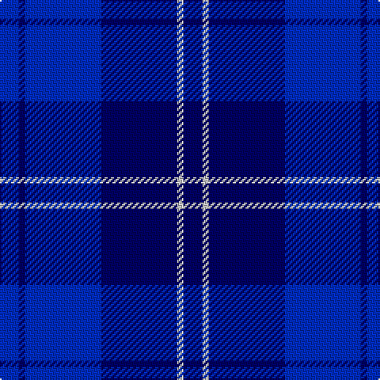

In pattern [BBBBWB](/patterns/bbbbwb/).

This was sourced from tartans-authority.  It is a [6 stripes tartan](/stripes/stripes6/).

Original link http://www.tartansauthority.com/tartan-ferret/display/4821/

## Thread count
B/12 DB4 B48 DB48 N4 DB/12

## Palette
Each colour and its ΔE from the base-6 reference it is a variant of.

| Colour | Shade | Base | ΔE (OKLab) |
|---|---|---|---|
| B | <code style="background-color:#002CC0;">#002CC0</code> `#002CC0` | B <code style="background-color:#2A418A;">#2A418A</code> | 0.10 |
| DB | <code style="background-color:#000064;">#000064</code> `#000064` | B <code style="background-color:#2A418A;">#2A418A</code> | 0.18 |
| N | <code style="background-color:#C8C8C8;">#C8C8C8</code> `#C8C8C8` | W <code style="background-color:#F7F7F7;">#F7F7F7</code> | 0.14 |

# Sample pattern

## Nearest tartans

The nearest existing variants by ΔTartan distance.

1. [Trotter (Personal)](/setts/s9/b23ba2b2ba2b2ba28r2ba4bb2~b0000cd-ba191970-bb1e90ff-rff0000~x2/) — ΔT 1.78
1. [U.S.S. John Paul Jones #1](/setts/s6/b3ba1bb16ba16bb2w2~b788cf0-ba000064-bb2828c8-wc8c8c8~x4/) — ΔT 2.01
1. [Williams (New York) (Personal)](/setts/s5/k30b6k6b41w2~b000080-k101010-w87ceeb~x2/) — ΔT 2.09
1. [Fujisankei Serene](/setts/s9/b1ba6bb4ba1bb16bc1bb4bc6ba1~b666666-ba778899-bb0000cd-bc2f4f4f~x4/) — ΔT 2.13
1. [British American School (Corporate)](/setts/s7/b2ba2r1ba16w1b20r2~b2c2c80-ba3850c8-rc80000-we0e0e0~x2/) — ΔT 2.17
1. [Fenston/Morris (Personal)](/setts/s5/k33b8k4b35ba3~b0000cd-baaa00ff-k101010~x2/) — ΔT 2.19
1. [Mackaw](/setts/s4/r2b35ba35y1~b0000cd-ba000080-rff0000-yffe600~x2/) — ΔT 2.19
1. [Argentina](/setts/s7/b5w3b33k3b3k36b3~b2c2c80-k00002c-we0e0e0~x2/) — ΔT 2.21
1. [Van Loo (Personal)](/setts/s7/b5ba30k25b5ba30bb2b5~b2888c4-ba2c2c80-bb780078-k101010~x2/) — ΔT 2.36
1. [Van Loo Tartan Tartan Number: 6717. Earliest known date: pre 2005 Nothing See products available Copyright © Blair Urquhart, Comrie, 2015](/setts/s7/b5ba30k25b5ba30bb3b5~b2888c4-ba2c2c80-bb780078-k101010~x2/) — ΔT 2.36

## Neighbour map

Every grey dot is one of 15726 variants placed by the first two principal components of the ΔTartan feature space (44% of its variance). Red is this tartan; blue dots are its nearest — click one to open its page.

<svg viewBox="0 0 640 380" role="img" style="max-width:100%;height:auto;border:1px solid #e0e0e0;border-radius:4px;display:block" xmlns="http://www.w3.org/2000/svg"><image href="/nn/cloud.v1.png" width="640" height="380"/><a href="/setts/s9/b23ba2b2ba2b2ba28r2ba4bb2~b0000cd-ba191970-bb1e90ff-rff0000~x2/"><circle cx="411.9" cy="197.1" r="4" fill="#3465a4"><title>Trotter (Personal)</title></circle></a><a href="/setts/s6/b3ba1bb16ba16bb2w2~b788cf0-ba000064-bb2828c8-wc8c8c8~x4/"><circle cx="298.5" cy="201.4" r="4" fill="#3465a4"><title>U.S.S. John Paul Jones #1</title></circle></a><a href="/setts/s5/k30b6k6b41w2~b000080-k101010-w87ceeb~x2/"><circle cx="433.3" cy="247.4" r="4" fill="#3465a4"><title>Williams (New York) (Personal)</title></circle></a><a href="/setts/s9/b1ba6bb4ba1bb16bc1bb4bc6ba1~b666666-ba778899-bb0000cd-bc2f4f4f~x4/"><circle cx="365.6" cy="187.8" r="4" fill="#3465a4"><title>Fujisankei Serene</title></circle></a><a href="/setts/s7/b2ba2r1ba16w1b20r2~b2c2c80-ba3850c8-rc80000-we0e0e0~x2/"><circle cx="392.5" cy="188.1" r="4" fill="#3465a4"><title>British American School (Corporate)</title></circle></a><a href="/setts/s5/k33b8k4b35ba3~b0000cd-baaa00ff-k101010~x2/"><circle cx="342.9" cy="248.9" r="4" fill="#3465a4"><title>Fenston/Morris (Personal)</title></circle></a><a href="/setts/s4/r2b35ba35y1~b0000cd-ba000080-rff0000-yffe600~x2/"><circle cx="413.6" cy="226.0" r="4" fill="#3465a4"><title>Mackaw</title></circle></a><a href="/setts/s7/b5w3b33k3b3k36b3~b2c2c80-k00002c-we0e0e0~x2/"><circle cx="376.0" cy="220.8" r="4" fill="#3465a4"><title>Argentina</title></circle></a><a href="/setts/s7/b5ba30k25b5ba30bb2b5~b2888c4-ba2c2c80-bb780078-k101010~x2/"><circle cx="367.4" cy="219.9" r="4" fill="#3465a4"><title>Van Loo (Personal)</title></circle></a><a href="/setts/s7/b5ba30k25b5ba30bb3b5~b2888c4-ba2c2c80-bb780078-k101010~x2/"><circle cx="346.5" cy="235.2" r="4" fill="#3465a4"><title>Van Loo Tartan Tartan Number: 6717. Earliest known date: pre 2005 Nothing See products available Copyright © Blair Urquhart, Comrie, 2015</title></circle></a><circle cx="385.3" cy="259.8" r="5" fill="#c00000"/></svg>

ID: /setts/s6/b3w1b12ba12b1ba3~b000064-ba002cc0-wc8c8c8~x4/
