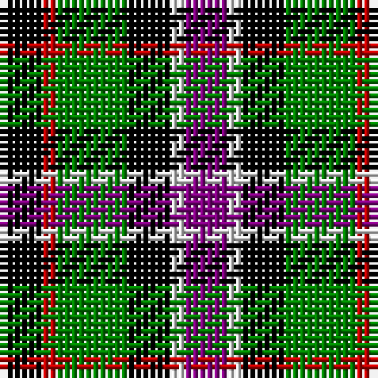

In pattern [BWKGRK](/patterns/bwkgrk/).

This was sourced from weddslist.  It is a [6 stripes tartan](/stripes/stripes6/).

Original link http://www.weddslist.com/cgi-bin/tartans/pg.pl?source=sts

## Thread count
K/6 R2 G10 K6 LN2 P/6

## Palette
Each colour and its ΔE from the base-6 reference it is a variant of.

| Colour | Shade | Base | ΔE (OKLab) |
|---|---|---|---|
| G | <code style="background-color:#008000;">#008000</code> `#008000` | G <code style="background-color:#006100;">#006100</code> | 0.10 |
| K | <code style="background-color:#000000;">#000000</code> `#000000` | K <code style="background-color:#000000;">#000000</code> | 0.00 |
| LN | <code style="background-color:#E0E0E0;">#E0E0E0</code> `#E0E0E0` | W <code style="background-color:#F7F7F7;">#F7F7F7</code> | 0.07 |
| P | <code style="background-color:#800080;">#800080</code> `#800080` | B <code style="background-color:#2A418A;">#2A418A</code> | 0.17 |
| R | <code style="background-color:#C00000;">#C00000</code> `#C00000` | R <code style="background-color:#CC0000;">#CC0000</code> | 0.03 |

# Sample pattern

## Nearest tartans

The nearest existing variants by ΔTartan distance.

1. [Wilson's, No 120](/setts/s7/k12g12w2g12k12b12r3x2~b800080-g008000-k000000-rc00000-we0e0e0/) — ΔT 0.63
1. [Wilson's, No 233](/setts/s7/k6g6w1g6k6b6ga1x4~b800080-g008000-ga30a010-k000000-we0e0e0/) — ΔT 0.78
1. [Wilson's, No 217](/setts/s5/b11ba2k10g10y2x2~b800080-ba5480b0-g008000-k000000-yf0c000/) — ΔT 0.89
1. [Birse](/setts/s6/k4g16k14y3b16r4x2~b304080-g008000-k000000-rc00000-yf0c000/) — ΔT 0.92
1. [Davidson, Double..](/setts/s8/b3r2b8k8g8k3w2k3x2~b304080-g008000-k000000-rc00000-we0e0e0/) — ΔT 1.01
1. [Dyce](/setts/s6/k2y1g6k6b6w1x4~b304080-g008000-k000000-we0e0e0-yf0c000/) — ΔT 1.06
1. [Casely](/setts/s6/r4g11k11g2b11ga3x4~b304080-g008000-ga607030-k000000-rc00000/) — ΔT 1.09
1. [MacNeil 2](/setts/s6/w2b10k10g9k3w2x2~b800080-g008000-k000000-we0e0e0/) — ΔT 1.12
1. [Russell (Clan)](/setts/s6/k3g10k10r3b8w3x2~b2c2c80-g006818-k101010-rc80000-wfcfcfc/) — ΔT 1.12
1. [Brodie hunting](/setts/s7/r2b8g8k8y1k8r2x2~b304080-g008000-k000000-rc00000-yf0c000/) — ΔT 1.13

## Neighbour map

Every grey dot is one of 15726 variants placed by the first two principal components of the ΔTartan feature space (44% of its variance). Red is this tartan; blue dots are its nearest — click one to open its page.

<svg viewBox="0 0 640 380" role="img" style="max-width:100%;height:auto;border:1px solid #e0e0e0;border-radius:4px;display:block" xmlns="http://www.w3.org/2000/svg"><image href="/nn/cloud.v1.png" width="640" height="380"/><a href="/setts/s7/k12g12w2g12k12b12r3x2~b800080-g008000-k000000-rc00000-we0e0e0/"><circle cx="89.4" cy="236.9" r="4" fill="#3465a4"><title>Wilson's, No 120</title></circle></a><a href="/setts/s7/k6g6w1g6k6b6ga1x4~b800080-g008000-ga30a010-k000000-we0e0e0/"><circle cx="96.0" cy="234.6" r="4" fill="#3465a4"><title>Wilson's, No 233</title></circle></a><a href="/setts/s5/b11ba2k10g10y2x2~b800080-ba5480b0-g008000-k000000-yf0c000/"><circle cx="76.7" cy="233.7" r="4" fill="#3465a4"><title>Wilson's, No 217</title></circle></a><a href="/setts/s6/k4g16k14y3b16r4x2~b304080-g008000-k000000-rc00000-yf0c000/"><circle cx="73.7" cy="229.3" r="4" fill="#3465a4"><title>Birse</title></circle></a><a href="/setts/s8/b3r2b8k8g8k3w2k3x2~b304080-g008000-k000000-rc00000-we0e0e0/"><circle cx="78.5" cy="234.2" r="4" fill="#3465a4"><title>Davidson, Double..</title></circle></a><a href="/setts/s6/k2y1g6k6b6w1x4~b304080-g008000-k000000-we0e0e0-yf0c000/"><circle cx="96.8" cy="223.8" r="4" fill="#3465a4"><title>Dyce</title></circle></a><a href="/setts/s6/r4g11k11g2b11ga3x4~b304080-g008000-ga607030-k000000-rc00000/"><circle cx="69.7" cy="234.9" r="4" fill="#3465a4"><title>Casely</title></circle></a><a href="/setts/s6/w2b10k10g9k3w2x2~b800080-g008000-k000000-we0e0e0/"><circle cx="103.6" cy="240.9" r="4" fill="#3465a4"><title>MacNeil 2</title></circle></a><a href="/setts/s6/k3g10k10r3b8w3x2~b2c2c80-g006818-k101010-rc80000-wfcfcfc/"><circle cx="63.9" cy="256.8" r="4" fill="#3465a4"><title>Russell (Clan)</title></circle></a><a href="/setts/s7/r2b8g8k8y1k8r2x2~b304080-g008000-k000000-rc00000-yf0c000/"><circle cx="135.0" cy="214.6" r="4" fill="#3465a4"><title>Brodie hunting</title></circle></a><circle cx="81.7" cy="239.4" r="5" fill="#c00000"/></svg>

ID: /setts/s6/b3w1k3g5r1k3x2~b800080-g008000-k000000-rc00000-we0e0e0/
