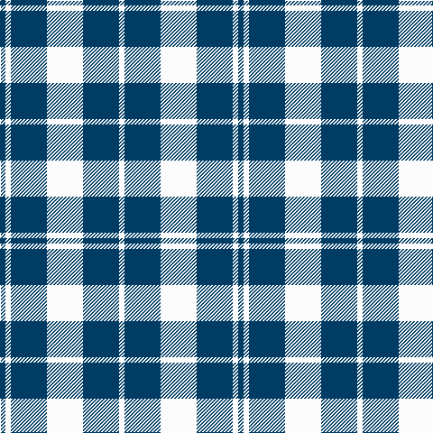

In pattern [BWBWBW](/patterns/bwbwbw/).

This was sourced from register-of-tartans.  It is a [6 stripes tartan](/stripes/stripes6/).

Original link https://www.tartanregister.gov.uk/tartanDetails.aspx?ref=211

## Thread count
DB/6 W6 DB40 W40 DB40 W/6

## Palette
Each colour and its ΔE from the base-6 reference it is a variant of.

| Colour | Shade | Base | ΔE (OKLab) |
|---|---|---|---|
| B | <code style="background-color:#2888C4;">#2888C4</code> `#2888C4` | B <code style="background-color:#2A418A;">#2A418A</code> | 0.21 |
| DB | <code style="background-color:#003C64;">#003C64</code> `#003C64` | B <code style="background-color:#2A418A;">#2A418A</code> | 0.08 |
| N | <code style="background-color:#C0C0C0;">#C0C0C0</code> `#C0C0C0` | W <code style="background-color:#F7F7F7;">#F7F7F7</code> | 0.17 |
| W | <code style="background-color:#FCFCFC;">#FCFCFC</code> `#FCFCFC` | W <code style="background-color:#F7F7F7;">#F7F7F7</code> | 0.01 |

# Sample pattern

## Nearest tartans

The nearest existing variants by ΔTartan distance.

1. [Scott (Abbreviated)](/setts/s7/w2k1w6k6w2k1w1x2~k101010-we0e0e0/) — ΔT 1.29
1. [MacMugen](/setts/s6/b3w16b4w3b12w2x3~b003c64-wfcf0c8/) — ΔT 1.38
1. [Erskine Blanket](/setts/s6/b1w1b5w5b1w1x8~b2c4084-we0e0e0/) — ΔT 1.38
1. [Erskine, Blanket](/setts/s6/b1w1b5w5b1w1x8~b304080-we0e0e0/) — ΔT 1.38
1. [Scott](/setts/s7/w2k1w6k6w2k1w1x2~k000000-we0e0e0/) — ΔT 1.43
1. [Lewis, Navy (Dance)](/setts/s4/b4w35b31w4x2~b1c0070-wf0e0c8/) — ΔT 1.47
1. [MacLeod Black & White](/setts/s5/w14k2w14k19w2x2~k101010-wfcfcfc/) — ΔT 1.51
1. [Queen Margaret University (Corporate](/setts/s7/b1w1b8w4b2w3k1x6~b2c2c80-k101010-we0e0e0/) — ΔT 1.57
1. [MacLeod Black & White Clan Tartan Tartan Number: 1828. Earliest known date: 1906 Same sett as MacLeod Black and Red 1591. Similar to Erskine (1185) and very close ro Campbell of Armadie (3481). See products available Copyright © Blair Urquhart, Comrie, 2015](/setts/s5/w8k1w8k12w1x2~k101010-we0e0e0/) — ΔT 1.59
1. [Cairn (Marton Mills)](/setts/s5/k2w1k8w8k1x8~k101010-we0e0e0/) — ΔT 1.60

## Neighbour map

Every grey dot is one of 15726 variants placed by the first two principal components of the ΔTartan feature space (44% of its variance). Red is this tartan; blue dots are its nearest — click one to open its page.

<svg viewBox="0 0 640 380" role="img" style="max-width:100%;height:auto;border:1px solid #e0e0e0;border-radius:4px;display:block" xmlns="http://www.w3.org/2000/svg"><image href="/nn/cloud.v1.png" width="640" height="380"/><a href="/setts/s7/w2k1w6k6w2k1w1x2~k101010-we0e0e0/"><circle cx="297.8" cy="240.0" r="4" fill="#3465a4"><title>Scott (Abbreviated)</title></circle></a><a href="/setts/s6/b3w16b4w3b12w2x3~b003c64-wfcf0c8/"><circle cx="291.9" cy="234.2" r="4" fill="#3465a4"><title>MacMugen</title></circle></a><a href="/setts/s6/b1w1b5w5b1w1x8~b2c4084-we0e0e0/"><circle cx="278.2" cy="253.9" r="4" fill="#3465a4"><title>Erskine Blanket</title></circle></a><a href="/setts/s6/b1w1b5w5b1w1x8~b304080-we0e0e0/"><circle cx="278.7" cy="253.7" r="4" fill="#3465a4"><title>Erskine, Blanket</title></circle></a><a href="/setts/s7/w2k1w6k6w2k1w1x2~k000000-we0e0e0/"><circle cx="295.6" cy="242.6" r="4" fill="#3465a4"><title>Scott</title></circle></a><a href="/setts/s4/b4w35b31w4x2~b1c0070-wf0e0c8/"><circle cx="304.9" cy="250.0" r="4" fill="#3465a4"><title>Lewis, Navy (Dance)</title></circle></a><a href="/setts/s5/w14k2w14k19w2x2~k101010-wfcfcfc/"><circle cx="311.3" cy="243.7" r="4" fill="#3465a4"><title>MacLeod Black &amp; White</title></circle></a><a href="/setts/s7/b1w1b8w4b2w3k1x6~b2c2c80-k101010-we0e0e0/"><circle cx="277.7" cy="214.5" r="4" fill="#3465a4"><title>Queen Margaret University (Corporate</title></circle></a><a href="/setts/s5/w8k1w8k12w1x2~k101010-we0e0e0/"><circle cx="320.0" cy="235.8" r="4" fill="#3465a4"><title>MacLeod Black &amp; White Clan Tartan Tartan Number: 1828. Earliest known date: 1906 Same sett as MacLeod Black and Red 1591. Similar to Erskine (1185) and very close ro Campbell of Armadie (3481). See products available Copyright © Blair Urquhart, Comrie, 2015</title></circle></a><a href="/setts/s5/k2w1k8w8k1x8~k101010-we0e0e0/"><circle cx="310.2" cy="245.9" r="4" fill="#3465a4"><title>Cairn (Marton Mills)</title></circle></a><circle cx="322.6" cy="253.8" r="5" fill="#c00000"/></svg>

ID: /setts/s6/b3w3b20w20b20w3x2~b003c64-wfcfcfc/
