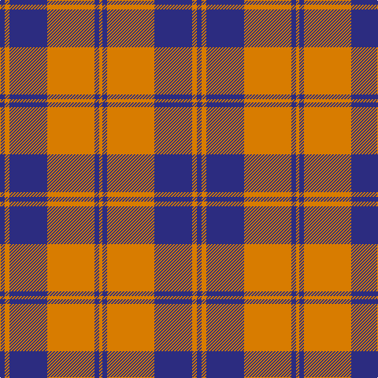

In pattern [BYBYBY](/patterns/bybyby/).

This was sourced from register-of-tartans.  It is a [6 stripes tartan](/stripes/stripes6/).

Original link https://www.tartanregister.gov.uk/tartanDetails.aspx?ref=128

## Register references

External register numbers recorded for this tartan.

- Scottish Register of Tartans: [128](https://www.tartanregister.gov.uk/tartanDetails.aspx?ref=128)
- Scottish Tartans Authority (ITI): 5881

## Thread count
DB/6 O6 DB48 O60 DB6 O/4

## Palette
Each colour and its ΔE from the base-6 reference it is a variant of.

| Colour | Shade | Base | ΔE (OKLab) |
|---|---|---|---|
| B | <code style="background-color:#1474B4;">#1474B4</code> `#1474B4` | B <code style="background-color:#2A418A;">#2A418A</code> | 0.15 |
| DB | <code style="background-color:#2C2C80;">#2C2C80</code> `#2C2C80` | B <code style="background-color:#2A418A;">#2A418A</code> | 0.06 |
| O | <code style="background-color:#D87C00;">#D87C00</code> `#D87C00` | Y <code style="background-color:#F2BF00;">#F2BF00</code> | 0.17 |

# Sample pattern

## Nearest tartans

The nearest existing variants by ΔTartan distance.

1. [Wcwm 1166-2](/setts/s6/b44y3b4w3b4y44~b3c2010-wc8c8c8-yc09898~x2/) — ΔT 1.04
1. [Auburn University (Alabama) (Corp)](/setts/s6/b3r3b24r30b3r2~b202060-rb84c00~x2/) — ΔT 1.13
1. [Machair (warp)](/setts/s6/r72k16w9k4w5k16~k000030-r906030-we0e0e0~x2/) — ΔT 1.46
1. [Erskine, Grey](/setts/s6/b6w2b25w25b2w6~b505050-wc0c0c0~x2/) — ΔT 1.51
1. [Erskine Dress Burgandy Clan Tartan Tartan Number: 1972. Earliest known date: 1971 A popular Dress tartan for Scottish Highland Dancing. See products available Copyright © Blair Urquhart, Comrie, 2015](/setts/s6/r5w2r25w25r2w5~r901c38-we0e0e0~x2/) — ΔT 1.53
1. [Sanix Large Muted](/setts/s4/b3y30b40r3~b304080-rc00000-yd08010~x2/) — ΔT 1.58
1. [MacQueen variant](/setts/s6/b2r7b2r7b22y2~b2c4084-rdc0000-ye8c000~x2/) — ΔT 1.60
1. [Bon Accord](/setts/s7/r6w3r17b3r3b25r3~b003c64-rc80000-wffffff~x2/) — ΔT 1.64
1. [Bon Accord (District)](/setts/s7/r6w3r17b3r3b25r3~b003c64-rc80000-wfcfcfc~x2/) — ΔT 1.65
1. [Korner-Macpherson (Personal)](/setts/s7/g5r3g35k28g4k11g2~g808080-k101010-rc80000~x2/) — ΔT 1.66

## Neighbour map

Every grey dot is one of 15726 variants placed by the first two principal components of the ΔTartan feature space (44% of its variance). Red is this tartan; blue dots are its nearest — click one to open its page.

<svg viewBox="0 0 640 380" role="img" style="max-width:100%;height:auto;border:1px solid #e0e0e0;border-radius:4px;display:block" xmlns="http://www.w3.org/2000/svg"><image href="/nn/cloud.v1.png" width="640" height="380"/><a href="/setts/s6/b44y3b4w3b4y44~b3c2010-wc8c8c8-yc09898~x2/"><circle cx="344.9" cy="184.1" r="4" fill="#3465a4"><title>Wcwm 1166-2</title></circle></a><a href="/setts/s6/b3r3b24r30b3r2~b202060-rb84c00~x2/"><circle cx="411.0" cy="215.4" r="4" fill="#3465a4"><title>Auburn University (Alabama) (Corp)</title></circle></a><a href="/setts/s6/r72k16w9k4w5k16~k000030-r906030-we0e0e0~x2/"><circle cx="360.3" cy="174.7" r="4" fill="#3465a4"><title>Machair (warp)</title></circle></a><a href="/setts/s6/b6w2b25w25b2w6~b505050-wc0c0c0~x2/"><circle cx="355.1" cy="225.3" r="4" fill="#3465a4"><title>Erskine, Grey</title></circle></a><a href="/setts/s6/r5w2r25w25r2w5~r901c38-we0e0e0~x2/"><circle cx="340.8" cy="200.8" r="4" fill="#3465a4"><title>Erskine Dress Burgandy Clan Tartan Tartan Number: 1972. Earliest known date: 1971 A popular Dress tartan for Scottish Highland Dancing. See products available Copyright © Blair Urquhart, Comrie, 2015</title></circle></a><a href="/setts/s4/b3y30b40r3~b304080-rc00000-yd08010~x2/"><circle cx="370.4" cy="233.2" r="4" fill="#3465a4"><title>Sanix Large Muted</title></circle></a><a href="/setts/s6/b2r7b2r7b22y2~b2c4084-rdc0000-ye8c000~x2/"><circle cx="393.4" cy="210.8" r="4" fill="#3465a4"><title>MacQueen variant</title></circle></a><a href="/setts/s7/r6w3r17b3r3b25r3~b003c64-rc80000-wffffff~x2/"><circle cx="309.2" cy="209.6" r="4" fill="#3465a4"><title>Bon Accord</title></circle></a><a href="/setts/s7/r6w3r17b3r3b25r3~b003c64-rc80000-wfcfcfc~x2/"><circle cx="309.8" cy="209.8" r="4" fill="#3465a4"><title>Bon Accord (District)</title></circle></a><a href="/setts/s7/g5r3g35k28g4k11g2~g808080-k101010-rc80000~x2/"><circle cx="345.4" cy="191.1" r="4" fill="#3465a4"><title>Korner-Macpherson (Personal)</title></circle></a><circle cx="383.9" cy="203.7" r="5" fill="#c00000"/></svg>

ID: /setts/s6/b3y3b24y30b3y2~b2c2c80-yd87c00~x2/
