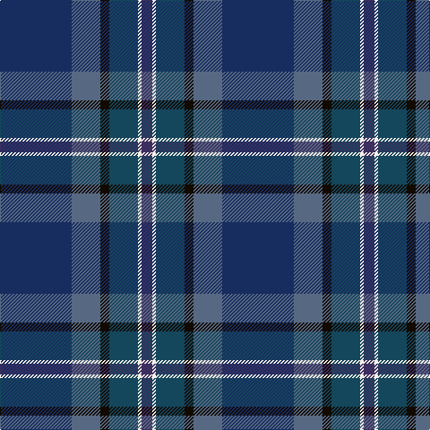

In pattern [BBKBWB](/patterns/bbkbwb/).

This was sourced from register-of-tartans.  It is a [6 stripes tartan](/stripes/stripes6/).

Original link https://www.tartanregister.gov.uk/tartanDetails.aspx?ref=10344

## Register references

External register numbers recorded for this tartan.

- Scottish Register of Tartans: [10344](https://www.tartanregister.gov.uk/tartanDetails.aspx?ref=10344)

## Thread count
DB/80 B32 K10 DBa32 W4 DBb/12

## Palette
Each colour and its ΔE from the base-6 reference it is a variant of.

| Colour | Shade | Base | ΔE (OKLab) |
|---|---|---|---|
| B | <code style="background-color:#576982;">#576982</code> `#576982` | B <code style="background-color:#2A418A;">#2A418A</code> | 0.14 |
| DB | <code style="background-color:#172D60;">#172D60</code> `#172D60` | B <code style="background-color:#2A418A;">#2A418A</code> | 0.09 |
| DBa | <code style="background-color:#14465C;">#14465C</code> `#14465C` | B <code style="background-color:#2A418A;">#2A418A</code> | 0.09 |
| DBb | <code style="background-color:#3D2E60;">#3D2E60</code> `#3D2E60` | B <code style="background-color:#2A418A;">#2A418A</code> | 0.08 |
| K | <code style="background-color:#120A01;">#120A01</code> `#120A01` | K <code style="background-color:#000000;">#000000</code> | 0.15 |
| W | <code style="background-color:#F7F1E8;">#F7F1E8</code> `#F7F1E8` | W <code style="background-color:#F7F7F7;">#F7F7F7</code> | 0.02 |

# Sample pattern

## Nearest tartans

The nearest existing variants by ΔTartan distance.

1. [Monarchs Corporate Sport Tartan Tartan Number: 2222. Earliest known date: 2002 Designed by Enid Brown of Lyle & Scott Ltd for Gleneagles Golf Developments. To be used for golf clothing and accessories. The Monarch's Course, created in the early 1990's by Jack Nicklaus, was renamed The PGA Centenary Course in February 2001 to celebrate the centenary year of The Professional Golfer's Association and is the selected venue for the 2014 Ryder Cup. See products available Copyright © Blair Urquhart, Comrie, 2015](/setts/s6/b19k4ba1k4g9ka1~b2c2c80-ba680028-g005448-k101010-ka000000~x4/) — ΔT 1.55
1. [Chesters, Eric (Personal)](/setts/s7/k12g8y1ga13b1ba31k8~b5c8ca8-ba202060-g006818-ga003820-k101010-ye8c000~x2/) — ΔT 1.56
1. [Timmins (Personal)](/setts/s10/g4b2ba14b12ba32y1b12bb14b2r4~b003c64-ba2c2c80-bb780078-g289c18-r880000-ye8c000~x2/) — ΔT 1.62
1. [Little-Dowse Wedding](/setts/s8/b31y6ya3ba36b8g60y7bb7~b4c3428-ba1c1c50-bb5f749c-g005448-ya08858-yab0b0b0~x2/) — ΔT 1.65
1. [Bouncing Blackie (Personal)](/setts/s7/b5ba8bb13g21ba34bb55r3~b700070-ba24246c-bb1c1c1c-g007040-r742800/) — ΔT 1.67
1. [Bobby Jones (Personal)](/setts/s6/r1g2b12g8ba16y1~b1c1c1c-ba202060-g604000-r880000-ybc8c00~x2/) — ΔT 1.73
1. [Passion of Scotland (Fashion)](/setts/s7/b6r4b2ba25k30g2k2~b344054-ba1c1c50-g408060-k101010-r888888~x2/) — ΔT 1.75
1. [Little-Dowse Wedding](/setts/s8/g31ga6r3b31g8gb60ga7ba7~b202060-ba1870a4-g643424-ga8c7038-gb406054-r888888~x2/) — ΔT 1.79
1. [Stewmann (Personal)](/setts/s9/g24b4g3ba11bb8ba37k3ba2r4~b5c8ca8-ba2c2c80-bb440044-g003820-k101010-re87878~x2/) — ΔT 1.80
1. [Riley's Theme](/setts/s6/b20ba4g5bb14y1b2~b667aa3-ba292929-bb683c66-g6f8070-yccc7ad~x2/) — ΔT 1.81

## Neighbour map

Every grey dot is one of 15726 variants placed by the first two principal components of the ΔTartan feature space (44% of its variance). Red is this tartan; blue dots are its nearest — click one to open its page.

<svg viewBox="0 0 640 380" role="img" style="max-width:100%;height:auto;border:1px solid #e0e0e0;border-radius:4px;display:block" xmlns="http://www.w3.org/2000/svg"><image href="/nn/cloud.v1.png" width="640" height="380"/><a href="/setts/s6/b19k4ba1k4g9ka1~b2c2c80-ba680028-g005448-k101010-ka000000~x4/"><circle cx="348.6" cy="201.1" r="4" fill="#3465a4"><title>Monarchs Corporate Sport Tartan Tartan Number: 2222. Earliest known date: 2002 Designed by Enid Brown of Lyle &amp; Scott Ltd for Gleneagles Golf Developments. To be used for golf clothing and accessories. The Monarch's Course, created in the early 1990's by Jack Nicklaus, was renamed The PGA Centenary Course in February 2001 to celebrate the centenary year of The Professional Golfer's Association and is the selected venue for the 2014 Ryder Cup. See products available Copyright © Blair Urquhart, Comrie, 2015</title></circle></a><a href="/setts/s7/k12g8y1ga13b1ba31k8~b5c8ca8-ba202060-g006818-ga003820-k101010-ye8c000~x2/"><circle cx="282.7" cy="165.1" r="4" fill="#3465a4"><title>Chesters, Eric (Personal)</title></circle></a><a href="/setts/s10/g4b2ba14b12ba32y1b12bb14b2r4~b003c64-ba2c2c80-bb780078-g289c18-r880000-ye8c000~x2/"><circle cx="340.3" cy="153.8" r="4" fill="#3465a4"><title>Timmins (Personal)</title></circle></a><a href="/setts/s8/b31y6ya3ba36b8g60y7bb7~b4c3428-ba1c1c50-bb5f749c-g005448-ya08858-yab0b0b0~x2/"><circle cx="251.7" cy="163.8" r="4" fill="#3465a4"><title>Little-Dowse Wedding</title></circle></a><a href="/setts/s7/b5ba8bb13g21ba34bb55r3~b700070-ba24246c-bb1c1c1c-g007040-r742800/"><circle cx="342.5" cy="206.9" r="4" fill="#3465a4"><title>Bouncing Blackie (Personal)</title></circle></a><a href="/setts/s6/r1g2b12g8ba16y1~b1c1c1c-ba202060-g604000-r880000-ybc8c00~x2/"><circle cx="304.3" cy="216.5" r="4" fill="#3465a4"><title>Bobby Jones (Personal)</title></circle></a><a href="/setts/s7/b6r4b2ba25k30g2k2~b344054-ba1c1c50-g408060-k101010-r888888~x2/"><circle cx="332.6" cy="198.7" r="4" fill="#3465a4"><title>Passion of Scotland (Fashion)</title></circle></a><a href="/setts/s8/g31ga6r3b31g8gb60ga7ba7~b202060-ba1870a4-g643424-ga8c7038-gb406054-r888888~x2/"><circle cx="284.1" cy="170.1" r="4" fill="#3465a4"><title>Little-Dowse Wedding</title></circle></a><a href="/setts/s9/g24b4g3ba11bb8ba37k3ba2r4~b5c8ca8-ba2c2c80-bb440044-g003820-k101010-re87878~x2/"><circle cx="323.4" cy="155.5" r="4" fill="#3465a4"><title>Stewmann (Personal)</title></circle></a><a href="/setts/s6/b20ba4g5bb14y1b2~b667aa3-ba292929-bb683c66-g6f8070-yccc7ad~x2/"><circle cx="344.0" cy="197.0" r="4" fill="#3465a4"><title>Riley's Theme</title></circle></a><circle cx="300.7" cy="189.7" r="5" fill="#c00000"/></svg>

ID: /setts/s6/b40ba16k5bb16w2bc6~b172d60-ba576982-bb14465c-bc3d2e60-k120a01-wf7f1e8~x2/
