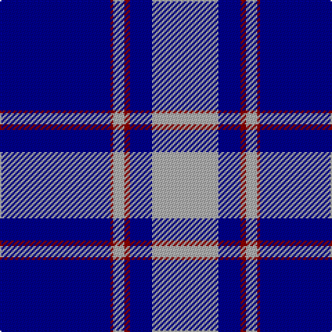

In pattern [BRYRBY](/patterns/bryrby/).

This was sourced from register-of-tartans.  It is a [6 stripes tartan](/stripes/stripes6/).

Original link https://www.tartanregister.gov.uk/tartanDetails.aspx?ref=4934

## Register references

External register numbers recorded for this tartan.

- Scottish Register of Tartans: [4934](https://www.tartanregister.gov.uk/tartanDetails.aspx?ref=4934)
- Scottish Tartans Authority (ITI): 3632

## Thread count
DB/80 DR2 N8 DR4 DB16 N/48

## Palette
Each colour and its ΔE from the base-6 reference it is a variant of.

| Colour | Shade | Base | ΔE (OKLab) |
|---|---|---|---|
| DB | <code style="background-color:#00008C;">#00008C</code> `#00008C` | B <code style="background-color:#2A418A;">#2A418A</code> | 0.13 |
| DR | <code style="background-color:#8C0000;">#8C0000</code> `#8C0000` | R <code style="background-color:#CC0000;">#CC0000</code> | 0.14 |
| N | <code style="background-color:#B0B0B0;">#B0B0B0</code> `#B0B0B0` | Y <code style="background-color:#F2BF00;">#F2BF00</code> | 0.18 |

# Sample pattern

## Nearest tartans

The nearest existing variants by ΔTartan distance.

1. [Antigonish](/setts/s8/b4ba1b4ba24w6ba4w1ba2~b5c8ca8-ba2c2c80-wfcfcfc~x4/) — ΔT 1.27
1. [St. Andrews, Earl of (District)](/setts/s6/b52ba28w5ba3w2ba10~b1870a4-ba1c0070-wf8f8f8~x2/) — ΔT 1.37
1. [North Carolina](/setts/s7/b64r8b1w8b4ba15w4~b000080-ba0000cd-rff0000-wffffff~x2/) — ΔT 1.56
1. [St. Andrews, Earl of](/setts/s10/b52ba28w5ba3w2ba10w2ba3w5ba28~b1870a4-ba1c0070-wf8f8f8~x2/) — ΔT 1.62
1. [Lynn (Personal)](/setts/s8/b18w1k3w1b9w1k45b4~b2474e8-k101010-we0e0e0~x2/) — ΔT 1.64
1. [Hoosier (Fashion)](/setts/s8/b15ba65y7b4y3ba30b15w3~b1474b4-ba1c0070-we0e0e0-ye8c000~x2/) — ΔT 1.72
1. [Wcwm 4907-2](/setts/s7/b40k8y8b4y1b4ya8~b180064-k000000-yc89800-yab0b0b0~x4/) — ΔT 1.76
1. [Christopher Newport University](/setts/s9/b5k1w2k1wa6k1w2b25w2~b000080-k101010-wc8c8c8-waffffff~x2/) — ΔT 1.76
1. [Hannah (Personal)](/setts/s6/w2b35k9w3k9y2~b003df5-k101010-wffffff-yffe600~x2/) — ΔT 1.80
1. [Baker Family Tartan Tartan Number: 613. Earliest known date: pre 2003 STS notes 'Sample in trade specimens file.' See products available Copyright © Blair Urquhart, Comrie, 2015](/setts/s8/b28ba3w1ba3b4w2bb1w5~b2c2c80-ba480800-bb780078-we0e0e0~x4/) — ΔT 1.80

## Neighbour map

Every grey dot is one of 15726 variants placed by the first two principal components of the ΔTartan feature space (44% of its variance). Red is this tartan; blue dots are its nearest — click one to open its page.

<svg viewBox="0 0 640 380" role="img" style="max-width:100%;height:auto;border:1px solid #e0e0e0;border-radius:4px;display:block" xmlns="http://www.w3.org/2000/svg"><image href="/nn/cloud.v1.png" width="640" height="380"/><a href="/setts/s8/b4ba1b4ba24w6ba4w1ba2~b5c8ca8-ba2c2c80-wfcfcfc~x4/"><circle cx="413.9" cy="155.4" r="4" fill="#3465a4"><title>Antigonish</title></circle></a><a href="/setts/s6/b52ba28w5ba3w2ba10~b1870a4-ba1c0070-wf8f8f8~x2/"><circle cx="358.2" cy="183.7" r="4" fill="#3465a4"><title>St. Andrews, Earl of (District)</title></circle></a><a href="/setts/s7/b64r8b1w8b4ba15w4~b000080-ba0000cd-rff0000-wffffff~x2/"><circle cx="414.4" cy="115.1" r="4" fill="#3465a4"><title>North Carolina</title></circle></a><a href="/setts/s10/b52ba28w5ba3w2ba10w2ba3w5ba28~b1870a4-ba1c0070-wf8f8f8~x2/"><circle cx="333.6" cy="151.0" r="4" fill="#3465a4"><title>St. Andrews, Earl of</title></circle></a><a href="/setts/s8/b18w1k3w1b9w1k45b4~b2474e8-k101010-we0e0e0~x2/"><circle cx="412.2" cy="132.7" r="4" fill="#3465a4"><title>Lynn (Personal)</title></circle></a><a href="/setts/s8/b15ba65y7b4y3ba30b15w3~b1474b4-ba1c0070-we0e0e0-ye8c000~x2/"><circle cx="403.0" cy="163.2" r="4" fill="#3465a4"><title>Hoosier (Fashion)</title></circle></a><a href="/setts/s7/b40k8y8b4y1b4ya8~b180064-k000000-yc89800-yab0b0b0~x4/"><circle cx="400.6" cy="134.9" r="4" fill="#3465a4"><title>Wcwm 4907-2</title></circle></a><a href="/setts/s9/b5k1w2k1wa6k1w2b25w2~b000080-k101010-wc8c8c8-waffffff~x2/"><circle cx="378.3" cy="120.0" r="4" fill="#3465a4"><title>Christopher Newport University</title></circle></a><a href="/setts/s6/w2b35k9w3k9y2~b003df5-k101010-wffffff-yffe600~x2/"><circle cx="317.2" cy="165.6" r="4" fill="#3465a4"><title>Hannah (Personal)</title></circle></a><a href="/setts/s8/b28ba3w1ba3b4w2bb1w5~b2c2c80-ba480800-bb780078-we0e0e0~x4/"><circle cx="425.8" cy="126.1" r="4" fill="#3465a4"><title>Baker Family Tartan Tartan Number: 613. Earliest known date: pre 2003 STS notes 'Sample in trade specimens file.' See products available Copyright © Blair Urquhart, Comrie, 2015</title></circle></a><circle cx="400.6" cy="160.4" r="5" fill="#c00000"/></svg>

ID: /setts/s6/b40r1y4r2b8y24~b00008c-r8c0000-yb0b0b0~x2/
