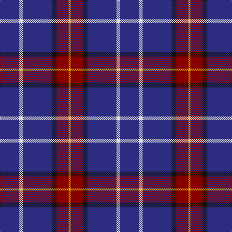

In pattern [BWBKRY](/patterns/bwbkry/).

This was sourced from tartans-authority.  It is a [6 stripes tartan](/stripes/stripes6/).

Original link http://www.tartansauthority.com/tartan-ferret/display/7650/

## Attestations

This cloth appears in 2 source records; the oldest owns this page.

- pre 2008 — Stradling (Name) (tartans-authority, [record](http://www.tartansauthority.com/tartan-ferret/display/7650/))
- undated — Stradling (register-of-tartans, [record](https://www.tartanregister.gov.uk/tartanDetails.aspx?ref=5663))

## Thread count
DB/40 LN7 DB60 K10 DR25 Y/4

## Palette
Each colour and its ΔE from the base-6 reference it is a variant of.

| Colour | Shade | Base | ΔE (OKLab) |
|---|---|---|---|
| DB | <code style="background-color:#2C2C80;">#2C2C80</code> `#2C2C80` | B <code style="background-color:#2A418A;">#2A418A</code> | 0.06 |
| DR | <code style="background-color:#880000;">#880000</code> `#880000` | R <code style="background-color:#CC0000;">#CC0000</code> | 0.15 |
| K | <code style="background-color:#101010;">#101010</code> `#101010` | K <code style="background-color:#000000;">#000000</code> | 0.17 |
| LN | <code style="background-color:#E0E0E0;">#E0E0E0</code> `#E0E0E0` | W <code style="background-color:#F7F7F7;">#F7F7F7</code> | 0.07 |
| Y | <code style="background-color:#E8C000;">#E8C000</code> `#E8C000` | Y <code style="background-color:#F2BF00;">#F2BF00</code> | 0.02 |

# Sample pattern

## Nearest tartans

The nearest existing variants by ΔTartan distance.

1. [Massachusetts (Unofficial)](/setts/s6/r4b48k20y12b20w4-b1c0070-k101010-rc80000-wc0c0c0-ybc8c00/) — ΔT 1.10
1. [Massachusetts](/setts/s6/r4b48k20ra12b20w4-b304080-k000000-rc00020-ra906030-we0e0e0/) — ΔT 1.20
1. [Brigid Mhairi (Personal)](/setts/s7/b4ba22bb38b2bb38bc8y4-b2c2c80-ba2888c4-bb440044-bc780078-yd87c00/) — ΔT 1.21
1. [Warren Wilson College (Corporate)](/setts/s8/g40y12b40ya6b96r12b8r12-b1c0070-g006818-r880000-ya0a0a0-yae8c000/) — ΔT 1.26
1. [Maud Mary Irish Family Tartan Tartan Number: 268. Earliest known date: pre 1892 Dublin See products available Copyright © Blair Urquhart, Comrie, 2015](/setts/s8/b65k9b21y8b21w8b35r35-b2c2c80-k101010-rc80000-we0e0e0-ye8c000/) — ΔT 1.29
1. [Fitzgerald Blue Irish Family Tartan Tartan Number: 1419. Earliest known date: pre 2003 One of four Fitzgerald tartans all apparently designed by Robert P. Fitzgerald of Philadelphia. Starting with this variation of Robertson, he then designed the blue and hunting as color variations and a further "fancy dress" version. See products available Copyright © Blair Urquhart, Comrie, 2015](/setts/s9/r6b42r6b6k26b26ba6b6w4-b2c2c80-ba5c8ca8-k101010-rc80000-we0e0e0/) — ΔT 1.31
1. [Maud, Mary](/setts/s8/b65k9b21y8b21w8b35r35-b304080-k000000-rc00000-we0e0e0-yf0c000/) — ΔT 1.40
1. [Masai Shuka 29 (Artefact)](/setts/s8/r10b40r6b40k12b6w4b2-b2c2c80-k000000-rc80000-w98c8e8/) — ΔT 1.47
1. [Wheadon (Name)](/setts/s6/b80g14y6g14b30r10-b34349c-g008c20-rc80000-ye8c000/) — ΔT 1.49
1. [De Nardi Hunting (Personal)](/setts/s8/b60r6b6y6b6g60b72w10-b2c2c80-g006818-rc80000-wfcfcfc-ye8c000/) — ΔT 1.54

## Neighbour map

Every grey dot is one of 15726 variants placed by the first two principal components of the ΔTartan feature space (44% of its variance). Red is this tartan; blue dots are its nearest — click one to open its page.

<svg viewBox="0 0 640 380" role="img" style="max-width:100%;height:auto;border:1px solid #e0e0e0;border-radius:4px;display:block" xmlns="http://www.w3.org/2000/svg"><image href="/nn/cloud.v1.png" width="640" height="380"/><a href="/setts/s6/r4b48k20y12b20w4-b1c0070-k101010-rc80000-wc0c0c0-ybc8c00/"><circle cx="321.8" cy="196.6" r="4" fill="#3465a4"><title>Massachusetts (Unofficial)</title></circle></a><a href="/setts/s6/r4b48k20ra12b20w4-b304080-k000000-rc00020-ra906030-we0e0e0/"><circle cx="314.7" cy="192.3" r="4" fill="#3465a4"><title>Massachusetts</title></circle></a><a href="/setts/s7/b4ba22bb38b2bb38bc8y4-b2c2c80-ba2888c4-bb440044-bc780078-yd87c00/"><circle cx="396.0" cy="174.4" r="4" fill="#3465a4"><title>Brigid Mhairi (Personal)</title></circle></a><a href="/setts/s8/g40y12b40ya6b96r12b8r12-b1c0070-g006818-r880000-ya0a0a0-yae8c000/"><circle cx="347.5" cy="162.4" r="4" fill="#3465a4"><title>Warren Wilson College (Corporate)</title></circle></a><a href="/setts/s8/b65k9b21y8b21w8b35r35-b2c2c80-k101010-rc80000-we0e0e0-ye8c000/"><circle cx="350.6" cy="203.6" r="4" fill="#3465a4"><title>Maud Mary Irish Family Tartan Tartan Number: 268. Earliest known date: pre 1892 Dublin See products available Copyright © Blair Urquhart, Comrie, 2015</title></circle></a><a href="/setts/s9/r6b42r6b6k26b26ba6b6w4-b2c2c80-ba5c8ca8-k101010-rc80000-we0e0e0/"><circle cx="329.3" cy="182.9" r="4" fill="#3465a4"><title>Fitzgerald Blue Irish Family Tartan Tartan Number: 1419. Earliest known date: pre 2003 One of four Fitzgerald tartans all apparently designed by Robert P. Fitzgerald of Philadelphia. Starting with this variation of Robertson, he then designed the blue and hunting as color variations and a further &quot;fancy dress&quot; version. See products available Copyright © Blair Urquhart, Comrie, 2015</title></circle></a><a href="/setts/s8/b65k9b21y8b21w8b35r35-b304080-k000000-rc00000-we0e0e0-yf0c000/"><circle cx="349.3" cy="203.3" r="4" fill="#3465a4"><title>Maud, Mary</title></circle></a><a href="/setts/s8/r10b40r6b40k12b6w4b2-b2c2c80-k000000-rc80000-w98c8e8/"><circle cx="451.3" cy="174.0" r="4" fill="#3465a4"><title>Masai Shuka 29 (Artefact)</title></circle></a><a href="/setts/s6/b80g14y6g14b30r10-b34349c-g008c20-rc80000-ye8c000/"><circle cx="426.3" cy="199.7" r="4" fill="#3465a4"><title>Wheadon (Name)</title></circle></a><a href="/setts/s8/b60r6b6y6b6g60b72w10-b2c2c80-g006818-rc80000-wfcfcfc-ye8c000/"><circle cx="340.0" cy="173.0" r="4" fill="#3465a4"><title>De Nardi Hunting (Personal)</title></circle></a><circle cx="384.0" cy="191.5" r="5" fill="#c00000"/></svg>

ID: /setts/s6/b40w7b60k10r25y4-b2c2c80-k101010-r880000-we0e0e0-ye8c000/
