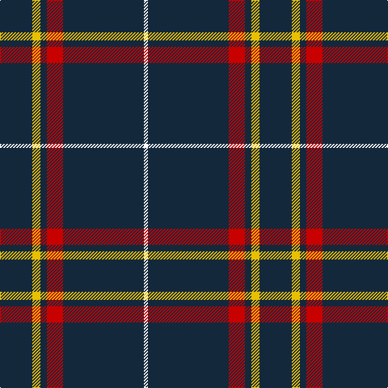

In pattern [BYBRBW](/patterns/bybrbw/).

This was sourced from register-of-tartans.  It is a [6 stripes tartan](/stripes/stripes6/).

Original link https://www.tartanregister.gov.uk/tartanDetails.aspx?ref=1069

## Attestations

This cloth appears in 2 source records; the oldest owns this page.

- 01/08/2005 — East of Scotland Tartan Army (register-of-tartans, [record](https://www.tartanregister.gov.uk/tartanDetails.aspx?ref=1069))
- August 2005 — East of Scotland Tartan Army (Corp.) (tartans-authority, [record](http://www.tartansauthority.com/tartan-ferret/display/6719/))

## Thread count
DN/40 Y10 DN8 R20 DN100 W/5

## Palette
Each colour and its ΔE from the base-6 reference it is a variant of.

| Colour | Shade | Base | ΔE (OKLab) |
|---|---|---|---|
| DN | <code style="background-color:#14283C;">#14283C</code> `#14283C` | B <code style="background-color:#2C4084;">#2C4084</code> | 0.14 |
| R | <code style="background-color:#C80000;">#C80000</code> `#C80000` | R <code style="background-color:#C80000;">#C80000</code> | 0.00 |
| W | <code style="background-color:#FCFCFC;">#FCFCFC</code> `#FCFCFC` | W <code style="background-color:#F4F4F0;">#F4F4F0</code> | 0.03 |
| Y | <code style="background-color:#E8C000;">#E8C000</code> `#E8C000` | Y <code style="background-color:#E8C000;">#E8C000</code> | 0.00 |

# Sample pattern

ID: /setts/s6/b40y10b8r20b100w5-b14283c-rc80000-wfcfcfc-ye8c000/
