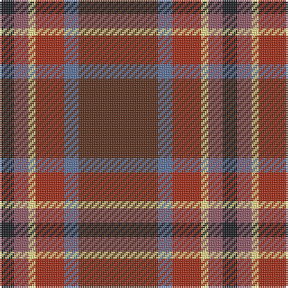

In pattern [BBRYRB](/patterns/bbryrb/).

This was sourced from register-of-tartans.  It is a [6 stripes tartan](/stripes/stripes6/).

Original link https://www.tartanregister.gov.uk/tartanDetails.aspx?ref=10299

## Thread count
K/8 LT8 LY4 R16 B8 T/44

## Palette
Each colour and its ΔE from the base-6 reference it is a variant of.

| Colour | Shade | Base | ΔE (OKLab) |
|---|---|---|---|
| B | <code style="background-color:#5F749C;">#5F749C</code> `#5F749C` | B <code style="background-color:#2C4084;">#2C4084</code> | 0.17 |
| K | <code style="background-color:#1E2025;">#1E2025</code> `#1E2025` | B <code style="background-color:#2C4084;">#2C4084</code> | 0.18 |
| LT | <code style="background-color:#905966;">#905966</code> `#905966` | R <code style="background-color:#C80000;">#C80000</code> | 0.15 |
| LY | <code style="background-color:#F8E38C;">#F8E38C</code> `#F8E38C` | Y <code style="background-color:#E8C000;">#E8C000</code> | 0.11 |
| R | <code style="background-color:#A32D18;">#A32D18</code> `#A32D18` | R <code style="background-color:#C80000;">#C80000</code> | 0.07 |
| T | <code style="background-color:#5D321F;">#5D321F</code> `#5D321F` | B <code style="background-color:#2C4084;">#2C4084</code> | 0.18 |

# Sample pattern

ID: /setts/s6/b44ba8r16y4ra8bb8-b5d321f-ba5f749c-bb1e2025-ra32d18-ra905966-yf8e38c/
