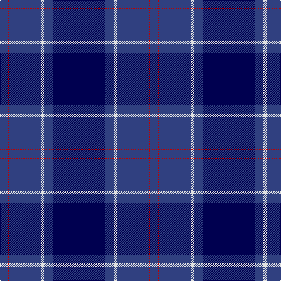

In pattern [BBWBRB](/patterns/bbwbrb/).

This was sourced from weddslist.  It is a [6 stripes tartan](/stripes/stripes6/).

Original link http://www.weddslist.com/cgi-bin/tartans/pg.pl?source=sts

## Thread count
B/14 R2 B54 LN6 B14 DB/90

## Palette
Each colour and its ΔE from the base-6 reference it is a variant of.

| Colour | Shade | Base | ΔE (OKLab) |
|---|---|---|---|
| B | <code style="background-color:#304080;">#304080</code> `#304080` | B <code style="background-color:#2A418A;">#2A418A</code> | 0.02 |
| DB | <code style="background-color:#000050;">#000050</code> `#000050` | B <code style="background-color:#2A418A;">#2A418A</code> | 0.21 |
| LN | <code style="background-color:#E0E0E0;">#E0E0E0</code> `#E0E0E0` | W <code style="background-color:#F7F7F7;">#F7F7F7</code> | 0.07 |
| R | <code style="background-color:#C00000;">#C00000</code> `#C00000` | R <code style="background-color:#CC0000;">#CC0000</code> | 0.03 |

# Sample pattern

## Nearest tartans

The nearest existing variants by ΔTartan distance.

1. [Edzell, U.S. Navy](/setts/s6/b104ba16w8ba66r3ba16~b000050-ba304080-rc00000-we0e0e0/) — ΔT 0.45
1. [Navy-Radar](/setts/s6/b51ba8w4ba30r1ba9x2~b202060-ba1474b4-rc80000-we0e0e0/) — ΔT 1.22
1. [Koot Wedding (Personal)](/setts/s6/b48k32r1k8r3w3x2~b2c2c80-k101010-rc80000-wfcfcfc/) — ΔT 1.45
1. [NHS Grampian](/setts/s7/b4ba36k16w1b2w1k4x2~b2888c4-ba2c2c80-k101010-wfcfcfc/) — ΔT 1.46
1. [British Energy](/setts/s6/b52k12ba18y1ba1y4x2~b1c0070-ba6c0070-k101010-ye8c000/) — ΔT 1.48
1. [Ramsay Blue Clan Tartan Tartan Number: 259. Earliest known date: 1930 This sample comes from the MacGregor-Hastie collection which forms the basis of the cloth archive of the Scottish Tartans Society. Some of the samples, including this one, were unmarked. One can assume that the sample dates between 1930 and 1950. See products available Copyright © Blair Urquhart, Comrie, 2015](/setts/s6/k4w2k28b30k1b3x2~b2c2c80-k101010-we0e0e0/) — ΔT 1.53
1. [S.C.O.T.S.](/setts/s6/b55ba18w3ba2r2ba6x2~b304080-ba000050-rc00020-we0e0e0/) — ΔT 1.58
1. [Deighan (Burham Kent) (Name)](/setts/s5/b4ba43k20b7r2x2~b5c5c5c-ba000068-k101010-r888888/) — ΔT 1.62
1. [Doral](/setts/s7/b26g6b2g17ga4w1ga4x4~b000064-g0c5454-ga343400-wfcfcfc/) — ΔT 1.67
1. [Earl Blue Marl](/setts/s6/b80k28ba9k3r5k12x2~b2c2c80-ba780078-k101010-r9c68a4/) — ΔT 1.70

## Neighbour map

Every grey dot is one of 15726 variants placed by the first two principal components of the ΔTartan feature space (44% of its variance). Red is this tartan; blue dots are its nearest — click one to open its page.

<svg viewBox="0 0 640 380" role="img" style="max-width:100%;height:auto;border:1px solid #e0e0e0;border-radius:4px;display:block" xmlns="http://www.w3.org/2000/svg"><image href="/nn/cloud.v1.png" width="640" height="380"/><a href="/setts/s6/b104ba16w8ba66r3ba16~b000050-ba304080-rc00000-we0e0e0/"><circle cx="384.0" cy="181.3" r="4" fill="#3465a4"><title>Edzell, U.S. Navy</title></circle></a><a href="/setts/s6/b51ba8w4ba30r1ba9x2~b202060-ba1474b4-rc80000-we0e0e0/"><circle cx="385.8" cy="159.1" r="4" fill="#3465a4"><title>Navy-Radar</title></circle></a><a href="/setts/s6/b48k32r1k8r3w3x2~b2c2c80-k101010-rc80000-wfcfcfc/"><circle cx="387.7" cy="153.7" r="4" fill="#3465a4"><title>Koot Wedding (Personal)</title></circle></a><a href="/setts/s7/b4ba36k16w1b2w1k4x2~b2888c4-ba2c2c80-k101010-wfcfcfc/"><circle cx="392.5" cy="145.3" r="4" fill="#3465a4"><title>NHS Grampian</title></circle></a><a href="/setts/s6/b52k12ba18y1ba1y4x2~b1c0070-ba6c0070-k101010-ye8c000/"><circle cx="425.2" cy="148.5" r="4" fill="#3465a4"><title>British Energy</title></circle></a><a href="/setts/s6/k4w2k28b30k1b3x2~b2c2c80-k101010-we0e0e0/"><circle cx="412.9" cy="198.8" r="4" fill="#3465a4"><title>Ramsay Blue Clan Tartan Tartan Number: 259. Earliest known date: 1930 This sample comes from the MacGregor-Hastie collection which forms the basis of the cloth archive of the Scottish Tartans Society. Some of the samples, including this one, were unmarked. One can assume that the sample dates between 1930 and 1950. See products available Copyright © Blair Urquhart, Comrie, 2015</title></circle></a><a href="/setts/s6/b55ba18w3ba2r2ba6x2~b304080-ba000050-rc00020-we0e0e0/"><circle cx="466.1" cy="175.3" r="4" fill="#3465a4"><title>S.C.O.T.S.</title></circle></a><a href="/setts/s5/b4ba43k20b7r2x2~b5c5c5c-ba000068-k101010-r888888/"><circle cx="400.2" cy="218.4" r="4" fill="#3465a4"><title>Deighan (Burham Kent) (Name)</title></circle></a><a href="/setts/s7/b26g6b2g17ga4w1ga4x4~b000064-g0c5454-ga343400-wfcfcfc/"><circle cx="345.5" cy="191.3" r="4" fill="#3465a4"><title>Doral</title></circle></a><a href="/setts/s6/b80k28ba9k3r5k12x2~b2c2c80-ba780078-k101010-r9c68a4/"><circle cx="451.2" cy="193.1" r="4" fill="#3465a4"><title>Earl Blue Marl</title></circle></a><circle cx="406.5" cy="173.9" r="5" fill="#c00000"/></svg>

ID: /setts/s6/b45ba7w3ba27r1ba7x2~b000050-ba304080-rc00000-we0e0e0/
