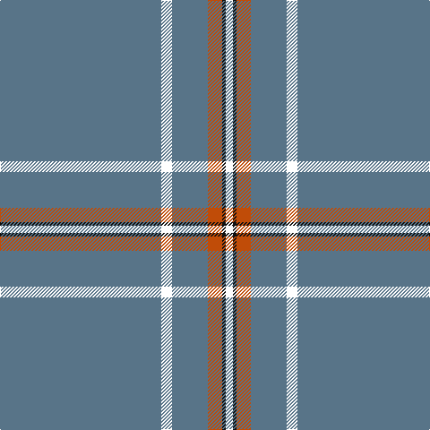

In pattern [BKBRKW](/patterns/bkbrkw/).

This was sourced from register-of-tartans.  It is a [6 stripes tartan](/stripes/stripes6/).

Original link https://www.tartanregister.gov.uk/tartanDetails.aspx?ref=4788

## Register references

External register numbers recorded for this tartan.

- Scottish Register of Tartans: [4788](https://www.tartanregister.gov.uk/tartanDetails.aspx?ref=4788)
- Scottish Tartans Authority (ITI): 2465
- Scottish Tartans World Register: 2465

## Thread count
B/180 YY12 B40 DO16 K4 W/8

## Palette
Each colour and its ΔE from the base-6 reference it is a variant of.

| Colour | Shade | Base | ΔE (OKLab) |
|---|---|---|---|
| B | <code style="background-color:#587488;">#587488</code> `#587488` | B <code style="background-color:#2A418A;">#2A418A</code> | 0.17 |
| DO | <code style="background-color:#C04C08;">#C04C08</code> `#C04C08` | R <code style="background-color:#CC0000;">#CC0000</code> | 0.08 |
| K | <code style="background-color:#101010;">#101010</code> `#101010` | K <code style="background-color:#000000;">#000000</code> | 0.17 |
| W | <code style="background-color:#FCFCFC;">#FCFCFC</code> `#FCFCFC` | W <code style="background-color:#F7F7F7;">#F7F7F7</code> | 0.01 |

# Sample pattern

## Nearest tartans

The nearest existing variants by ΔTartan distance.

1. [Wylie (Name)](/setts/s6/b45y3b10r4k1w2~b587488-k101010-rc04c08-wfcfcfc-yfccc00~x4/) — ΔT 0.95
1. [Wylie](/setts/s6/b45y3b10r4k1w2~b304080-k000000-re06000-we0e0e0-yf0c000~x2/) — ΔT 1.41
1. [Cullen (Christian Hill) (Personal)](/setts/s7/b8y2b8g7b57k3w1~b5f749c-g003c14-k101010-w98c8e8-ydc943c~x2/) — ΔT 1.61
1. [European](/setts/s8/b70y4b3y4b7k2b2r7~b506878-k101010-rc80000-ye8c000~x2/) — ΔT 1.62
1. [MacLaine of Lochbuie, hunting](/setts/s5/b32r3b4k1y3~b304080-k000000-rc00000-yf0c000~x2/) — ΔT 1.78
1. [Inverness, Duke of York](/setts/s8/b122r11w4r15y4b6y4b30~b304080-rc00000-we0e0e0-yf0c000/) — ΔT 1.93
1. [Alpha Chi Sigma Fraternity](/setts/s10/b35y1b3y1b3y1b20r6w1r5~b003c64-rc80000-we0e0e0-ye8c000~x2/) — ΔT 1.94
1. [Wyckoff, Ann Grainger Phillips Commemorative Tartan Tartan Number: 10610. Earliest known date: 2 May 2012 Created to commemorate the 85th birthday of the designer's mother, with a field of blue to match her eyes and with one line for each of her four children in the colour of his or her birth stone (sapphire, pearl, diamond, garnet). See products available Copyright © Blair Urquhart, Comrie, 2015](/setts/s8/b70ba5b3w5b3wa5b3k5~b50729f-ba0000cd-k000000-wffcccc-waffffff~x2/) — ΔT 1.97
1. [Wyckoff, Ann Grainger Phillips](/setts/s9/b70ba5b3w5b3w5b3r5b8~b50729f-ba0000cd-rff0000-wffffff~x2/) — ΔT 1.99
1. [Reece (Name)](/setts/s7/w2y44b8y2b2y3r1~b2c2c80-rc80000-we0e0e0-ya08858~x2/) — ΔT 2.00

## Neighbour map

Every grey dot is one of 15726 variants placed by the first two principal components of the ΔTartan feature space (44% of its variance). Red is this tartan; blue dots are its nearest — click one to open its page.

<svg viewBox="0 0 640 380" role="img" style="max-width:100%;height:auto;border:1px solid #e0e0e0;border-radius:4px;display:block" xmlns="http://www.w3.org/2000/svg"><image href="/nn/cloud.v1.png" width="640" height="380"/><a href="/setts/s6/b45y3b10r4k1w2~b587488-k101010-rc04c08-wfcfcfc-yfccc00~x4/"><circle cx="622.1" cy="134.5" r="4" fill="#3465a4"><title>Wylie (Name)</title></circle></a><a href="/setts/s6/b45y3b10r4k1w2~b304080-k000000-re06000-we0e0e0-yf0c000~x2/"><circle cx="592.0" cy="127.9" r="4" fill="#3465a4"><title>Wylie</title></circle></a><a href="/setts/s7/b8y2b8g7b57k3w1~b5f749c-g003c14-k101010-w98c8e8-ydc943c~x2/"><circle cx="626.0" cy="131.3" r="4" fill="#3465a4"><title>Cullen (Christian Hill) (Personal)</title></circle></a><a href="/setts/s8/b70y4b3y4b7k2b2r7~b506878-k101010-rc80000-ye8c000~x2/"><circle cx="626.0" cy="133.7" r="4" fill="#3465a4"><title>European</title></circle></a><a href="/setts/s5/b32r3b4k1y3~b304080-k000000-rc00000-yf0c000~x2/"><circle cx="595.8" cy="168.5" r="4" fill="#3465a4"><title>MacLaine of Lochbuie, hunting</title></circle></a><a href="/setts/s8/b122r11w4r15y4b6y4b30~b304080-rc00000-we0e0e0-yf0c000/"><circle cx="574.9" cy="140.3" r="4" fill="#3465a4"><title>Inverness, Duke of York</title></circle></a><a href="/setts/s10/b35y1b3y1b3y1b20r6w1r5~b003c64-rc80000-we0e0e0-ye8c000~x2/"><circle cx="557.9" cy="133.9" r="4" fill="#3465a4"><title>Alpha Chi Sigma Fraternity</title></circle></a><a href="/setts/s8/b70ba5b3w5b3wa5b3k5~b50729f-ba0000cd-k000000-wffcccc-waffffff~x2/"><circle cx="512.0" cy="112.9" r="4" fill="#3465a4"><title>Wyckoff, Ann Grainger Phillips Commemorative Tartan Tartan Number: 10610. Earliest known date: 2 May 2012 Created to commemorate the 85th birthday of the designer's mother, with a field of blue to match her eyes and with one line for each of her four children in the colour of his or her birth stone (sapphire, pearl, diamond, garnet). See products available Copyright © Blair Urquhart, Comrie, 2015</title></circle></a><a href="/setts/s9/b70ba5b3w5b3w5b3r5b8~b50729f-ba0000cd-rff0000-wffffff~x2/"><circle cx="558.3" cy="129.6" r="4" fill="#3465a4"><title>Wyckoff, Ann Grainger Phillips</title></circle></a><a href="/setts/s7/w2y44b8y2b2y3r1~b2c2c80-rc80000-we0e0e0-ya08858~x2/"><circle cx="589.6" cy="121.6" r="4" fill="#3465a4"><title>Reece (Name)</title></circle></a><circle cx="598.0" cy="127.4" r="5" fill="#c00000"/></svg>

ID: /setts/s6/b45k3b10r4ka1w2~b587488-k000000-ka101010-rc04c08-wfcfcfc~x4/
