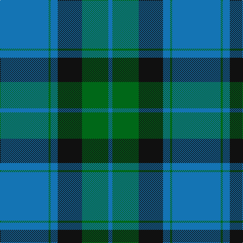

This page is one **sett** — a single exact thread-count. It belongs to the [tartan](/tartans/b48g2b7k24g26b4/)
(the same proportion at any scale), whose colour order is pattern [BGBKGB](/stripes/bgbkgb/).

Sourced from tartans-authority.  It is a [6 stripe tartan](/stripes/stripes6/).

Original link http://www.tartansauthority.com/tartan-ferret/display/8941/

## Thread count
B/96 G4 B14 K48 G52 B/8

## Palette

Palette: <strong>Tartan Register</strong>
<table><thead><tr><th>Colour</th><th>Threads</th><th>Shade</th><th>Base</th><th>OKLCh</th></tr></thead><tbody><tr><td>B/</td><td style="text-align:right;font-variant-numeric:tabular-nums">96</td><td><code style="background-color:#1474B4;">#1474B4</code> <small style="color:#888">#1474B4</small></td><td>B <code style="background-color:#2A418A;">#2A418A</code></td><td><small style="color:#888">oklch(54.0% 0.129 245.1)</small></td></tr><tr><td>G</td><td style="text-align:right;font-variant-numeric:tabular-nums">4</td><td><code style="background-color:#006818;">#006818</code> <small style="color:#888">#006818</small></td><td>G <code style="background-color:#006100;">#006100</code></td><td><small style="color:#888">oklch(45.0% 0.142 145.0)</small></td></tr><tr><td>B</td><td style="text-align:right;font-variant-numeric:tabular-nums">14</td><td><code style="background-color:#1474B4;">#1474B4</code> <small style="color:#888">#1474B4</small></td><td>B <code style="background-color:#2A418A;">#2A418A</code></td><td><small style="color:#888">oklch(54.0% 0.129 245.1)</small></td></tr><tr><td>K</td><td style="text-align:right;font-variant-numeric:tabular-nums">48</td><td><code style="background-color:#101010;">#101010</code> <small style="color:#888">#101010</small></td><td>K <code style="background-color:#000000;">#000000</code></td><td><small style="color:#888">oklch(17.3% 0.000 89.9)</small></td></tr><tr><td>G</td><td style="text-align:right;font-variant-numeric:tabular-nums">52</td><td><code style="background-color:#006818;">#006818</code> <small style="color:#888">#006818</small></td><td>G <code style="background-color:#006100;">#006100</code></td><td><small style="color:#888">oklch(45.0% 0.142 145.0)</small></td></tr><tr><td>B/</td><td style="text-align:right;font-variant-numeric:tabular-nums">8</td><td><code style="background-color:#1474B4;">#1474B4</code> <small style="color:#888">#1474B4</small></td><td>B <code style="background-color:#2A418A;">#2A418A</code></td><td><small style="color:#888">oklch(54.0% 0.129 245.1)</small></td></tr></tbody></table>

# Sample pattern

## Nearest tartans

The nearest existing variants by ΔTartan distance, with this tartan at the top so the swatches line up against it.

ΔTartan

Tartan

Sett

—

<a href="/ttd/edit/#slug=b48g2b7k24g26b4~x2">Unidentified (Kallmeyer 'B')</a> <a class="nn-out" href="/setts/s6/b48g2b7k24g26b4~x2/" title="open its dictionary page">↗</a>

1.33

<a href="/ttd/edit/#slug=b32k10g15k2ly4~x2">Rothesay &amp; Caithness Fencibles (Mil)</a> <a class="nn-out" href="/setts/s5/b32k10g15k2ly4~x2/" title="open its dictionary page">↗</a>

1.41

<a href="/ttd/edit/#slug=db4k4db24g32w1g2~x4">Oliphant (Clan)</a> <a class="nn-out" href="/setts/s6/db4k4db24g32w1g2~x4/" title="open its dictionary page">↗</a>

1.47

<a href="/ttd/edit/#slug=db72k21g16t3g17t3~x2">MacRobart</a> <a class="nn-out" href="/setts/s6/db72k21g16t3g17t3~x2/" title="open its dictionary page">↗</a>

1.48

<a href="/ttd/edit/#slug=r2db32g14db5g16w2~x2">Connacht Irish District Tartan Tartan Number: 4485. Earliest known date: 1994 Phil Smith obtained in Perthshire from a swatch dated 1994 shown to him by Keith Lumsden of the Scottish Tartans Society. However www.uniq-orn.com shows this as Connaught Green. See products available Copyright © Blair Urquhart, Comrie, 2015</a> <a class="nn-out" href="/setts/s6/r2db32g14db5g16w2~x2/" title="open its dictionary page">↗</a>

1.55

<a href="/ttd/edit/#slug=db22ly2db1ly2db10y2g11y6~x2">Katsushika (Corporate)</a> <a class="nn-out" href="/setts/s8/db22ly2db1ly2db10y2g11y6~x2/" title="open its dictionary page">↗</a>

1.57

<a href="/ttd/edit/#slug=g26db10k3db2dy2db10~x4">St. Andrews Old Course Hotel (Corp)</a> <a class="nn-out" href="/setts/s6/g26db10k3db2dy2db10~x4/" title="open its dictionary page">↗</a>

1.58

<a href="/ttd/edit/#slug=db4w1db12g12db1g4~x2">Unidentified, Tweed</a> <a class="nn-out" href="/setts/s6/db4w1db12g12db1g4~x2/" title="open its dictionary page">↗</a>

1.59

<a href="/ttd/edit/#slug=t28dt15r2dt2w1dt6~x2">Corries</a> <a class="nn-out" href="/setts/s6/t28dt15r2dt2w1dt6~x2/" title="open its dictionary page">↗</a>

1.60

<a href="/ttd/edit/#slug=dg4w1dg26b26k2b4~x4">Melville (Two black lines)</a> <a class="nn-out" href="/setts/s6/dg4w1dg26b26k2b4~x4/" title="open its dictionary page">↗</a>

1.61

<a href="/ttd/edit/#slug=r1g16db16g1~x2">Barclay</a> <a class="nn-out" href="/setts/s4/r1g16db16g1~x2/" title="open its dictionary page">↗</a>

## Neighbour map

Every grey dot is one of 14299 variants placed by the first two principal components of the ΔTartan feature space (44% of its variance). Red is this tartan; blue dots are its nearest — click one to open its page.

<svg viewBox="0 0 640 380" role="img" style="max-width:100%;height:auto;border:1px solid #e0e0e0;border-radius:4px;display:block" xmlns="http://www.w3.org/2000/svg"><image href="/nn/cloud.v1.png" width="640" height="380"/><a href="/setts/s5/b32k10g15k2ly4~x2/"><circle cx="277.0" cy="208.5" r="4" fill="#3465a4"><title>Rothesay &amp; Caithness Fencibles (Mil)</title></circle></a><a href="/setts/s6/db4k4db24g32w1g2~x4/"><circle cx="374.7" cy="178.2" r="4" fill="#3465a4"><title>Oliphant (Clan)</title></circle></a><a href="/setts/s6/db72k21g16t3g17t3~x2/"><circle cx="327.8" cy="172.8" r="4" fill="#3465a4"><title>MacRobart</title></circle></a><a href="/setts/s6/r2db32g14db5g16w2~x2/"><circle cx="323.6" cy="202.1" r="4" fill="#3465a4"><title>Connacht Irish District Tartan Tartan Number: 4485. Earliest known date: 1994 Phil Smith obtained in Perthshire from a swatch dated 1994 shown to him by Keith Lumsden of the Scottish Tartans Society. However www.uniq-orn.com shows this as Connaught Green. See products available Copyright © Blair Urquhart, Comrie, 2015</title></circle></a><a href="/setts/s8/db22ly2db1ly2db10y2g11y6~x2/"><circle cx="349.4" cy="173.1" r="4" fill="#3465a4"><title>Katsushika (Corporate)</title></circle></a><a href="/setts/s6/g26db10k3db2dy2db10~x4/"><circle cx="315.7" cy="217.5" r="4" fill="#3465a4"><title>St. Andrews Old Course Hotel (Corp)</title></circle></a><a href="/setts/s6/db4w1db12g12db1g4~x2/"><circle cx="339.8" cy="243.6" r="4" fill="#3465a4"><title>Unidentified, Tweed</title></circle></a><a href="/setts/s6/t28dt15r2dt2w1dt6~x2/"><circle cx="381.9" cy="178.5" r="4" fill="#3465a4"><title>Corries</title></circle></a><a href="/setts/s6/dg4w1dg26b26k2b4~x4/"><circle cx="370.5" cy="193.3" r="4" fill="#3465a4"><title>Melville (Two black lines)</title></circle></a><a href="/setts/s4/r1g16db16g1~x2/"><circle cx="385.6" cy="256.1" r="4" fill="#3465a4"><title>Barclay</title></circle></a><circle cx="344.8" cy="211.7" r="5" fill="#c00000"/></svg>

ID: /setts/s6/b48g2b7k24g26b4~x2/
