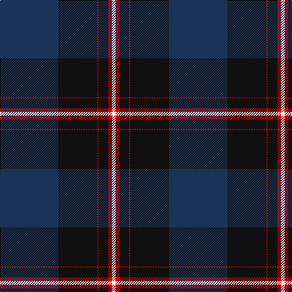

In pattern [BKRKRW](/patterns/bkrkrw/).

This was sourced from register-of-tartans.  It is a [6 stripes tartan](/stripes/stripes6/).

Original link https://www.tartanregister.gov.uk/tartanDetails.aspx?ref=10636

## Register references

External register numbers recorded for this tartan.

- Scottish Register of Tartans: [10636](https://www.tartanregister.gov.uk/tartanDetails.aspx?ref=10636)

## Thread count
DB/96 K64 R2 K16 R6 W/6

## Palette
Each colour and its ΔE from the base-6 reference it is a variant of.

| Colour | Shade | Base | ΔE (OKLab) |
|---|---|---|---|
| DB | <code style="background-color:#1B3357;">#1B3357</code> `#1B3357` | B <code style="background-color:#2A418A;">#2A418A</code> | 0.10 |
| K | <code style="background-color:#101010;">#101010</code> `#101010` | K <code style="background-color:#000000;">#000000</code> | 0.17 |
| R | <code style="background-color:#CC0000;">#CC0000</code> `#CC0000` | R <code style="background-color:#CC0000;">#CC0000</code> | 0.00 |
| W | <code style="background-color:#FFFFFF;">#FFFFFF</code> `#FFFFFF` | W <code style="background-color:#F7F7F7;">#F7F7F7</code> | 0.02 |

# Sample pattern

## Nearest tartans

The nearest existing variants by ΔTartan distance.

1. [Koot Wedding (Personal)](/setts/s6/b48k32r1k8r3w3~b2c2c80-k101010-rc80000-wfcfcfc~x2/) — ΔT 1.03
1. [Casely of Mannerston (Personal)](/setts/s7/b50g4k22g23r1g1r2~b2c2c80-g006818-k101010-rc80000~x2/) — ΔT 1.13
1. [Oliphant](/setts/s6/b4k4b24g32y1g2~b000052-g11450d-k000000-yaaaaaa~x2/) — ΔT 1.32
1. [Home or Hume (Vestiarium Scoticum)](/setts/s8/k28r1k2r1k8b24g2b3~b2c4084-g005020-k101010-rdc0000~x2/) — ΔT 1.35
1. [Ramsay Blue Clan Tartan Tartan Number: 259. Earliest known date: 1930 This sample comes from the MacGregor-Hastie collection which forms the basis of the cloth archive of the Scottish Tartans Society. Some of the samples, including this one, were unmarked. One can assume that the sample dates between 1930 and 1950. See products available Copyright © Blair Urquhart, Comrie, 2015](/setts/s6/k4w2k28b30k1b3~b2c2c80-k101010-we0e0e0~x2/) — ΔT 1.44
1. [MacNeill](/setts/s9/b5r3b21k5b5k40ka2k2w1~b304080-k101010-ka000000-rc00000-we0e0e0~x2/) — ΔT 1.46
1. [Potts (Personal)](/setts/s6/g1b36ba28b3g3y1~b202060-ba441800-g74846c-yfccc00~x2/) — ΔT 1.49
1. [Oliphant](/setts/s6/b4k4b24g32w1g2~b00004c-g004c00-k000000-wd0d0d0~x2/) — ΔT 1.54
1. [Home or Hume Clan Tartan Tartan Number: 127. Earliest known date: 1842 D.W.Stewart says, "The tartan of the ancient and notable family of Home, though differing in colour, has the same scheme as the Grey Douglas. Both first appear in the Vestiarium Scoticum." Border 'Clans' are mentioned in an Act of the Scottish Parliament in 1587, but no evidence of a Clan tartan exists before the earliest date given here. See products available Copyright © Blair Urquhart, Comrie, 2015](/setts/s8/k28r1k2r1k8b24g2b3~b2c2c80-g006818-k101010-rc80000~x2/) — ΔT 1.56
1. [Hope-Weir/Weir](/setts/s8/k8y1k1b28k12g2k1ba2~b2c4084-ba3c82af-g005020-k101010-ye8c000~x2/) — ΔT 1.56

## Neighbour map

Every grey dot is one of 15726 variants placed by the first two principal components of the ΔTartan feature space (44% of its variance). Red is this tartan; blue dots are its nearest — click one to open its page.

<svg viewBox="0 0 640 380" role="img" style="max-width:100%;height:auto;border:1px solid #e0e0e0;border-radius:4px;display:block" xmlns="http://www.w3.org/2000/svg"><image href="/nn/cloud.v1.png" width="640" height="380"/><a href="/setts/s6/b48k32r1k8r3w3~b2c2c80-k101010-rc80000-wfcfcfc~x2/"><circle cx="387.7" cy="153.7" r="4" fill="#3465a4"><title>Koot Wedding (Personal)</title></circle></a><a href="/setts/s7/b50g4k22g23r1g1r2~b2c2c80-g006818-k101010-rc80000~x2/"><circle cx="364.4" cy="147.8" r="4" fill="#3465a4"><title>Casely of Mannerston (Personal)</title></circle></a><a href="/setts/s6/b4k4b24g32y1g2~b000052-g11450d-k000000-yaaaaaa~x2/"><circle cx="386.5" cy="185.6" r="4" fill="#3465a4"><title>Oliphant</title></circle></a><a href="/setts/s8/k28r1k2r1k8b24g2b3~b2c4084-g005020-k101010-rdc0000~x2/"><circle cx="422.1" cy="172.4" r="4" fill="#3465a4"><title>Home or Hume (Vestiarium Scoticum)</title></circle></a><a href="/setts/s6/k4w2k28b30k1b3~b2c2c80-k101010-we0e0e0~x2/"><circle cx="412.9" cy="198.8" r="4" fill="#3465a4"><title>Ramsay Blue Clan Tartan Tartan Number: 259. Earliest known date: 1930 This sample comes from the MacGregor-Hastie collection which forms the basis of the cloth archive of the Scottish Tartans Society. Some of the samples, including this one, were unmarked. One can assume that the sample dates between 1930 and 1950. See products available Copyright © Blair Urquhart, Comrie, 2015</title></circle></a><a href="/setts/s9/b5r3b21k5b5k40ka2k2w1~b304080-k101010-ka000000-rc00000-we0e0e0~x2/"><circle cx="408.8" cy="126.1" r="4" fill="#3465a4"><title>MacNeill</title></circle></a><a href="/setts/s6/g1b36ba28b3g3y1~b202060-ba441800-g74846c-yfccc00~x2/"><circle cx="451.6" cy="179.5" r="4" fill="#3465a4"><title>Potts (Personal)</title></circle></a><a href="/setts/s6/b4k4b24g32w1g2~b00004c-g004c00-k000000-wd0d0d0~x2/"><circle cx="370.1" cy="179.7" r="4" fill="#3465a4"><title>Oliphant</title></circle></a><a href="/setts/s8/k28r1k2r1k8b24g2b3~b2c2c80-g006818-k101010-rc80000~x2/"><circle cx="433.5" cy="177.1" r="4" fill="#3465a4"><title>Home or Hume Clan Tartan Tartan Number: 127. Earliest known date: 1842 D.W.Stewart says, &quot;The tartan of the ancient and notable family of Home, though differing in colour, has the same scheme as the Grey Douglas. Both first appear in the Vestiarium Scoticum.&quot; Border 'Clans' are mentioned in an Act of the Scottish Parliament in 1587, but no evidence of a Clan tartan exists before the earliest date given here. See products available Copyright © Blair Urquhart, Comrie, 2015</title></circle></a><a href="/setts/s8/k8y1k1b28k12g2k1ba2~b2c4084-ba3c82af-g005020-k101010-ye8c000~x2/"><circle cx="367.9" cy="144.0" r="4" fill="#3465a4"><title>Hope-Weir/Weir</title></circle></a><circle cx="402.1" cy="162.1" r="5" fill="#c00000"/></svg>

ID: /setts/s6/b48k32r1k8r3w3~b1b3357-k101010-rcc0000-wffffff~x2/
