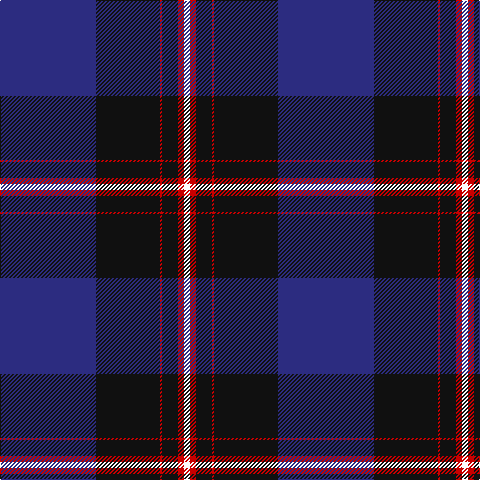

In pattern [BKRKRW](/patterns/bkrkrw/).

This was sourced from tartans-authority.  It is a [6 stripes tartan](/stripes/stripes6/).

Original link http://www.tartansauthority.com/tartan-ferret/display/10636/

## Thread count
DB/96 K64 R2 K16 R6 W/6

## Palette
Each colour and its ΔE from the base-6 reference it is a variant of.

| Colour | Shade | Base | ΔE (OKLab) |
|---|---|---|---|
| DB | <code style="background-color:#2C2C80;">#2C2C80</code> `#2C2C80` | B <code style="background-color:#2A418A;">#2A418A</code> | 0.06 |
| K | <code style="background-color:#101010;">#101010</code> `#101010` | K <code style="background-color:#000000;">#000000</code> | 0.17 |
| R | <code style="background-color:#C80000;">#C80000</code> `#C80000` | R <code style="background-color:#CC0000;">#CC0000</code> | 0.01 |
| W | <code style="background-color:#FCFCFC;">#FCFCFC</code> `#FCFCFC` | W <code style="background-color:#F7F7F7;">#F7F7F7</code> | 0.01 |

# Sample pattern

## Nearest tartans

The nearest existing variants by ΔTartan distance.

1. [Koot Wedding (Personal)](/setts/s6/b48k32r1k8r3w3~b1b3357-k101010-rcc0000-wffffff~x2/) — ΔT 1.03
1. [NHS Grampian](/setts/s7/b4ba36k16w1b2w1k4~b2888c4-ba2c2c80-k101010-wfcfcfc~x2/) — ΔT 1.03
1. [Finnie (Personal)](/setts/s8/b4w4b37k20w1ba5w1k4~b2c2c80-ba780078-k101010-we0e0e0~x2/) — ΔT 1.07
1. [Dunlop](/setts/s8/k3r1k30w1b28r1b1w3~b2c2c80-k101010-rc80000-we0e0e0~x2/) — ΔT 1.20
1. [British Energy](/setts/s6/b52k12ba18y1ba1y4~b1c0070-ba6c0070-k101010-ye8c000~x2/) — ΔT 1.32
1. [Grahame Laurie Band (Corporate)](/setts/s7/k8y2b6y2k36ba84w7~b780078-ba2c2c80-k101010-we0e0e0-yfccc00/) — ΔT 1.33
1. [Ramsay Blue Clan Tartan Tartan Number: 259. Earliest known date: 1930 This sample comes from the MacGregor-Hastie collection which forms the basis of the cloth archive of the Scottish Tartans Society. Some of the samples, including this one, were unmarked. One can assume that the sample dates between 1930 and 1950. See products available Copyright © Blair Urquhart, Comrie, 2015](/setts/s6/k4w2k28b30k1b3~b2c2c80-k101010-we0e0e0~x2/) — ΔT 1.36
1. [Edzell, U.S. Navy](/setts/s6/b104ba16w8ba66r3ba16~b000050-ba304080-rc00000-we0e0e0/) — ΔT 1.42
1. [Casely of Mannerston (Personal)](/setts/s7/b50g4k22g23r1g1r2~b2c2c80-g006818-k101010-rc80000~x2/) — ΔT 1.42
1. [MacLaurin of Brioch Clan Tartan Tartan Number: 344. Earliest known date: 1856 This sett was approved by the Chief and accepted by the A.G.M. of the Clan MacLaren Society as Dress MacLaren in 1981. The sett has been designed by changing the blue ground of the usual MacLaren sett to white and then centering a blue stripe on the white ground. This illustration is based on a kilt belonging to the designer, Mr I.G.Campbell MacLaren. See products available Copyright © Blair Urquhart, Comrie, 2015](/setts/s7/b36k10g3r3g6k1y2~b2c2c80-g006818-k101010-rc80000-ye8c000~x2/) — ΔT 1.43

## Neighbour map

Every grey dot is one of 15726 variants placed by the first two principal components of the ΔTartan feature space (44% of its variance). Red is this tartan; blue dots are its nearest — click one to open its page.

<svg viewBox="0 0 640 380" role="img" style="max-width:100%;height:auto;border:1px solid #e0e0e0;border-radius:4px;display:block" xmlns="http://www.w3.org/2000/svg"><image href="/nn/cloud.v1.png" width="640" height="380"/><a href="/setts/s6/b48k32r1k8r3w3~b1b3357-k101010-rcc0000-wffffff~x2/"><circle cx="402.1" cy="162.1" r="4" fill="#3465a4"><title>Koot Wedding (Personal)</title></circle></a><a href="/setts/s7/b4ba36k16w1b2w1k4~b2888c4-ba2c2c80-k101010-wfcfcfc~x2/"><circle cx="392.5" cy="145.3" r="4" fill="#3465a4"><title>NHS Grampian</title></circle></a><a href="/setts/s8/b4w4b37k20w1ba5w1k4~b2c2c80-ba780078-k101010-we0e0e0~x2/"><circle cx="362.5" cy="134.6" r="4" fill="#3465a4"><title>Finnie (Personal)</title></circle></a><a href="/setts/s8/k3r1k30w1b28r1b1w3~b2c2c80-k101010-rc80000-we0e0e0~x2/"><circle cx="356.5" cy="137.8" r="4" fill="#3465a4"><title>Dunlop</title></circle></a><a href="/setts/s6/b52k12ba18y1ba1y4~b1c0070-ba6c0070-k101010-ye8c000~x2/"><circle cx="425.2" cy="148.5" r="4" fill="#3465a4"><title>British Energy</title></circle></a><a href="/setts/s7/k8y2b6y2k36ba84w7~b780078-ba2c2c80-k101010-we0e0e0-yfccc00/"><circle cx="384.4" cy="116.9" r="4" fill="#3465a4"><title>Grahame Laurie Band (Corporate)</title></circle></a><a href="/setts/s6/k4w2k28b30k1b3~b2c2c80-k101010-we0e0e0~x2/"><circle cx="412.9" cy="198.8" r="4" fill="#3465a4"><title>Ramsay Blue Clan Tartan Tartan Number: 259. Earliest known date: 1930 This sample comes from the MacGregor-Hastie collection which forms the basis of the cloth archive of the Scottish Tartans Society. Some of the samples, including this one, were unmarked. One can assume that the sample dates between 1930 and 1950. See products available Copyright © Blair Urquhart, Comrie, 2015</title></circle></a><a href="/setts/s6/b104ba16w8ba66r3ba16~b000050-ba304080-rc00000-we0e0e0/"><circle cx="384.0" cy="181.3" r="4" fill="#3465a4"><title>Edzell, U.S. Navy</title></circle></a><a href="/setts/s7/b50g4k22g23r1g1r2~b2c2c80-g006818-k101010-rc80000~x2/"><circle cx="364.4" cy="147.8" r="4" fill="#3465a4"><title>Casely of Mannerston (Personal)</title></circle></a><a href="/setts/s7/b36k10g3r3g6k1y2~b2c2c80-g006818-k101010-rc80000-ye8c000~x2/"><circle cx="383.2" cy="128.5" r="4" fill="#3465a4"><title>MacLaurin of Brioch Clan Tartan Tartan Number: 344. Earliest known date: 1856 This sett was approved by the Chief and accepted by the A.G.M. of the Clan MacLaren Society as Dress MacLaren in 1981. The sett has been designed by changing the blue ground of the usual MacLaren sett to white and then centering a blue stripe on the white ground. This illustration is based on a kilt belonging to the designer, Mr I.G.Campbell MacLaren. See products available Copyright © Blair Urquhart, Comrie, 2015</title></circle></a><circle cx="387.7" cy="153.7" r="5" fill="#c00000"/></svg>

ID: /setts/s6/b48k32r1k8r3w3~b2c2c80-k101010-rc80000-wfcfcfc~x2/
