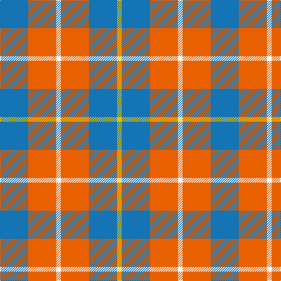

In pattern [BRWRBY](/patterns/brwrby/).

This was sourced from register-of-tartans.  It is a [6 stripes tartan](/stripes/stripes6/).

Original link https://www.tartanregister.gov.uk/tartanDetails.aspx?ref=4303

## Thread count
B/48 O48 W8 O48 B48 Y/8

## Palette
Each colour and its ΔE from the base-6 reference it is a variant of.

| Colour | Shade | Base | ΔE (OKLab) |
|---|---|---|---|
| B | <code style="background-color:#1474B4;">#1474B4</code> `#1474B4` | B <code style="background-color:#2A418A;">#2A418A</code> | 0.15 |
| O | <code style="background-color:#E86000;">#E86000</code> `#E86000` | R <code style="background-color:#CC0000;">#CC0000</code> | 0.14 |
| R | <code style="background-color:#C80000;">#C80000</code> `#C80000` | R <code style="background-color:#CC0000;">#CC0000</code> | 0.01 |
| W | <code style="background-color:#FCFCFC;">#FCFCFC</code> `#FCFCFC` | W <code style="background-color:#F7F7F7;">#F7F7F7</code> | 0.01 |
| Y | <code style="background-color:#E8C000;">#E8C000</code> `#E8C000` | Y <code style="background-color:#F2BF00;">#F2BF00</code> | 0.02 |

# Sample pattern

## Nearest tartans

The nearest existing variants by ΔTartan distance.

1. [Doohan (Name)](/setts/s5/b20y10r40b40w20-b5c8ca8-rc80000-wfcfcfc-ybc8c00/) — ΔT 1.25
1. [Doohan (New South Wales), Andrew](/setts/s5/b20y10r40b40w20-b5f749c-rca2625-wf9f5ef-ye0a126/) — ΔT 1.27
1. [Snowbird](/setts/s8/r58b24y30r16y30b24r58w8-b1474b4-rc80000-we0e0e0-y48a4c0/) — ΔT 1.32
1. [Snowbird (Corporate)](/setts/s5/r16y30b24r58w8-b1474b4-rc80000-we0e0e0-y48a4c0/) — ΔT 1.39
1. [MacLeod of Argentina](/setts/s5/b20w6b24y28r8-b1474b4-rc80000-wfcfcfc-yd8b000/) — ΔT 1.41
1. [MacLeod, of Argentina](/setts/s5/b20w6b24y28r8-b304080-rc00000-we0e0e0-yf0c000/) — ΔT 1.46
1. [Buckeye](/setts/s4/r100k16w32ra64-k101010-r888888-rac80000-wfcfcfc/) — ΔT 1.46
1. [Buckeye](/setts/s4/g100k16w32r64-g75786c-k120a01-rdd1212-wf7f1e8/) — ΔT 1.54
1. [Trinity Bicycles (Corporate)](/setts/s5/g8w22g28wa60r8-g704400-rc80000-wb4c0c8-wac8c8bc/) — ΔT 1.62
1. [Louisburg](/setts/s4/r44y20w6b16-b1c0070-r888888-wf8f8f8-ye8c000/) — ΔT 1.66

## Neighbour map

Every grey dot is one of 15726 variants placed by the first two principal components of the ΔTartan feature space (44% of its variance). Red is this tartan; blue dots are its nearest — click one to open its page.

<svg viewBox="0 0 640 380" role="img" style="max-width:100%;height:auto;border:1px solid #e0e0e0;border-radius:4px;display:block" xmlns="http://www.w3.org/2000/svg"><image href="/nn/cloud.v1.png" width="640" height="380"/><a href="/setts/s5/b20y10r40b40w20-b5c8ca8-rc80000-wfcfcfc-ybc8c00/"><circle cx="171.0" cy="272.1" r="4" fill="#3465a4"><title>Doohan (Name)</title></circle></a><a href="/setts/s5/b20y10r40b40w20-b5f749c-rca2625-wf9f5ef-ye0a126/"><circle cx="177.3" cy="273.8" r="4" fill="#3465a4"><title>Doohan (New South Wales), Andrew</title></circle></a><a href="/setts/s8/r58b24y30r16y30b24r58w8-b1474b4-rc80000-we0e0e0-y48a4c0/"><circle cx="251.0" cy="228.0" r="4" fill="#3465a4"><title>Snowbird</title></circle></a><a href="/setts/s5/r16y30b24r58w8-b1474b4-rc80000-we0e0e0-y48a4c0/"><circle cx="269.8" cy="236.1" r="4" fill="#3465a4"><title>Snowbird (Corporate)</title></circle></a><a href="/setts/s5/b20w6b24y28r8-b1474b4-rc80000-wfcfcfc-yd8b000/"><circle cx="201.7" cy="266.3" r="4" fill="#3465a4"><title>MacLeod of Argentina</title></circle></a><a href="/setts/s5/b20w6b24y28r8-b304080-rc00000-we0e0e0-yf0c000/"><circle cx="187.7" cy="257.7" r="4" fill="#3465a4"><title>MacLeod, of Argentina</title></circle></a><a href="/setts/s4/r100k16w32ra64-k101010-r888888-rac80000-wfcfcfc/"><circle cx="206.4" cy="243.4" r="4" fill="#3465a4"><title>Buckeye</title></circle></a><a href="/setts/s4/g100k16w32r64-g75786c-k120a01-rdd1212-wf7f1e8/"><circle cx="210.5" cy="245.4" r="4" fill="#3465a4"><title>Buckeye</title></circle></a><a href="/setts/s5/g8w22g28wa60r8-g704400-rc80000-wb4c0c8-wac8c8bc/"><circle cx="234.5" cy="221.1" r="4" fill="#3465a4"><title>Trinity Bicycles (Corporate)</title></circle></a><a href="/setts/s4/r44y20w6b16-b1c0070-r888888-wf8f8f8-ye8c000/"><circle cx="219.5" cy="237.2" r="4" fill="#3465a4"><title>Louisburg</title></circle></a><circle cx="233.3" cy="248.0" r="5" fill="#c00000"/></svg>

ID: /setts/s6/b48r48w8r48b48y8-b1474b4-re86000-wfcfcfc-ye8c000/
