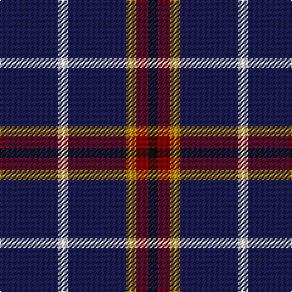

In pattern [BWBYRK](/patterns/bwbyrk/).

This was sourced from tartans-authority.  It is a [6 stripes tartan](/stripes/stripes6/).

Original link http://www.tartansauthority.com/tartan-ferret/display/10045/

## Thread count
DB/48 W8 DB48 DY8 DR10 K/8

## Palette
Each colour and its ΔE from the base-6 reference it is a variant of.

| Colour | Shade | Base | ΔE (OKLab) |
|---|---|---|---|
| DB | <code style="background-color:#1C1C50;">#1C1C50</code> `#1C1C50` | B <code style="background-color:#2A418A;">#2A418A</code> | 0.14 |
| DR | <code style="background-color:#880000;">#880000</code> `#880000` | R <code style="background-color:#CC0000;">#CC0000</code> | 0.15 |
| DY | <code style="background-color:#BC8C00;">#BC8C00</code> `#BC8C00` | Y <code style="background-color:#F2BF00;">#F2BF00</code> | 0.16 |
| K | <code style="background-color:#101010;">#101010</code> `#101010` | K <code style="background-color:#000000;">#000000</code> | 0.17 |
| W | <code style="background-color:#F8F8F8;">#F8F8F8</code> `#F8F8F8` | W <code style="background-color:#F7F7F7;">#F7F7F7</code> | 0.00 |

# Sample pattern

## Nearest tartans

The nearest existing variants by ΔTartan distance.

1. [De Grussa](/setts/s6/b48w8b48y8r10k8-b191970-k101010-r8b0000-wffffff-yffd700/) — ΔT 0.92
1. [Maud, Mary](/setts/s8/b65k9b21y8b21w8b35r35-b304080-k000000-rc00000-we0e0e0-yf0c000/) — ΔT 1.32
1. [Maud Mary Irish Family Tartan Tartan Number: 268. Earliest known date: pre 1892 Dublin See products available Copyright © Blair Urquhart, Comrie, 2015](/setts/s8/b65k9b21y8b21w8b35r35-b2c2c80-k101010-rc80000-we0e0e0-ye8c000/) — ΔT 1.34
1. [Abertay University (Estimated threadcount)](/setts/s6/r10b30g6b30y6b6-b2c2c80-g006818-rc80000-ye8c000/) — ΔT 1.36
1. [St. Eloi](/setts/s6/r18y12k60w6k60y12-k00002c-r880000-we0e0e0-yd09800/) — ΔT 1.52
1. [Bukowski-Jackson (Personal)](/setts/s10/b60ba10b10w10b20wa8r8b20g10b20-b14283c-ba5c8ca8-g00643c-rdc0000-wc49cd8-waffffff/) — ΔT 1.60
1. [Cowe (Personal)](/setts/s7/k16b6k64ba28w6k50b6-b5c8ca8-ba1474b4-k101010-wfcfcfc/) — ΔT 1.63
1. [Benson (New England)](/setts/s7/k32b4k16r6y6r6k16-b1474b4-k101010-rc80000-yb8b8b8/) — ΔT 1.75
1. [Massachusetts](/setts/s6/r4b48k20ra12b20w4-b304080-k000000-rc00020-ra906030-we0e0e0/) — ΔT 1.76
1. [Stradling (Name)](/setts/s6/b40w7b60k10r25y4-b2c2c80-k101010-r880000-we0e0e0-ye8c000/) — ΔT 1.78

## Neighbour map

Every grey dot is one of 15726 variants placed by the first two principal components of the ΔTartan feature space (44% of its variance). Red is this tartan; blue dots are its nearest — click one to open its page.

<svg viewBox="0 0 640 380" role="img" style="max-width:100%;height:auto;border:1px solid #e0e0e0;border-radius:4px;display:block" xmlns="http://www.w3.org/2000/svg"><image href="/nn/cloud.v1.png" width="640" height="380"/><a href="/setts/s6/b48w8b48y8r10k8-b191970-k101010-r8b0000-wffffff-yffd700/"><circle cx="358.8" cy="213.5" r="4" fill="#3465a4"><title>De Grussa</title></circle></a><a href="/setts/s8/b65k9b21y8b21w8b35r35-b304080-k000000-rc00000-we0e0e0-yf0c000/"><circle cx="349.3" cy="203.3" r="4" fill="#3465a4"><title>Maud, Mary</title></circle></a><a href="/setts/s8/b65k9b21y8b21w8b35r35-b2c2c80-k101010-rc80000-we0e0e0-ye8c000/"><circle cx="350.6" cy="203.6" r="4" fill="#3465a4"><title>Maud Mary Irish Family Tartan Tartan Number: 268. Earliest known date: pre 1892 Dublin See products available Copyright © Blair Urquhart, Comrie, 2015</title></circle></a><a href="/setts/s6/r10b30g6b30y6b6-b2c2c80-g006818-rc80000-ye8c000/"><circle cx="401.7" cy="254.2" r="4" fill="#3465a4"><title>Abertay University (Estimated threadcount)</title></circle></a><a href="/setts/s6/r18y12k60w6k60y12-k00002c-r880000-we0e0e0-yd09800/"><circle cx="375.7" cy="216.0" r="4" fill="#3465a4"><title>St. Eloi</title></circle></a><a href="/setts/s10/b60ba10b10w10b20wa8r8b20g10b20-b14283c-ba5c8ca8-g00643c-rdc0000-wc49cd8-waffffff/"><circle cx="349.5" cy="175.9" r="4" fill="#3465a4"><title>Bukowski-Jackson (Personal)</title></circle></a><a href="/setts/s7/k16b6k64ba28w6k50b6-b5c8ca8-ba1474b4-k101010-wfcfcfc/"><circle cx="411.4" cy="211.8" r="4" fill="#3465a4"><title>Cowe (Personal)</title></circle></a><a href="/setts/s7/k32b4k16r6y6r6k16-b1474b4-k101010-rc80000-yb8b8b8/"><circle cx="403.9" cy="228.2" r="4" fill="#3465a4"><title>Benson (New England)</title></circle></a><a href="/setts/s6/r4b48k20ra12b20w4-b304080-k000000-rc00020-ra906030-we0e0e0/"><circle cx="314.7" cy="192.3" r="4" fill="#3465a4"><title>Massachusetts</title></circle></a><a href="/setts/s6/b40w7b60k10r25y4-b2c2c80-k101010-r880000-we0e0e0-ye8c000/"><circle cx="384.0" cy="191.5" r="4" fill="#3465a4"><title>Stradling (Name)</title></circle></a><circle cx="376.4" cy="219.9" r="5" fill="#c00000"/></svg>

ID: /setts/s6/b48w8b48y8r10k8-b1c1c50-k101010-r880000-wf8f8f8-ybc8c00/
