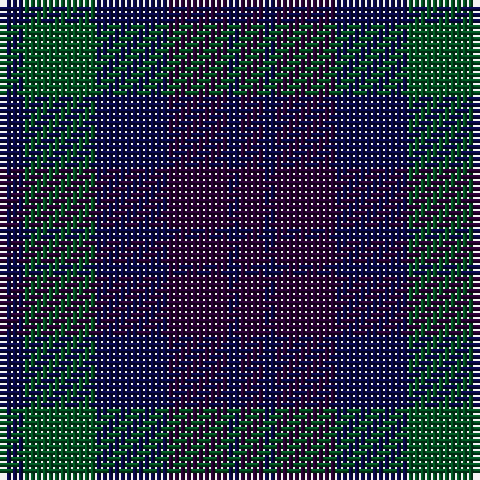

In pattern [BBBBGB](/patterns/bbbbgb/).

This was sourced from register-of-tartans.  It is a [6 stripes tartan](/stripes/stripes6/).

Original link https://www.tartanregister.gov.uk/tartanDetails.aspx?ref=4334

## Thread count
DB/4 G12 DB12 DP10 DB2 DP/4

## Palette
Each colour and its ΔE from the base-6 reference it is a variant of.

| Colour | Shade | Base | ΔE (OKLab) |
|---|---|---|---|
| DB | <code style="background-color:#080848;">#080848</code> `#080848` | B <code style="background-color:#2C4084;">#2C4084</code> | 0.19 |
| DP | <code style="background-color:#280032;">#280032</code> `#280032` | B <code style="background-color:#2C4084;">#2C4084</code> | 0.21 |
| G | <code style="background-color:#005020;">#005020</code> `#005020` | G <code style="background-color:#006400;">#006400</code> | 0.08 |

# Sample pattern

## Nearest tartans

The nearest existing variants by ΔTartan distance.

1. [I Y](/setts/s6/k8g32k26b32ba6b6-b141e46-ba5f749c-g005448-k101010/) — ΔT 1.34
1. [Unidentified #29](/setts/s5/k10g28k32b24g8-b080848-g005020-k101010/) — ΔT 1.44
1. [Glasgow Academy](/setts/s8/b28k8b8k8b8k28ba28k8-b1c0070-ba6c0070-k101010/) — ΔT 1.55
1. [Sutherland 42nd](/setts/s6/b4k4b12k12g12k4-b2c4084-g005020-k101010/) — ΔT 1.72
1. [Daks (Blue)](/setts/s8/g6b12ba4y4ba22b4ba4g6-b2c2c80-ba202060-g604000-ya08858/) — ΔT 1.76
1. [Slanj, The](/setts/s6/b10k44ba8k8ba52k8-b0596fa-ba080848-k101010/) — ΔT 1.79
1. [McWilliams (2014)](/setts/s12/b6k4b26k18g6k4g28k4g6k18b30k6-b202060-g604000-k101010/) — ΔT 1.83
1. [Rangers 1989 (Sports)](/setts/s4/b42k20ba16r6-b2c2c84-ba24486c-k101010-rc80000/) — ΔT 1.88
1. [Glen Shee #3 (Fashion)](/setts/s5/r8b58ba60k58r8-b003c64-ba501400-k101010-r9c68a4/) — ΔT 1.90
1. [Unidentified No 63](/setts/s7/k6g8k2g8k6b8k2-b2c4084-g005020-k101010/) — ΔT 1.90

## Neighbour map

Every grey dot is one of 15726 variants placed by the first two principal components of the ΔTartan feature space (44% of its variance). Red is this tartan; blue dots are its nearest — click one to open its page.

<svg viewBox="0 0 640 380" role="img" style="max-width:100%;height:auto;border:1px solid #e0e0e0;border-radius:4px;display:block" xmlns="http://www.w3.org/2000/svg"><image href="/nn/cloud.v1.png" width="640" height="380"/><a href="/setts/s6/k8g32k26b32ba6b6-b141e46-ba5f749c-g005448-k101010/"><circle cx="234.8" cy="300.0" r="4" fill="#3465a4"><title>I Y</title></circle></a><a href="/setts/s5/k10g28k32b24g8-b080848-g005020-k101010/"><circle cx="262.6" cy="355.0" r="4" fill="#3465a4"><title>Unidentified #29</title></circle></a><a href="/setts/s8/b28k8b8k8b8k28ba28k8-b1c0070-ba6c0070-k101010/"><circle cx="274.0" cy="315.1" r="4" fill="#3465a4"><title>Glasgow Academy</title></circle></a><a href="/setts/s6/b4k4b12k12g12k4-b2c4084-g005020-k101010/"><circle cx="231.9" cy="341.5" r="4" fill="#3465a4"><title>Sutherland 42nd</title></circle></a><a href="/setts/s8/g6b12ba4y4ba22b4ba4g6-b2c2c80-ba202060-g604000-ya08858/"><circle cx="301.8" cy="270.6" r="4" fill="#3465a4"><title>Daks (Blue)</title></circle></a><a href="/setts/s6/b10k44ba8k8ba52k8-b0596fa-ba080848-k101010/"><circle cx="343.9" cy="285.0" r="4" fill="#3465a4"><title>Slanj, The</title></circle></a><a href="/setts/s12/b6k4b26k18g6k4g28k4g6k18b30k6-b202060-g604000-k101010/"><circle cx="298.5" cy="260.8" r="4" fill="#3465a4"><title>McWilliams (2014)</title></circle></a><a href="/setts/s4/b42k20ba16r6-b2c2c84-ba24486c-k101010-rc80000/"><circle cx="299.2" cy="295.8" r="4" fill="#3465a4"><title>Rangers 1989 (Sports)</title></circle></a><a href="/setts/s5/r8b58ba60k58r8-b003c64-ba501400-k101010-r9c68a4/"><circle cx="219.4" cy="279.4" r="4" fill="#3465a4"><title>Glen Shee #3 (Fashion)</title></circle></a><a href="/setts/s7/k6g8k2g8k6b8k2-b2c4084-g005020-k101010/"><circle cx="233.6" cy="336.4" r="4" fill="#3465a4"><title>Unidentified No 63</title></circle></a><circle cx="286.9" cy="322.7" r="5" fill="#c00000"/></svg>

ID: /setts/s6/b4g12b12ba10b2ba4-b080848-ba280032-g005020/
