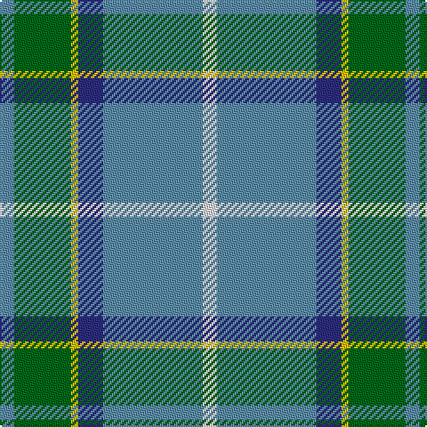

In pattern [BGYBBW](/patterns/bgybbw/).

This was sourced from tartans-authority.  It is a [6 stripes tartan](/stripes/stripes6/).

Original link http://www.tartansauthority.com/tartan-ferret/display/3032/

## Attestations

This cloth appears in 2 source records; the oldest owns this page.

- 1980-81 — Allanton (Fashion) (tartans-authority, [record](http://www.tartansauthority.com/tartan-ferret/display/3032/))
- undated — Allanton (register-of-tartans, [record](https://www.tartanregister.gov.uk/tartanDetails.aspx?ref=5397))

## Thread count
B/8 G32 Y4 DB14 B56 LN/8

## Palette
Each colour and its ΔE from the base-6 reference it is a variant of.

| Colour | Shade | Base | ΔE (OKLab) |
|---|---|---|---|
| B | <code style="background-color:#5C8CA8;">#5C8CA8</code> `#5C8CA8` | B <code style="background-color:#2A418A;">#2A418A</code> | 0.23 |
| DB | <code style="background-color:#2C2C80;">#2C2C80</code> `#2C2C80` | B <code style="background-color:#2A418A;">#2A418A</code> | 0.06 |
| G | <code style="background-color:#006818;">#006818</code> `#006818` | G <code style="background-color:#006100;">#006100</code> | 0.02 |
| LN | <code style="background-color:#E0E0E0;">#E0E0E0</code> `#E0E0E0` | W <code style="background-color:#F7F7F7;">#F7F7F7</code> | 0.07 |
| Y | <code style="background-color:#E8C000;">#E8C000</code> `#E8C000` | Y <code style="background-color:#F2BF00;">#F2BF00</code> | 0.02 |

# Sample pattern

## Nearest tartans

The nearest existing variants by ΔTartan distance.

1. [Manx Laxey (Blue)](/setts/s6/b4g16y2ba7b28w4~b6098b4-ba780078-g005834-we0e0e0-ye8c000~x2/) — ΔT 0.59
1. [Vance](/setts/s6/k3b2g13w2b24r3~b2888c4-g289c18-k101010-r880000-we0e0e0~x4/) — ΔT 0.87
1. [Sterling, Rob (Florida) (Personal)](/setts/s5/g11y10b11ba33w3~b433a5a-ba1870a4-g649848-wf9f5ef-ye0a126~x2/) — ΔT 1.02
1. [Carrick Hunting (Personal)](/setts/s8/g13b1g1b1g3ba5k4y2~b780078-ba1474b4-g408060-k101010-ye8c000~x4/) — ΔT 1.06
1. [Sterling (Name)](/setts/s5/g11y10b11ba33w3~b003c64-ba1474b4-g006818-wfcfcfc-ybc8c00~x2/) — ΔT 1.07
1. [Bahamas (District)](/setts/s8/b8y2b22g6r2w10g12b3~b40647c-g007c00-rc80000-wc8c8c8-y9c9c00~x2/) — ΔT 1.09
1. [Bahamas](/setts/s8/b8y2b22g6r2w10g12b3~b40647c-g004800-rc80000-wc8c8c8-y9c9c00~x2/) — ΔT 1.11
1. [Carrick Htg (Clan)](/setts/s8/g13b1g1b1g3ba5k4y2~b440044-ba1474b4-g408060-k101010-ye8c000~x4/) — ΔT 1.14
1. [Celtic Norse Heritage Society](/setts/s5/r10k1b3g3y1~b2c2c80-g006818-k101010-r888888-yfccc00~x6/) — ΔT 1.14
1. [Phoenix Police Honor Guard (Corp.)](/setts/s5/b10k3ba65g56y6~b202060-ba2888c4-g006818-k101010-ye8c000/) — ΔT 1.15

## Neighbour map

Every grey dot is one of 15726 variants placed by the first two principal components of the ΔTartan feature space (44% of its variance). Red is this tartan; blue dots are its nearest — click one to open its page.

<svg viewBox="0 0 640 380" role="img" style="max-width:100%;height:auto;border:1px solid #e0e0e0;border-radius:4px;display:block" xmlns="http://www.w3.org/2000/svg"><image href="/nn/cloud.v1.png" width="640" height="380"/><a href="/setts/s6/b4g16y2ba7b28w4~b6098b4-ba780078-g005834-we0e0e0-ye8c000~x2/"><circle cx="271.4" cy="179.6" r="4" fill="#3465a4"><title>Manx Laxey (Blue)</title></circle></a><a href="/setts/s6/k3b2g13w2b24r3~b2888c4-g289c18-k101010-r880000-we0e0e0~x4/"><circle cx="287.2" cy="178.3" r="4" fill="#3465a4"><title>Vance</title></circle></a><a href="/setts/s5/g11y10b11ba33w3~b433a5a-ba1870a4-g649848-wf9f5ef-ye0a126~x2/"><circle cx="227.0" cy="210.2" r="4" fill="#3465a4"><title>Sterling, Rob (Florida) (Personal)</title></circle></a><a href="/setts/s8/g13b1g1b1g3ba5k4y2~b780078-ba1474b4-g408060-k101010-ye8c000~x4/"><circle cx="290.8" cy="168.8" r="4" fill="#3465a4"><title>Carrick Hunting (Personal)</title></circle></a><a href="/setts/s5/g11y10b11ba33w3~b003c64-ba1474b4-g006818-wfcfcfc-ybc8c00~x2/"><circle cx="226.0" cy="214.6" r="4" fill="#3465a4"><title>Sterling (Name)</title></circle></a><a href="/setts/s8/b8y2b22g6r2w10g12b3~b40647c-g007c00-rc80000-wc8c8c8-y9c9c00~x2/"><circle cx="258.7" cy="196.8" r="4" fill="#3465a4"><title>Bahamas (District)</title></circle></a><a href="/setts/s8/b8y2b22g6r2w10g12b3~b40647c-g004800-rc80000-wc8c8c8-y9c9c00~x2/"><circle cx="246.8" cy="192.3" r="4" fill="#3465a4"><title>Bahamas</title></circle></a><a href="/setts/s8/g13b1g1b1g3ba5k4y2~b440044-ba1474b4-g408060-k101010-ye8c000~x4/"><circle cx="288.2" cy="168.6" r="4" fill="#3465a4"><title>Carrick Htg (Clan)</title></circle></a><a href="/setts/s5/r10k1b3g3y1~b2c2c80-g006818-k101010-r888888-yfccc00~x6/"><circle cx="279.7" cy="198.0" r="4" fill="#3465a4"><title>Celtic Norse Heritage Society</title></circle></a><a href="/setts/s5/b10k3ba65g56y6~b202060-ba2888c4-g006818-k101010-ye8c000/"><circle cx="291.2" cy="181.3" r="4" fill="#3465a4"><title>Phoenix Police Honor Guard (Corp.)</title></circle></a><circle cx="278.9" cy="186.2" r="5" fill="#c00000"/></svg>

ID: /setts/s6/b4g16y2ba7b28w4~b5c8ca8-ba2c2c80-g006818-we0e0e0-ye8c000~x2/
