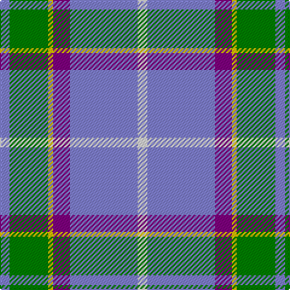

In pattern [BGYBBW](/patterns/bgybbw/).

This was sourced from weddslist.  It is a [6 stripes tartan](/stripes/stripes6/).

Original link http://www.weddslist.com/cgi-bin/tartans/pg.pl?source=sts

## Thread count
B/8 G32 Y4 P14 B56 LN/8

## Palette
Each colour and its ΔE from the base-6 reference it is a variant of.

| Colour | Shade | Base | ΔE (OKLab) |
|---|---|---|---|
| B | <code style="background-color:#8080D0;">#8080D0</code> `#8080D0` | B <code style="background-color:#2A418A;">#2A418A</code> | 0.24 |
| G | <code style="background-color:#008000;">#008000</code> `#008000` | G <code style="background-color:#006100;">#006100</code> | 0.10 |
| LN | <code style="background-color:#E0E0E0;">#E0E0E0</code> `#E0E0E0` | W <code style="background-color:#F7F7F7;">#F7F7F7</code> | 0.07 |
| P | <code style="background-color:#800080;">#800080</code> `#800080` | B <code style="background-color:#2A418A;">#2A418A</code> | 0.17 |
| Y | <code style="background-color:#F0C000;">#F0C000</code> `#F0C000` | Y <code style="background-color:#F2BF00;">#F2BF00</code> | 0.00 |

# Sample pattern

## Nearest tartans

The nearest existing variants by ΔTartan distance.

1. [Manx Laxey (Blue)](/setts/s6/b4g16y2ba7b28w4~b6098b4-ba780078-g005834-we0e0e0-ye8c000~x2/) — ΔT 0.64
1. [Roseberry (Name)](/setts/s6/w8b30g5w3ba8r5~b5c8ca8-ba2c2c80-g289c18-rc80000-we0e0e0/) — ΔT 0.75
1. [Herriot (New Zealand) (Name)](/setts/s6/w15y2b5ya3ba40b10~b003c64-ba64809c-we0e0e0-ye8c000-yaa0a0a0/) — ΔT 0.76
1. [Allanton (Fashion)](/setts/s6/b4g16y2ba7b28w4~b5c8ca8-ba2c2c80-g006818-we0e0e0-ye8c000~x2/) — ΔT 1.20
1. [Afternoon Tea / Earl Grey](/setts/s6/r15b98ba72y25ba8w15~b3682af-ba003c64-re87878-wf0e0c8-yc4bc68/) — ΔT 1.21
1. [Roseberry](/setts/s6/w8b30g5w3ba8r5~b3399cc-ba333399-g339900-rcc0000-wffffff/) — ΔT 1.22
1. [Celtic Norse Heritage Society](/setts/s5/r10k1b3g3y1~b2c2c80-g006818-k101010-r888888-yfccc00~x6/) — ΔT 1.22
1. [Emond, Kenneth (Personal)](/setts/s5/b36ba21y4w12bb2~b003c64-ba5c8ca8-bb5a008c-wc0c0c0-yffe600~x2/) — ΔT 1.23
1. [Bagpipe Shop (Corporate)](/setts/s5/b10w3wa3g1r1~b5c5c5c-g289c18-rc80000-we0e0e0-wac0c0c0~x10/) — ΔT 1.28
1. [Sterling, Rob (Florida) (Personal)](/setts/s5/g11y10b11ba33w3~b433a5a-ba1870a4-g649848-wf9f5ef-ye0a126~x2/) — ΔT 1.30

## Neighbour map

Every grey dot is one of 15726 variants placed by the first two principal components of the ΔTartan feature space (44% of its variance). Red is this tartan; blue dots are its nearest — click one to open its page.

<svg viewBox="0 0 640 380" role="img" style="max-width:100%;height:auto;border:1px solid #e0e0e0;border-radius:4px;display:block" xmlns="http://www.w3.org/2000/svg"><image href="/nn/cloud.v1.png" width="640" height="380"/><a href="/setts/s6/b4g16y2ba7b28w4~b6098b4-ba780078-g005834-we0e0e0-ye8c000~x2/"><circle cx="271.4" cy="179.6" r="4" fill="#3465a4"><title>Manx Laxey (Blue)</title></circle></a><a href="/setts/s6/w8b30g5w3ba8r5~b5c8ca8-ba2c2c80-g289c18-rc80000-we0e0e0/"><circle cx="233.7" cy="179.4" r="4" fill="#3465a4"><title>Roseberry (Name)</title></circle></a><a href="/setts/s6/w15y2b5ya3ba40b10~b003c64-ba64809c-we0e0e0-ye8c000-yaa0a0a0/"><circle cx="292.6" cy="151.8" r="4" fill="#3465a4"><title>Herriot (New Zealand) (Name)</title></circle></a><a href="/setts/s6/b4g16y2ba7b28w4~b5c8ca8-ba2c2c80-g006818-we0e0e0-ye8c000~x2/"><circle cx="278.9" cy="186.2" r="4" fill="#3465a4"><title>Allanton (Fashion)</title></circle></a><a href="/setts/s6/r15b98ba72y25ba8w15~b3682af-ba003c64-re87878-wf0e0c8-yc4bc68/"><circle cx="205.2" cy="183.4" r="4" fill="#3465a4"><title>Afternoon Tea / Earl Grey</title></circle></a><a href="/setts/s6/w8b30g5w3ba8r5~b3399cc-ba333399-g339900-rcc0000-wffffff/"><circle cx="214.0" cy="173.1" r="4" fill="#3465a4"><title>Roseberry</title></circle></a><a href="/setts/s5/r10k1b3g3y1~b2c2c80-g006818-k101010-r888888-yfccc00~x6/"><circle cx="279.7" cy="198.0" r="4" fill="#3465a4"><title>Celtic Norse Heritage Society</title></circle></a><a href="/setts/s5/b36ba21y4w12bb2~b003c64-ba5c8ca8-bb5a008c-wc0c0c0-yffe600~x2/"><circle cx="237.3" cy="179.1" r="4" fill="#3465a4"><title>Emond, Kenneth (Personal)</title></circle></a><a href="/setts/s5/b10w3wa3g1r1~b5c5c5c-g289c18-rc80000-we0e0e0-wac0c0c0~x10/"><circle cx="273.4" cy="188.7" r="4" fill="#3465a4"><title>Bagpipe Shop (Corporate)</title></circle></a><a href="/setts/s5/g11y10b11ba33w3~b433a5a-ba1870a4-g649848-wf9f5ef-ye0a126~x2/"><circle cx="227.0" cy="210.2" r="4" fill="#3465a4"><title>Sterling, Rob (Florida) (Personal)</title></circle></a><circle cx="270.1" cy="174.5" r="5" fill="#c00000"/></svg>

ID: /setts/s6/b4g16y2ba7b28w4~b8080d0-ba800080-g008000-we0e0e0-yf0c000~x2/
