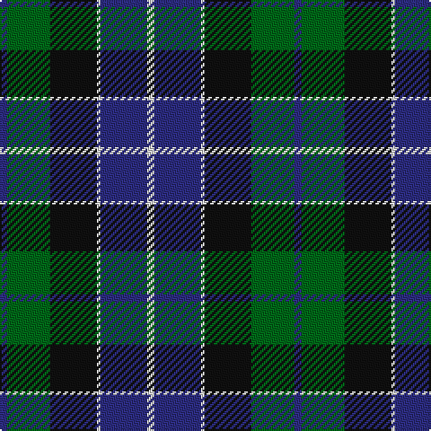

In pattern [BGKWBW](/patterns/bgkwbw/).

This was sourced from house-of-tartan.  It is a [6 stripes tartan](/stripes/stripes6/).

Original link http://www.house-of-tartan.scotland.net/house/TartanViewjs.asp?colr=Def&tnam=170

## Thread count
DB/4 G24 K26 LN2 DB26 LN/4

## Palette
Each colour and its ΔE from the base-6 reference it is a variant of.

| Colour | Shade | Base | ΔE (OKLab) |
|---|---|---|---|
| DB | <code style="background-color:#2C2C80;">#2C2C80</code> `#2C2C80` | B <code style="background-color:#2A418A;">#2A418A</code> | 0.06 |
| G | <code style="background-color:#006818;">#006818</code> `#006818` | G <code style="background-color:#006100;">#006100</code> | 0.02 |
| K | <code style="background-color:#101010;">#101010</code> `#101010` | K <code style="background-color:#000000;">#000000</code> | 0.17 |
| LN | <code style="background-color:#E0E0E0;">#E0E0E0</code> `#E0E0E0` | W <code style="background-color:#F7F7F7;">#F7F7F7</code> | 0.07 |

# Sample pattern

## Nearest tartans

The nearest existing variants by ΔTartan distance.

1. [Oceanic (Corporate?)](/setts/s7/y8k4r39k37b36k6b7-b003c64-k101010-r888888-ye8c000/) — ΔT 0.72
1. [Dress Watch](/setts/s8/b8k6b36k36g36b2g4w8-b2c2c80-g006818-k101010-wfcfcfc/) — ΔT 0.85
1. [Campbell of Argyll (Smiths)](/setts/s6/b4k4b24k22g32w4-b2c2c80-g006818-k101010-we0e0e0/) — ΔT 0.86
1. [MacKirdy](/setts/s5/k4g24k22b24w2-b1474b4-g408060-k101010-wfcfcfc/) — ΔT 0.89
1. [Gunn](/setts/s6/g4b24g2k24g24r4-b1c0070-g006400-k101010-rc80000/) — ΔT 0.90
1. [Russell Clan Tartan Tartan Number: 1094. Earliest known date: c.1815 It seems certain that the tartan was first known as Galbraith. William Wilson and Sons of Bannockburn recorded the pattern as Russell in their pattern book of 1847, although it was named Hunter in the earlier book of 1819. See products available Copyright © Blair Urquhart, Comrie, 2015](/setts/s6/k4g24k24r2b24w4-b2c2c80-g006818-k101010-rc80000-we0e0e0/) — ΔT 0.90
1. [MacKirdy Family Tartan Tartan Number: 1092. Earliest known date: 1930-50 This sample comes from the MacGregor-Hastie collection which forms the basis of the cloth archive of the Scottish Tartans Society. MacGregor-Hastie noted, "A pattern seen at Andersons, Edinburgh, was labelled 'MacKirdy'. It is a simple green tartan. The family are usually given as a sept of the Stuarts of Bute. The tartan is modern". One can assume that the sample dates between 1930 and 1950. At a very early period the larger part of the Island of Bute belonged to the Mackuerdys, which was leased to them by King James IV in 1489. Later Bute became the stronghold of the Stuarts of Bute. See products available Copyright © Blair Urquhart, Comrie, 2015](/setts/s5/k4g24k22b24w2-b2c2c80-g006818-k101010-we0e0e0/) — ΔT 0.92
1. [Skibo](/setts/s5/r4g46b22ba44r4-b000050-ba304080-g008000-rc00000/) — ΔT 0.93
1. [Unidentified No 26](/setts/s6/w4b4g22k20b20w3-b2c4084-g005020-k101010-we0e0e0/) — ΔT 0.94
1. [Gammell (1978) (Personal)](/setts/s7/b6r4b44k22g44r4g6-b1c0070-g006818-k101010-rc80000/) — ΔT 0.96

## Neighbour map

Every grey dot is one of 15726 variants placed by the first two principal components of the ΔTartan feature space (44% of its variance). Red is this tartan; blue dots are its nearest — click one to open its page.

<svg viewBox="0 0 640 380" role="img" style="max-width:100%;height:auto;border:1px solid #e0e0e0;border-radius:4px;display:block" xmlns="http://www.w3.org/2000/svg"><image href="/nn/cloud.v1.png" width="640" height="380"/><a href="/setts/s7/y8k4r39k37b36k6b7-b003c64-k101010-r888888-ye8c000/"><circle cx="169.4" cy="207.2" r="4" fill="#3465a4"><title>Oceanic (Corporate?)</title></circle></a><a href="/setts/s8/b8k6b36k36g36b2g4w8-b2c2c80-g006818-k101010-wfcfcfc/"><circle cx="192.4" cy="177.1" r="4" fill="#3465a4"><title>Dress Watch</title></circle></a><a href="/setts/s6/b4k4b24k22g32w4-b2c2c80-g006818-k101010-we0e0e0/"><circle cx="180.8" cy="233.7" r="4" fill="#3465a4"><title>Campbell of Argyll (Smiths)</title></circle></a><a href="/setts/s5/k4g24k22b24w2-b1474b4-g408060-k101010-wfcfcfc/"><circle cx="175.7" cy="230.4" r="4" fill="#3465a4"><title>MacKirdy</title></circle></a><a href="/setts/s6/g4b24g2k24g24r4-b1c0070-g006400-k101010-rc80000/"><circle cx="212.6" cy="226.2" r="4" fill="#3465a4"><title>Gunn</title></circle></a><a href="/setts/s6/k4g24k24r2b24w4-b2c2c80-g006818-k101010-rc80000-we0e0e0/"><circle cx="163.8" cy="201.0" r="4" fill="#3465a4"><title>Russell Clan Tartan Tartan Number: 1094. Earliest known date: c.1815 It seems certain that the tartan was first known as Galbraith. William Wilson and Sons of Bannockburn recorded the pattern as Russell in their pattern book of 1847, although it was named Hunter in the earlier book of 1819. See products available Copyright © Blair Urquhart, Comrie, 2015</title></circle></a><a href="/setts/s5/k4g24k22b24w2-b2c2c80-g006818-k101010-we0e0e0/"><circle cx="199.3" cy="242.3" r="4" fill="#3465a4"><title>MacKirdy Family Tartan Tartan Number: 1092. Earliest known date: 1930-50 This sample comes from the MacGregor-Hastie collection which forms the basis of the cloth archive of the Scottish Tartans Society. MacGregor-Hastie noted, &quot;A pattern seen at Andersons, Edinburgh, was labelled 'MacKirdy'. It is a simple green tartan. The family are usually given as a sept of the Stuarts of Bute. The tartan is modern&quot;. One can assume that the sample dates between 1930 and 1950. At a very early period the larger part of the Island of Bute belonged to the Mackuerdys, which was leased to them by King James IV in 1489. Later Bute became the stronghold of the Stuarts of Bute. See products available Copyright © Blair Urquhart, Comrie, 2015</title></circle></a><a href="/setts/s5/r4g46b22ba44r4-b000050-ba304080-g008000-rc00000/"><circle cx="212.8" cy="228.3" r="4" fill="#3465a4"><title>Skibo</title></circle></a><a href="/setts/s6/w4b4g22k20b20w3-b2c4084-g005020-k101010-we0e0e0/"><circle cx="146.4" cy="236.9" r="4" fill="#3465a4"><title>Unidentified No 26</title></circle></a><a href="/setts/s7/b6r4b44k22g44r4g6-b1c0070-g006818-k101010-rc80000/"><circle cx="227.3" cy="206.4" r="4" fill="#3465a4"><title>Gammell (1978) (Personal)</title></circle></a><circle cx="183.8" cy="210.4" r="5" fill="#c00000"/></svg>

ID: /setts/s6/b4g24k26w2b26w4-b2c2c80-g006818-k101010-we0e0e0/
