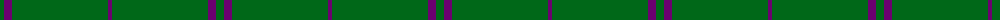
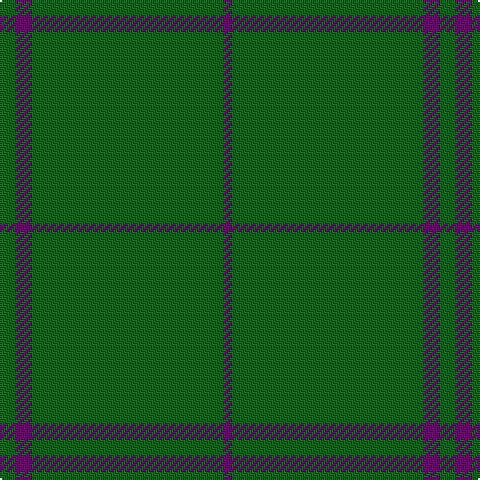

In pattern [BGGGBG](/patterns/bgggbg/).

This was sourced from tartans-authority.  It is a [6 stripes tartan](/stripes/stripes6/).

Original link http://www.tartansauthority.com/tartan-ferret/display/4160/

## Thread count
G/8 Pa8 G80 G8 G8 P/4

## Palette
Each colour and its ΔE from the base-6 reference it is a variant of.

| Colour | Shade | Base | ΔE (OKLab) |
|---|---|---|---|
| G | <code style="background-color:#006818;">#006818</code> `#006818` | G <code style="background-color:#006400;">#006400</code> | 0.02 |
| P | <code style="background-color:#6C0070;">#6C0070</code> `#6C0070` | B <code style="background-color:#2C4084;">#2C4084</code> | 0.15 |
| Pa | <code style="background-color:#6C0070;">#6C0070</code> `#6C0070` | B <code style="background-color:#2C4084;">#2C4084</code> | 0.15 |

# Sample pattern

ID: /setts/s6/b4g8g8g80b8g8-b6c0070-g006818/
