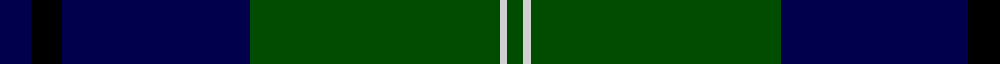

In pattern [BKBGWG](/patterns/bkbgwg/).

This was sourced from weddslist.  It is a [6 stripes tartan](/stripes/stripes6/).

Original link http://www.weddslist.com/cgi-bin/tartans/pg.pl?source=rb

## Thread count
DB/8 K8 DB48 G64 N2 G/4

## Palette
Each colour and its ΔE from the base-6 reference it is a variant of.

| Colour | Shade | Base | ΔE (OKLab) |
|---|---|---|---|
| DB | <code style="background-color:#00004C;">#00004C</code> `#00004C` | B <code style="background-color:#2A418A;">#2A418A</code> | 0.21 |
| G | <code style="background-color:#004C00;">#004C00</code> `#004C00` | G <code style="background-color:#006100;">#006100</code> | 0.07 |
| K | <code style="background-color:#000000;">#000000</code> `#000000` | K <code style="background-color:#000000;">#000000</code> | 0.00 |
| N | <code style="background-color:#D0D0D0;">#D0D0D0</code> `#D0D0D0` | W <code style="background-color:#F7F7F7;">#F7F7F7</code> | 0.12 |

# Sample pattern

## Nearest tartans

The nearest existing variants by ΔTartan distance.

1. [Oliphant](/setts/s6/b4k4b24g32y1g2~b000052-g11450d-k000000-yaaaaaa~x2/) — ΔT 0.60
1. [Johnston](/setts/s8/y3g2k1g30b24k2b2k2~b000052-g11450d-k000000-yaaaa00~x2/) — ΔT 0.93
1. [Oliphant (Clan)](/setts/s6/b4k4b24g32w1g2~b2c2c80-g006818-k101010-wfcfcfc~x4/) — ΔT 1.08
1. [Oliphant Family Tartan Tartan Number: 242. Earliest known date: 1842 Also The Setts No: 210. W & A K Johnston, 1906. Often referred to as 'Oliphant and Melville'. There is a similar pattern listed under 'Melville' which is also worn by the Oliphants. There is no definitive provenance to distinguish one from the other, though the Vestiarium has proved unreliable in many cases. See MELVILLE. See products available Copyright © Blair Urquhart, Comrie, 2015](/setts/s6/b4k4b24g32w1g2~b2c2c80-g006818-k101010-we0e0e0~x2/) — ΔT 1.10
1. [Johnston](/setts/s8/y3g2k1g30b24k2b2k2~b000064-g004c00-k000000-yffc800~x2/) — ΔT 1.19
1. [Gretna Green Fashion Tartan Tartan Number: 5119. Earliest known date: 01/01/1996 Designed in 1996 by Lochcarron for Tartan & Tweeds of Gretna Green. Gretna Green became famous for runaway marriages when 'irregular' marriages were banned by law in England in 1753. Couples were able to run to Scotland and become legally married by proclamation in front of two witnesses. This form of marriage was recognised worldwide. From the middle of the 18th century these marriages were in such demand that the blacksmith, conveniently situated on the crossroads at Gretna Green, became known as the 'anvil priest', giving birth to the anvil as the symbol of Gretna Green. Many couples are still married at the original smithy while many others, although married elsewhere, visit Gretna Green to take the traditional Scottish oath. The Gretna Green tartan reflects the twin influences of this history and that of the powerful border clan Johnstone, so influential in this area of Dumfriesshire, on which this tartan is based. Sample in Scottish Tartans Authority's Johnston Collection. See products available Copyright © Blair Urquhart, Comrie, 2015](/setts/s8/b2g2k1g30b20r2b2r2~b1c0070-g006818-k000000-rc80000~x2/) — ΔT 1.34
1. [Gretna Green](/setts/s8/b2g2y1g30b20r2b2r2~b1c0070-g006818-rc80000-yd8b000~x2/) — ΔT 1.42
1. [Johnston Clan Tartan Tartan Number: 1063. Earliest known date: 1842 A powerful Border Clan who pursued a deadly feud with the Maxwells. Their stronghold was Lochwood Tower, near Beattock, which was burned down by the Maxwells in 1593. The tartan was first published in the Vestiarium Scoticum in 1842. Before that time Border tartans were generally un-named. More likely the tartan came from the Aberdeenshire Johnstons, whose family seat is at Caskieben, Blackburn. (Ref: The Setts.. No. 82. D.C.Stewart.) See products available Copyright © Blair Urquhart, Comrie, 2015](/setts/s8/y3g2k1g30b24k2b2k2~b2c2c80-g006818-k101010-ye8c000~x2/) — ΔT 1.45
1. [Harley (Leslie), Robert](/setts/s8/g2k3y1k3g2b8g16k1~b000048-g005020-k101010-yffe600~x4/) — ΔT 1.48
1. [MacRobart](/setts/s6/b72k21g16ba3g17ba3~b304080-ba5480b0-g008000-k000000~x2/) — ΔT 1.49

## Neighbour map

Every grey dot is one of 15726 variants placed by the first two principal components of the ΔTartan feature space (44% of its variance). Red is this tartan; blue dots are its nearest — click one to open its page.

<svg viewBox="0 0 640 380" role="img" style="max-width:100%;height:auto;border:1px solid #e0e0e0;border-radius:4px;display:block" xmlns="http://www.w3.org/2000/svg"><image href="/nn/cloud.v1.png" width="640" height="380"/><a href="/setts/s6/b4k4b24g32y1g2~b000052-g11450d-k000000-yaaaaaa~x2/"><circle cx="386.5" cy="185.6" r="4" fill="#3465a4"><title>Oliphant</title></circle></a><a href="/setts/s8/y3g2k1g30b24k2b2k2~b000052-g11450d-k000000-yaaaa00~x2/"><circle cx="351.2" cy="151.9" r="4" fill="#3465a4"><title>Johnston</title></circle></a><a href="/setts/s6/b4k4b24g32w1g2~b2c2c80-g006818-k101010-wfcfcfc~x4/"><circle cx="371.8" cy="174.5" r="4" fill="#3465a4"><title>Oliphant (Clan)</title></circle></a><a href="/setts/s6/b4k4b24g32w1g2~b2c2c80-g006818-k101010-we0e0e0~x2/"><circle cx="375.5" cy="176.0" r="4" fill="#3465a4"><title>Oliphant Family Tartan Tartan Number: 242. Earliest known date: 1842 Also The Setts No: 210. W &amp; A K Johnston, 1906. Often referred to as 'Oliphant and Melville'. There is a similar pattern listed under 'Melville' which is also worn by the Oliphants. There is no definitive provenance to distinguish one from the other, though the Vestiarium has proved unreliable in many cases. See MELVILLE. See products available Copyright © Blair Urquhart, Comrie, 2015</title></circle></a><a href="/setts/s8/y3g2k1g30b24k2b2k2~b000064-g004c00-k000000-yffc800~x2/"><circle cx="330.6" cy="143.7" r="4" fill="#3465a4"><title>Johnston</title></circle></a><a href="/setts/s8/b2g2k1g30b20r2b2r2~b1c0070-g006818-k000000-rc80000~x2/"><circle cx="365.9" cy="141.1" r="4" fill="#3465a4"><title>Gretna Green Fashion Tartan Tartan Number: 5119. Earliest known date: 01/01/1996 Designed in 1996 by Lochcarron for Tartan &amp; Tweeds of Gretna Green. Gretna Green became famous for runaway marriages when 'irregular' marriages were banned by law in England in 1753. Couples were able to run to Scotland and become legally married by proclamation in front of two witnesses. This form of marriage was recognised worldwide. From the middle of the 18th century these marriages were in such demand that the blacksmith, conveniently situated on the crossroads at Gretna Green, became known as the 'anvil priest', giving birth to the anvil as the symbol of Gretna Green. Many couples are still married at the original smithy while many others, although married elsewhere, visit Gretna Green to take the traditional Scottish oath. The Gretna Green tartan reflects the twin influences of this history and that of the powerful border clan Johnstone, so influential in this area of Dumfriesshire, on which this tartan is based. Sample in Scottish Tartans Authority's Johnston Collection. See products available Copyright © Blair Urquhart, Comrie, 2015</title></circle></a><a href="/setts/s8/b2g2y1g30b20r2b2r2~b1c0070-g006818-rc80000-yd8b000~x2/"><circle cx="364.5" cy="139.9" r="4" fill="#3465a4"><title>Gretna Green</title></circle></a><a href="/setts/s8/y3g2k1g30b24k2b2k2~b2c2c80-g006818-k101010-ye8c000~x2/"><circle cx="345.7" cy="144.2" r="4" fill="#3465a4"><title>Johnston Clan Tartan Tartan Number: 1063. Earliest known date: 1842 A powerful Border Clan who pursued a deadly feud with the Maxwells. Their stronghold was Lochwood Tower, near Beattock, which was burned down by the Maxwells in 1593. The tartan was first published in the Vestiarium Scoticum in 1842. Before that time Border tartans were generally un-named. More likely the tartan came from the Aberdeenshire Johnstons, whose family seat is at Caskieben, Blackburn. (Ref: The Setts.. No. 82. D.C.Stewart.) See products available Copyright © Blair Urquhart, Comrie, 2015</title></circle></a><a href="/setts/s8/g2k3y1k3g2b8g16k1~b000048-g005020-k101010-yffe600~x4/"><circle cx="343.2" cy="191.6" r="4" fill="#3465a4"><title>Harley (Leslie), Robert</title></circle></a><a href="/setts/s6/b72k21g16ba3g17ba3~b304080-ba5480b0-g008000-k000000~x2/"><circle cx="324.5" cy="172.4" r="4" fill="#3465a4"><title>MacRobart</title></circle></a><circle cx="370.1" cy="179.7" r="5" fill="#c00000"/></svg>

ID: /setts/s6/b4k4b24g32w1g2~b00004c-g004c00-k000000-wd0d0d0~x2/
